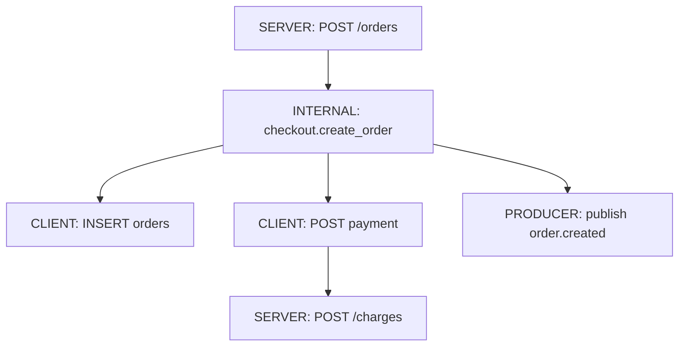
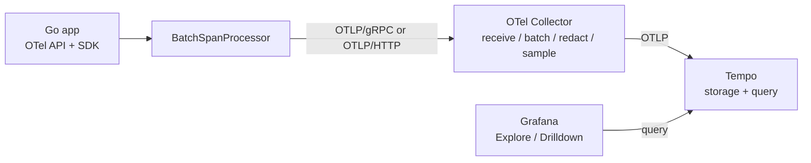
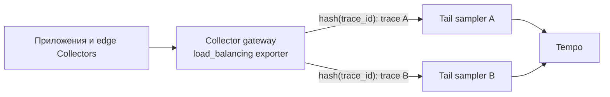

# Модель distributed tracing и flow OpenTelemetry

## Содержание

- [Зачем нужен tracing](#зачем-нужен-tracing)
- [Trace как дерево операций](#trace-как-дерево-операций)
- [Из чего состоит span](#из-чего-состоит-span)
- [Parent/child и span links](#parentchild-и-span-links)
- [Как переносится context](#как-переносится-context)
- [Где заканчивается OpenTelemetry](#где-заканчивается-opentelemetry)
- [Как spans попадают в backend](#как-spans-попадают-в-backend)
- [Head sampling и tail sampling](#head-sampling-и-tail-sampling)
- [Traces, metrics и logs](#traces-metrics-и-logs)
- [Стоимость, privacy и ограничения](#стоимость-privacy-и-ограничения)
- [Типичные ошибки](#типичные-ошибки)
- [Interview-ready answer](#interview-ready-answer)

Distributed tracing показывает путь одного конкретного запроса или события через процессы и зависимости. Он особенно полезен, когда итоговая latency складывается из нескольких HTTP/gRPC-вызовов, операций с БД, cache и message broker.

---

## Зачем нужен tracing

Метрика `p95 = 1.8s` говорит, что endpoint деградировал, но не объясняет, где потерялось время. Лог `context deadline exceeded` показывает ошибку конкретного компонента, но сам по себе не восстанавливает полный порядок вызовов. Trace связывает операции причинно и по времени.

Практическая модель:

| Сигнал | Основной вопрос | Типичный масштаб |
| --- | --- | --- |
| Metrics | Что и насколько массово изменилось? | Тысячи или миллионы операций |
| Logs | Что произошло в конкретной точке кода? | Одно событие |
| Traces | Как прошла конкретная операция и где потерялось время? | Один request/event path |

Tracing не заменяет два других сигнала. Нормальный investigation flow начинается с aggregate-симптома, сужается до нескольких traces и заканчивается деталями в logs или профиле.

```text
metric alert -> exemplar / trace search -> slow or failed span -> correlated logs
```

---

## Trace как дерево операций

`Trace` — набор причинно связанных spans с общим `trace_id`. `Span` — одна операция с началом и концом: входящий HTTP request, запрос к PostgreSQL, вызов payment service или обработка сообщения.



У всех узлов один `trace_id`, но собственный `span_id`. Поле parent указывает на span, который непосредственно вызвал текущую операцию. Поэтому trace — дерево или граф со links, а не просто список логов с одним correlation ID.

Понятия, которые часто смешивают:

| Сущность | Что описывает | Пример |
| --- | --- | --- |
| Trace | Весь causal path | Создание заказа |
| Span | Одну операцию | `INSERT orders` |
| SpanContext | Идентификаторы и flags, переносимые между границами | `trace_id`, `span_id`, `trace_flags`, `tracestate` |
| Resource | Процесс/сервис, создавший telemetry | `service.name=checkout`, environment, instance |
| Instrumentation scope | Библиотеку, создавшую span | Имя и версия HTTP instrumentation |
| Baggage | Отдельные key/value, переносимые с context | Tenant tier, только если это безопасно |

---

## Из чего состоит span

Полезный span содержит не только duration:

- `name` — стабильное имя операции;
- `trace_id`, `span_id` и parent span ID;
- start/end timestamps;
- `kind`;
- resource и span attributes;
- events;
- status;
- links к другим SpanContext.

### Span kind

`SpanKind` объясняет роль операции на process boundary:

| Kind | Когда использовать | Пример |
| --- | --- | --- |
| `SERVER` | Входящий синхронный request | HTTP handler, gRPC server |
| `CLIENT` | Исходящий синхронный remote call | HTTP client, SQL query |
| `PRODUCER` | Отправка работы для отложенной обработки | Publish в Kafka |
| `CONSUMER` | Получение или обработка отложенной работы | Kafka handler |
| `INTERNAL` | Значимая операция внутри процесса | Use case, expensive calculation |

Kind не заменяет имя span и attributes. Он нужен backend-инструментам, чтобы правильно восстанавливать границы и service graph.

### Attributes и events

Attribute описывает span в целом: route, DB operation, peer service. Event отмечает значимый момент внутри span, когда timestamp важен: retry, cache fallback, exception.

```text
span: payment.authorize (420ms)
attributes: payment.provider=acme, payment.operation=authorize
events:
    112ms retry.started attempt=2
    419ms exception type=DeadlineExceeded
```

Не превращайте каждый лог в span event. Иначе trace становится дорогой копией logs и обрезается по SDK/backend limits.

### Status

Status принимает `Unset`, `Error` или `Ok`. Успешный span обычно оставляют `Unset`: явный `Ok` не обязателен. В Go вызов `span.RecordError(err)` добавляет exception event, но сам не выставляет `Error`; если операция действительно считается failed, status нужно задать отдельно.

Не каждая доменная ошибка равна техническому failure. Например, ожидаемый `404` или declined payment может быть корректным бизнес-результатом. Политику status нужно согласовать с HTTP и domain semantics, иначе поиск `status = error` будет шумным.

---

## Parent/child и span links

Parent/child означает непосредственное продолжение работы:

- HTTP client span сервиса A становится remote parent для HTTP server span сервиса B;
- internal span становится parent для DB client span;
- producer context может стать parent consumer span при обработке одного сообщения.

`Link` выражает причинную связь, которая не образует обычное дерево. Он полезен, когда:

- один batch обрабатывает сообщения из нескольких producer contexts;
- фоновая работа начинается значительно позже исходного request;
- retry или replay намеренно начинает новый trace;
- один span агрегирует результаты нескольких upstream операций.

Нельзя назначить несколько parents, но можно добавить несколько links. Выбор parent или link для async processing — modeling decision: один длинный trace удобен для короткой очереди, отдельный linked trace лучше отражает долгоживущую, batch или replayable работу.

Подробнее этот trade-off разобран в [сквозном примере](./03-end-to-end-trace-example.md).

---

## Как переносится context

Внутри Go-процесса текущий SpanContext обычно находится в `context.Context`. Между процессами его нужно сериализовать в carrier транспорта.

| Boundary | Carrier |
| --- | --- |
| HTTP | Headers |
| gRPC | Metadata |
| Kafka/RabbitMQ/NATS | Message headers/properties |
| Внутренний вызов Go | `context.Context` |
| Database | Context передается драйверу, но не становится trace context внутри СУБД |

Для HTTP стандартный формат — W3C Trace Context:

```http
traceparent: 00-4bf92f3577b34da6a3ce929d0e0e4736-00f067aa0ba902b7-01
```

```text
version-trace_id-parent_id-trace_flags
```

Здесь `parent_id` — span ID операции отправителя, а `01` означает установленный sampled bit. Получатель извлекает remote SpanContext и создает новый span со своим `span_id`. Поэтому входящий HTTP server span является root только при отсутствии валидного parent context.

Propagation состоит из двух разных действий:

1. `Extract` на входе читает carrier и возвращает context с remote parent.
2. `Inject` перед исходящим вызовом записывает текущий SpanContext в carrier.

Instrumentation HTTP/gRPC-библиотек обычно делает это автоматически. Ручная instrumentation нужна для собственного протокола или message carrier.

### Baggage не равно span attributes

`baggage` переносит произвольные key/value между сервисами, но не добавляет их в spans автоматически по смыслу data model. Его нужно читать и применять явно либо через отдельный processor.

Baggage пересылается downstream и может выйти во внешний сервис. Нельзя помещать туда tokens, email, персональные данные и доверять входящим значениям как авторизованным claims.

То же относится к `traceparent`: внешний клиент может прислать поддельный trace ID. На trust boundary context нужно валидировать, при необходимости игнорировать или начинать новый trace; authorization по trace/baggage делать нельзя.

---

## Где заканчивается OpenTelemetry

OpenTelemetry — не одна библиотека и не trace storage. В production-цепочке роли разделены:

| Компонент | Ответственность |
| --- | --- |
| OTel API | Интерфейсы, через которые instrumentation создает telemetry |
| OTel SDK | Sampling, processors, resource, limits и export внутри приложения |
| Instrumentation libraries | Готовые spans для HTTP, gRPC, DB и других библиотек |
| OTLP | Protocol и data model для передачи telemetry |
| OTel Collector | Receive, batch, filter, redact, sample, route и export |
| Tempo/Jaeger/vendor backend | Хранение и поиск traces |
| Grafana/vendor UI | Investigation и визуализация |

Приложение может зависеть только от OTel API, а executable настраивает SDK. Это особенно полезно для shared libraries: библиотека создает spans через API, но не решает, куда их экспортировать и с каким sampling rate.

Collector не обязателен технически: SDK может экспортировать прямо в backend. Но Collector дает централизованную обработку, retries/queue, redaction, routing и tail sampling. Цена — еще один stateful operational layer, который нужно масштабировать и наблюдать.

---

## Как spans попадают в backend

Обычный production flow:



Когда span завершается, SDK передает его SpanProcessor. `BatchSpanProcessor` группирует завершенные spans и асинхронно вызывает exporter. OTLP использует protobuf data model поверх gRPC или HTTP; условный JSON в учебном примере не является точным OTLP/JSON payload.

Важные operational свойства:

- Tempo не scrape-ит spans из приложения, как Prometheus обычно scrape-ит metrics;
- exporter failure не должен ломать бизнес-request;
- bounded queue защищает приложение, поэтому при долгой недоступности Collector spans могут быть отброшены;
- перед завершением процесса нужно вызвать `TracerProvider.Shutdown` с deadline, чтобы попытаться выгрузить накопленный batch;
- telemetry pipeline нужно мониторить по dropped spans, queue size, export errors и Collector memory.

Collector повышает надежность доставки, но не превращает tracing в exactly-once pipeline. Observability должна переживать пропуски и дубли, а не становиться частью correctness бизнес-операции.

---

## Head sampling и tail sampling

Сохранять 100% traces часто дорого. Sampling ограничивает объем данных, но меняет вероятность увидеть редкий случай.

| Подход | Когда решение | Что умеет | Ограничения |
| --- | --- | --- | --- |
| Head sampling | В начале trace | Дешево, решение легко распространить через sampled flag | Еще не знает итоговую latency и status |
| Parent-based probability | В начале каждого span с учетом parent | Сохраняет согласованность решения между сервисами | Редкие errors могут не попасть в выборку |
| Tail sampling | После получения spans trace | Оставляет slow/error traces по результату | Нужны буфер, время ожидания, память и trace-aware routing |

Для head sampling в распределенной системе обычно используют parent-based sampler: downstream уважает решение remote parent, а новый root выбирается с заданной вероятностью. Независимый random sampler в каждом сервисе дает фрагментированные traces.

Tail sampler должен собрать достаточную часть trace на одном логическом processor instance. При горизонтальном масштабировании Collector spans одного `trace_id` нужно маршрутизировать согласованно. Tail sampling также увеличивает memory usage и decision latency.

Критичное ограничение: tail sampler не может вернуть spans, уже отброшенные head sampler. Если нужен tail sampling по errors/latency, upstream должен записывать и доставлять кандидаты до точки решения.

Sampling policy должна отвечать требованиям расследования. Типичный компромисс:

- базовая probability для нормального трафика;
- 100% для выбранных критичных flows, если volume позволяет;
- tail policies для errors и slow traces;
- отдельный budget и защита от всплеска ошибок, иначе именно во время incident pipeline перегрузится.

### Практический tail sampling в Collector

Tail sampling выполняет `tail_sampling` processor из
`opentelemetry-collector-contrib`. На 5 августа 2026 года компонент имеет статус
`beta` для traces. Collector группирует spans по `trace_id`, ждёт заданное время,
применяет policies и только после этого экспортирует сохранённые traces.

В примере ниже действуют три правила:

1. Сохранить trace, если хотя бы один span имеет status `ERROR`.
2. Сохранить trace, если его длительность не меньше двух секунд.
3. Сохранить 5% остальных traces как базовую выборку успешного трафика.

```yaml
receivers:
    otlp:
        protocols:
            grpc:
                endpoint: 0.0.0.0:4317
            http:
                endpoint: 0.0.0.0:4318

processors:
    memory_limiter:
        check_interval: 1s
        limit_mib: 2048
        spike_limit_mib: 512

    tail_sampling:
        decision_wait: 15s
        num_traces: 50000
        expected_new_traces_per_sec: 2000
        decision_cache:
            sampled_cache_size: 200000
            non_sampled_cache_size: 200000
        policies:
            - name: keep-errors
              type: status_code
              status_code:
                  status_codes: [ERROR]

            - name: keep-slow
              type: latency
              latency:
                  threshold_ms: 2000

            - name: baseline
              type: probabilistic
              probabilistic:
                  sampling_percentage: 5

    batch: {}

exporters:
    otlp/tempo:
        endpoint: tempo-distributor.observability.svc.cluster.local:4317

service:
    pipelines:
        traces:
            receivers: [otlp]
            processors: [memory_limiter, tail_sampling, batch]
            exporters: [otlp/tempo]
```

Это учебные параметры ёмкости, а не значения по умолчанию для production. Их
смысл:

- `decision_wait: 15s` даёт spans пятнадцать секунд на прибытие до решения;
- `num_traces: 50000` ограничивает число одновременно удерживаемых traces;
- `expected_new_traces_per_sec` помогает заранее выделить внутренние структуры,
  но не ограничивает входной поток;
- кеши решений запоминают решения для поздно пришедших spans дольше, чем
  Collector хранит данные исходного trace;
- `batch` стоит после `tail_sampling`, поэтому группирует уже отобранные spans.

Если на входе ожидается пик `2000` новых traces в секунду, то за окно ожидания
Collector должен одновременно удержать как минимум:

```text
2000 traces/s × 15 s = 30000 traces
```

Значение `50000` оставляет запас примерно 67%. Реальное потребление памяти всё
равно зависит от числа и размера spans внутри trace, поэтому конфигурацию проверяют
нагрузочным тестом. `memory_limiter` защищает процесс от выхода за пределы памяти,
но при давлении возвращает ошибку предыдущему компоненту. Без работающих retries
и обратного давления это приводит к потере telemetry, а не к бесплатному снижению
нагрузки.

Policies верхнего уровня голосуют за итоговое решение. В этой конфигурации trace
сохраняется, если совпадает хотя бы одно из трёх правил. Поэтому error и slow
traces сохраняются независимо от 5% базовой выборки. Явная `drop` policy имеет
приоритет и может отбросить trace, даже если другая policy проголосовала за
сохранение.

`status_code` проверяет именно status span. Если instrumentation записала
`error.type` или exception event, но не установила status `ERROR`, правило
`keep-errors` не сработает. Политика должна соответствовать реально экспортируемой
telemetry, а не предполагаемой схеме.

### Масштабирование tail sampler

Все spans одного trace должны попасть на один экземпляр tail-sampling Collector.
Обычный round-robin между несколькими экземплярами разделит trace на части и
каждый sampler примет решение по неполным данным.



В первом слое `load_balancing` exporter использует `routing_key: traceID` и
consistent hashing. Второй слой выполняет `tail_sampling`. При изменении списка
адресов sampler часть trace IDs может быть переназначена, поэтому частые
масштабирования и поэтапные обновления во время `decision_wait` тоже способны
создавать неполные traces.

Следить нужно как минимум за:

- traces, вытесненными из буфера раньше решения;
- возрастом поздно прибывших spans;
- числом sampled/dropped traces по каждой policy;
- памятью, отказами `memory_limiter`, очередями и ошибками экспорта Collector;
- реальной долей базовой выборки после всплесков ошибок.

Актуальные параметры и эксплуатационные метрики перечислены в документации
[Tail Sampling Processor](https://github.com/open-telemetry/opentelemetry-collector-contrib/tree/main/processor/tailsamplingprocessor),
а схема маршрутизации — в документации
[Load Balancing Exporter](https://github.com/open-telemetry/opentelemetry-collector-contrib/tree/main/exporter/loadbalancingexporter).

---

## Traces, metrics и logs

Сильный observability stack связывает сигналы, а не хранит их в изоляции.

### Metrics -> traces

Histogram exemplar может хранить `trace_id` конкретного наблюдения. В Grafana это позволяет перейти из точки latency spike к trace, который попал в bucket. Exemplar — пример, а не статистически репрезентативная выборка всех медленных запросов.

### Logs -> traces

Structured logger извлекает текущие `trace_id` и `span_id` из context. По ошибочному логу можно открыть trace, а по span — найти logs того же сервиса и временного окна.

### Traces -> metrics

Tempo metrics-generator или Collector connectors могут построить span metrics и service graphs из traces. Это удобно, но sampling влияет на полученную статистику. Для authoritative SLI обычно безопаснее отдельные application metrics, если sampling не скорректирован математически и pipeline не спроектирован для этой цели.

---

## Стоимость, privacy и ограничения

Стоимость tracing примерно определяется произведением:

```text
requests/sec × spans/request × bytes/span × sampling ratio × retention
```

Даже низкая cardinality не делает attribute бесплатным: он занимает сеть, storage и индекс. Высококардинальные значения вроде `user_id`, полного URL или raw SQL дополнительно ухудшают search/index cost.

Практические правила:

- имя span должно быть low-cardinality: `GET /orders/{id}`, а не `GET /orders/84721`;
- route template хранить отдельно от raw path;
- не писать request/response body, credentials, tokens и sensitive PII;
- SQL statement собирать только по утвержденной privacy policy и с sanitization;
- лимитировать количество attributes, events и links;
- контролировать размер baggage и список trust boundaries;
- задавать retention и sampling исходя из incident use cases, а не «на всякий случай».

Tracing имеет observer effect: instrumentation потребляет CPU и memory, exporter создает network traffic, а timestamps и scheduler noise влияют на очень короткие операции. Он хорошо локализует причинную цепочку, но не заменяет benchmark и profiler.

---

## Типичные ошибки

### «Middleware всегда создает root span»

Если входящий request содержит валидный remote context, HTTP server span продолжает существующий trace. Root создается только при отсутствии принятого parent.

### «Достаточно передать один trace ID»

Нужен полный SpanContext: как минимум `trace_id`, текущий parent `span_id` и flags. Иначе дерево и sampling decision потеряются.

### «RecordError автоматически делает span ошибочным»

В Go это отдельные операции. `RecordError` добавляет event, `SetStatus(codes.Error, ...)` меняет status.

### «Чем больше spans, тем лучше»

Микроспаны вокруг быстрых функций создают шум и стоимость. Instrument meaningful boundaries и операции, которые важны для latency, failure или domain investigation.

### «Tail sampling всегда сохраняет все errors»

Только errors, дошедшие до tail sampler и собранные до decision timeout. Head drop, неполная routing и перегрузка Collector делают trace неполным.

### «Tracing доказывает отсутствие проблемы»

Sampling и telemetry loss означают, что отсутствие trace не доказывает отсутствие события. Для alerting и SLO нужны aggregate metrics и контроль самого telemetry pipeline.

---

## Interview-ready answer

**1. Что такое distributed trace и span?**

- Trace — набор причинно связанных операций с общим `trace_id`.
- Span — одна операция со своим `span_id`, временем, kind, attributes, events и status.
- Parentage — parent span ID строит дерево синхронных вызовов, а links выражают дополнительные causal relationships.

**2. Как trace context проходит через систему?**

- Внутри процесса — Go-код передает текущий SpanContext через `context.Context`.
- Между процессами — instrumentation inject-ит и extract-ит W3C `traceparent`, gRPC metadata или message headers.
- На входе — server span становится root только при отсутствии принятого remote parent.

**3. За что отвечают OpenTelemetry, Collector и Tempo?**

- OpenTelemetry — API, SDK и instrumentation создают, обрабатывают и экспортируют telemetry.
- Collector — принимает, batch-ит, фильтрует, маршрутизирует и при необходимости sample-ит данные.
- Tempo — хранит и ищет traces, а Grafana предоставляет UI и TraceQL.

**4. Чем отличаются head sampling и tail sampling?**

- Head sampling — принимает дешевое решение в начале trace, но еще не знает итоговые latency и status.
- Tail sampling — может сохранить slow/error traces по результату, но требует буфера, памяти и trace-aware routing.
- Масштабирование — все spans одного `trace_id` направляются на один tail sampler.
- Ограничение — tail sampler не восстановит spans, которые уже отбросил head sampler.
