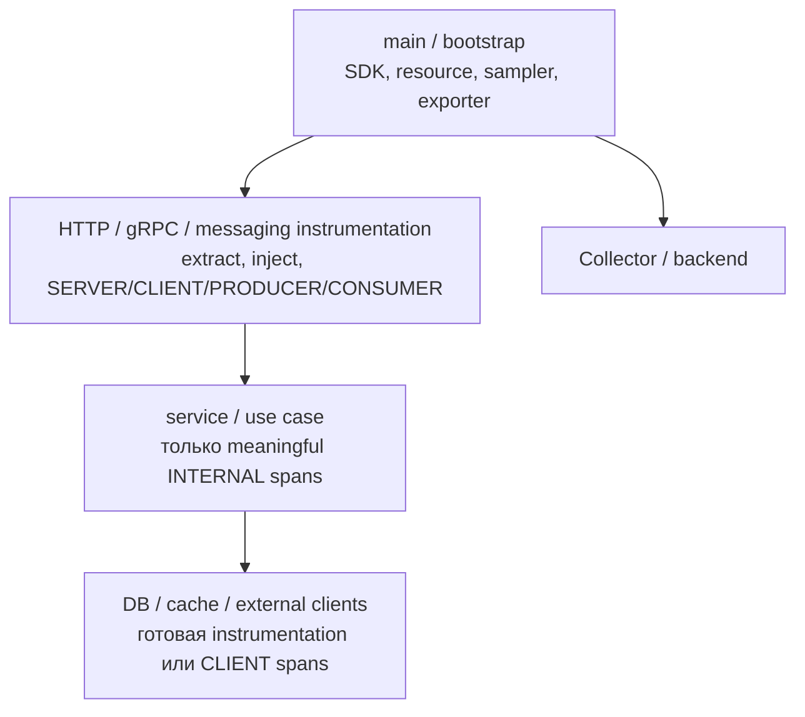

# OpenTelemetry в Go-сервисе

## Содержание

- [Архитектура instrumentation](#архитектура-instrumentation)
- [Bootstrap TracerProvider](#bootstrap-tracerprovider)
- [Входящий и исходящий HTTP](#входящий-и-исходящий-http)
- [gRPC: stats.Handler и interceptor](#grpc-statshandler-и-interceptor)
- [Manual spans в business code](#manual-spans-в-business-code)
- [Ошибки и status](#ошибки-и-status)
- [Context в goroutines](#context-в-goroutines)
- [Messaging и async boundaries](#messaging-и-async-boundaries)
- [Database instrumentation](#database-instrumentation)
- [Имена и attributes](#имена-и-attributes)
- [Sampling и shutdown](#sampling-и-shutdown)
- [Как тестировать tracing](#как-тестировать-tracing)
- [Production rollout](#production-rollout)
- [Типичные ошибки](#типичные-ошибки)
- [Interview-ready answer](#interview-ready-answer)

В Go tracing строится вокруг `context.Context`: instrumentation извлекает remote SpanContext на transport boundary, создает span и передает новый context вниз по call stack. Самые частые ошибки возникают не в exporter, а в propagation, дублирующей instrumentation и неуправляемых attributes.

---

## Архитектура instrumentation

Разделяйте ответственность по слоям:



- `main` владеет lifecycle SDK и configuration;
- transport instrumentation создает process-boundary spans и propagation;
- business code добавляет только spans, важные для latency и ошибок;
- libraries не должны инициализировать global SDK или выбирать backend;
- exporter не должен быть частью business correctness.

Сначала используйте готовую instrumentation для `net/http`, gRPC, SQL driver и broker client. Manual spans добавляйте там, где library span не выражает важную бизнес-операцию.

---

## Bootstrap TracerProvider

Минимальный production-oriented bootstrap должен создать exporter, resource, sampler и batch processor, затем зарегистрировать provider и propagator.

```go
package telemetry

import (
    "context"

    "go.opentelemetry.io/otel"
    "go.opentelemetry.io/otel/attribute"
    "go.opentelemetry.io/otel/exporters/otlp/otlptrace/otlptracegrpc"
    "go.opentelemetry.io/otel/propagation"
    "go.opentelemetry.io/otel/sdk/resource"
    sdktrace "go.opentelemetry.io/otel/sdk/trace"
)

func NewTracerProvider(
    ctx context.Context,
    serviceName string,
    environment string,
) (*sdktrace.TracerProvider, error) {
    exporter, err := otlptracegrpc.New(ctx)
    if err != nil {
        return nil, err
    }

    res, err := resource.New(
        ctx,
        resource.WithFromEnv(),
        resource.WithTelemetrySDK(),
        resource.WithAttributes(
            attribute.String("service.name", serviceName),
            attribute.String("deployment.environment.name", environment),
        ),
    )
    if err != nil {
        _ = exporter.Shutdown(ctx)
        return nil, err
    }

    provider := sdktrace.NewTracerProvider(
        sdktrace.WithResource(res),
        sdktrace.WithBatcher(exporter),
        sdktrace.WithSampler(
            sdktrace.ParentBased(sdktrace.TraceIDRatioBased(0.10)),
        ),
    )

    otel.SetTracerProvider(provider)
    otel.SetTextMapPropagator(
        propagation.NewCompositeTextMapPropagator(
            propagation.TraceContext{},
            propagation.Baggage{},
        ),
    )

    return provider, nil
}
```

В примере OTLP/gRPC exporter читает стандартные `OTEL_EXPORTER_OTLP_*` environment variables. Endpoint, TLS, headers и timeout лучше задавать deployment configuration, а не зашивать в binary.

Чтобы не перегружать пример, ключи resource attributes заданы строками. В application code полезно использовать constants/functions из версии `semconv`, совместимой с dependency graph. При обновлении OpenTelemetry держите версии `otel`, `otel/sdk`, exporter, contrib instrumentation и `semconv` совместимыми.

Почему важны resource attributes:

- без `service.name` backend часто показывает `unknown_service`;
- environment/namespace отделяют production от staging;
- instance attributes помогают увидеть, что проблема только в одном pod;
- эти признаки принадлежат процессу, поэтому их не надо дублировать на каждом span вручную.

---

## Входящий и исходящий HTTP

### Server instrumentation

Для `net/http` готовая middleware создает `SERVER` span, извлекает входящий context и записывает HTTP attributes.

```go
mux := http.NewServeMux()
mux.HandleFunc("POST /orders", createOrder)

handler := otelhttp.NewHandler(mux, "http.server")
server := &http.Server{
    Addr:    ":8080",
    Handler: handler,
}
```

Конкретный router integration должен записывать matched route template. Имя вроде `POST /orders/{id}` полезно, а raw path `POST /orders/84721` создает high cardinality. Не пытайтесь получить route template до того, как router сделал match; используйте его OTel middleware/hook.

В handler уже есть server span:

```go
func createOrder(w http.ResponseWriter, r *http.Request) {
    ctx := r.Context()
    current := trace.SpanFromContext(ctx)

    current.SetAttributes(
        attribute.String("app.operation", "order.create"),
    )

    // Передаем ctx в service layer.
}
```

Не создавайте второй span с именем `POST /orders` вручную: получится вложенный server-like span с почти одинаковой duration. Если нужен отдельный business step, назовите его по use case и оставьте kind `INTERNAL`.

### Client instrumentation

Исходящий HTTP client должен создать `CLIENT` span и inject-нуть текущий context в headers. Для `net/http` это делает instrumented transport:

```go
client := &http.Client{
    Transport: otelhttp.NewTransport(http.DefaultTransport),
    Timeout:   2 * time.Second,
}

req, err := http.NewRequestWithContext(
    ctx,
    http.MethodPost,
    paymentURL+"/charges",
    body,
)
if err != nil {
    return err
}

resp, err := client.Do(req)
if err != nil {
    return err
}
defer resp.Body.Close()
```

Критичные детали:

- `NewRequestWithContext` получает текущий `ctx`, а не `context.Background()`;
- один shared `http.Client` переиспользует connections; не создавайте client на каждый span;
- instrumentation не заменяет timeout и корректное закрытие body;
- при вызове внешнего third-party API решите, можно ли отправлять trace headers за trust boundary.

### Не instrument дважды

Если framework, service mesh или agent уже создает HTTP spans, второй middleware может дать дубли. Перед rollout откройте один trace и проверьте, что на request boundary ровно одна ожидаемая client/server пара.

---

## gRPC: stats.Handler и interceptor

Transport middleware/interceptor нужен для автоматического tracing каждого gRPC request. В актуальной `otelgrpc` эту роль выполняет `stats.Handler`, а не обязательно `grpc.UnaryServerInterceptor`.

Server handler:

```go
traceHandler := otelgrpc.NewServerHandler(
    otelgrpc.WithFilter(
        filters.Not(filters.HealthCheck()),
    ),
)

server := grpc.NewServer(
    grpc.StatsHandler(traceHandler),
    grpc.ChainUnaryInterceptor(
        recoveryInterceptor,
        authInterceptor,
        loggingInterceptor,
    ),
)
```

`otelgrpc.NewServerHandler`:

1. Извлекает W3C trace context из входящей gRPC metadata.
2. Создает `SERVER` span для RPC method.
3. Возвращает handler context с текущим span.
4. Записывает duration, status, размеры и количество messages.
5. Завершает span после окончания unary call или stream.

Фильтр health checks убирает регулярные probe-вызовы из traces и metrics. Обычные unary interceptors для recovery, auth и logging при этом остаются в `ChainUnaryInterceptor`: `StatsHandler` — отдельная server option, а не элемент этой цепочки.

Для исходящего вызова нужна симметричная client instrumentation:

```go
conn, err := grpc.NewClient(
    target,
    grpc.WithTransportCredentials(credentials),
    grpc.WithStatsHandler(
        otelgrpc.NewClientHandler(),
    ),
)
if err != nil {
    return nil, err
}
```

Client handler:

1. Берет текущий SpanContext из переданного в RPC `ctx`.
2. Создает `CLIENT` span.
3. Inject-ит context client span в outgoing metadata.
4. Записывает result/status и завершает span.

Для сквозного trace нужны обе стороны:

```text
service A handler ctx
    -> gRPC CLIENT span
    -> Inject(metadata)
    -> Extract(metadata)
    -> service B SERVER span
    -> service B handler ctx
```

Если включен только server handler, сервис сможет продолжить входящий trace, но его исходящие gRPC calls не продолжат цепочку. Если включен только client handler, caller передаст context, но downstream без server handler не создаст корректный server span и не положит его в handler context.

Название wrapper вроде `TraceInterceptor` допустимо, но тип возвращаемого значения важнее имени: если метод возвращает `stats.Handler`, подключать его нужно через `grpc.StatsHandler(...)`. Более точное имя `TraceStatsHandler` уменьшает риск попытаться добавить его в `ChainUnaryInterceptor`.

`TracerProvider` и exporter сами по себе не создают request spans. Они определяют sampling, processing и destination. Transport instrumentation создает boundary spans автоматически, а manual spans ниже нужны только для meaningful business operations:

```text
gRPC SERVER span                         automatic
└─ booking.confirm                       manual INTERNAL
   ├─ PostgreSQL query                   automatic DB CLIENT
   └─ provider-service gRPC CLIENT       automatic
      └─ provider-service SERVER         automatic
```

Перед созданием gRPC server/connections и обработкой трафика должны быть настроены `TracerProvider`, propagator и exporter. На shutdown provider нужно завершить после остановки server и in-flight RPC.

---

## Manual spans в business code

Manual span оправдан, если операция:

- заметна в latency budget;
- имеет самостоятельный failure mode;
- описывает важный use case;
- объединяет несколько infrastructure calls и помогает понять их смысл.

```go
func (s *Service) CreateOrder(
    ctx context.Context,
    cmd CreateOrderCommand,
) (Order, error) {
    ctx, span := s.tracer.Start(ctx, "order.create")
    defer span.End()

    span.SetAttributes(
        attribute.String("order.channel", cmd.Channel),
    )

    order, err := s.repo.Insert(ctx, cmd)
    if err != nil {
        span.RecordError(err)
        span.SetStatus(codes.Error, "insert order")
        return Order{}, err
    }

    return order, nil
}
```

Код обязан передать context, возвращенный `tracer.Start`, во все дочерние вызовы. Если продолжить использовать старый `ctx`, новые spans станут siblings, а не children.

Не создавайте spans вокруг тривиальных getters, сериализации на микросекунды и каждой функции. Полезный trace отвечает на operational question; он не повторяет call graph программы.

---

## Ошибки и status

В Go эти действия имеют разный смысл:

```go
if err != nil {
    span.RecordError(err)
    span.SetStatus(codes.Error, "charge payment")
    return err
}
```

- `RecordError` добавляет exception event с деталями ошибки;
- `SetStatus(codes.Error, ...)` помечает outcome span;
- возврат `err` сохраняет business control flow;
- логирование — отдельное решение, иначе одна ошибка может логироваться на каждом слое.

Не записывайте `err.Error()` в status description бездумно: там могут быть PII, SQL fragments или credentials. Description должна быть стабильной и безопасной, а подробность можно оставить в sanitized log.

Политику ошибок задавайте на границе:

| Ситуация | Возможная политика |
| --- | --- |
| HTTP 500 / transport timeout | `Error` |
| Expected 404 | Обычно не `Error`, зависит от API semantics |
| Payment declined | Domain outcome, не обязательно infrastructure error |
| Kafka publish failed, request откатывается | Producer и parent use-case spans — `Error` |
| Best-effort analytics publish failed | Producer — `Error`, HTTP request может остаться успешным |

Именно semantic outcome, а не наличие Go `error` само по себе, определяет status parent span.

---

## Context в goroutines

Для параллельной работы, которая является частью request, передавайте исходный context и дождитесь завершения goroutines.

```go
group, groupCtx := errgroup.WithContext(ctx)

group.Go(func() error {
    childCtx, span := tracer.Start(groupCtx, "inventory.reserve")
    defer span.End()

    return inventory.Reserve(childCtx, orderID)
})

group.Go(func() error {
    childCtx, span := tracer.Start(groupCtx, "pricing.calculate")
    defer span.End()

    return pricing.Calculate(childCtx, orderID)
})

if err := group.Wait(); err != nil {
    return err
}
```

Waterfall покажет пересечение spans и реальную wall-clock duration. Сумма durations параллельных children может быть больше duration parent — это нормально.

Fire-and-forget goroutine внутри handler — плохая boundary:

- request context отменится после ответа;
- процесс может завершиться раньше goroutine;
- span может закончиться после parent и потеряться на shutdown;
- нет durable retry.

Для надежной фоновой работы запишите job/event в broker или transactional outbox и создайте consumer span на стороне worker. `context.WithoutCancel` может быть осознанным локальным компромиссом, но он убирает cancellation/deadline и не делает работу durable.

---

## Messaging и async boundaries

Producer должен inject-нуть SpanContext в message headers, consumer — extract-нуть его до создания span. Используйте instrumentation конкретного client, а не сериализуйте `trace_id` вручную.

```text
producer context
    -> Inject(message headers)
    -> broker stores/delivers message
    -> Extract(message headers)
    -> consumer context
```

Span kinds:

- `PRODUCER` — publish/send;
- `CONSUMER` — receive/process;
- отдельный `CLIENT` span допустим для низкоуровневого broker request, если instrumentation различает protocol call и messaging operation.

Для одного сообщения consumer span может продолжить producer context. Для batch из нескольких сообщений нельзя выбрать честного единственного parent: создайте consumer/process span и добавьте links к SpanContext каждого сообщения.

В примере ниже consumer извлекает переданный `SpanContext` каждого сообщения,
пропускает невалидные contexts и создаёт новый root span для всего batch. Ни одно
из сообщений не становится случайным parent, но причинная связь с каждым из них
сохраняется через `trace.Link`.

<details>
<summary>Go: batch span с несколькими span links</summary>

```go
package consumer

import (
    "context"

    "go.opentelemetry.io/otel"
    "go.opentelemetry.io/otel/attribute"
    "go.opentelemetry.io/otel/propagation"
    "go.opentelemetry.io/otel/trace"
)

type Message struct {
    Headers map[string]string
    Body    []byte
}

func processBatch(ctx context.Context, messages []Message) error {
    links := make([]trace.Link, 0, len(messages))

    for _, message := range messages {
        messageCtx := otel.GetTextMapPropagator().Extract(
            context.Background(),
            propagation.MapCarrier(message.Headers),
        )

        spanContext := trace.SpanContextFromContext(messageCtx)
        if !spanContext.IsValid() {
            continue
        }

        links = append(links, trace.Link{
            SpanContext: spanContext,
        })
    }

    tracer := otel.Tracer("orders/consumer")
    ctx, span := tracer.Start(
        ctx,
        "orders.process_batch",
        trace.WithNewRoot(),
        trace.WithSpanKind(trace.SpanKindConsumer),
        trace.WithLinks(links...),
        trace.WithAttributes(
            attribute.Int("app.batch.message_count", len(messages)),
        ),
    )
    defer span.End()

    return handleMessages(ctx, messages)
}
```

</details>

`trace.WithNewRoot()` не даёт текущему span из `ctx` стать parent batch span.
Исходные `SpanContext` при этом не теряются: они передаются отдельно через
`trace.WithLinks`. `context.Background()` при извлечении нужен, чтобы сообщение
без trace headers не унаследовало случайный локальный context.

Не добавляйте сотни или тысячи links без оценки лимитов и стоимости. Для большого
batch SDK может отбросить links сверх настроенного лимита, а сам span станет
тяжёлым. В таком случае полезнее ограничить число links, сохранить агрегированные
attributes и оставить per-message корреляцию в logs или отдельных spans.

Retries и DLQ требуют явной модели:

- новый processing attempt — новый span;
- attempt number и delivery outcome — bounded attributes;
- original message context сохраняется как parent или link по принятой политике;
- не переиспользуйте один `span_id` между попытками;
- не кладите весь payload в attributes.

Сравнение parent и link для async flow есть в [сквозном примере](./03-end-to-end-trace-example.md).

---

## Database instrumentation

SQL span обычно создает instrumented driver/client. Business code по-прежнему обязан передавать context:

```go
row := db.QueryRowContext(
    ctx,
    `SELECT status FROM orders WHERE id = $1`,
    orderID,
)

if err := row.Scan(&status); err != nil {
    return err
}
```

Manual repository span поверх auto-instrumented SQL span нужен только если он описывает другую операцию, например `order.load_for_update`, включающую несколько queries. Второй `postgres SELECT` span вокруг того же вызова — дубль.

С SQL attributes особенно важна privacy:

- parameterized statement безопаснее interpolated SQL, но все равно проверьте policy;
- connection string и credentials запрещены;
- record count и operation name полезнее полного result;
- instrumentation overhead измеряйте под реальной нагрузкой.

---

## Имена и attributes

Имена должны описывать операцию и иметь bounded cardinality:

| Плохо | Лучше | Почему |
| --- | --- | --- |
| `GET /orders/84721` | `GET /orders/{id}` | ID не размножает span names |
| `doWork` | `order.reserve_inventory` | Видно назначение операции |
| `postgres query` на каждом слое | Один driver span + `order.load` | Нет дублей |
| Полный URL с query | Route/template + отдельные safe attributes | Query может содержать PII |

Приоритет attributes:

1. Ключ из OpenTelemetry semantic conventions, если он уже описывает нужное
   понятие.
2. Согласованный application-specific attribute с ограниченной cardinality.
3. Opaque ID только при подтверждённой privacy policy и реальном сценарии
   расследования.

### Semantic conventions — контракт telemetry

Semantic conventions задают не только имя attribute. Они определяют его тип,
смысл, известные значения и уровень обязательности, а для отдельных операций —
ещё имя и kind span. Благодаря этому instrumentation и dashboards одинаково
понимают, например, `http.request.method`.

Стабильность Go API `otel` не означает стабильность каждого attribute. Нужно
различать четыре слоя:

| Слой | На какой вопрос отвечает |
| --- | --- |
| Stability | может ли convention измениться без сохранения прежнего telemetry-контракта |
| Requirement level | должен ли attribute собираться: `Required`, `Conditionally Required`, `Recommended` или `Opt-In` |
| Версия instrumentation | какие keys конкретная библиотека действительно экспортирует |
| Schema URL | с какой версией semantic schema связывается telemetry |

`Required` не является синонимом `Stable`. Attribute со статусом `Development`
может быть обязательным внутри ещё нестабильной convention и поменяться при её
следующем обновлении.

Уровни зрелости semantic convention groups идут от `development`, `alpha`,
`beta` и `release_candidate` к `stable`. Статус нужно смотреть в документации
конкретной convention или в attribute registry, а не выводить из префикса.
В одном namespace могут одновременно находиться keys разной зрелости.

Например, в актуальном registry:

| Attribute | Статус | Практический смысл |
| --- | --- | --- |
| `service.name` | Stable | стабильное имя логического сервиса |
| `deployment.environment.name` | Stable | окружение: `production`, `staging` и другие значения |
| `http.request.method` | Stable | метод HTTP-запроса |
| `http.route` | Stable | низкокардинальный route template |
| `http.response.status_code` | Stable | HTTP status code |
| `http.request.body.size` | Development | ключ всё ещё может эволюционировать |

Stable convention образует контракт с alerts, dashboards и queries. При этом
список attributes может расширяться, а в список well-known values могут
добавляться значения. Consumer не должен падать при неизвестном enum value.

Schema URL полезен как указание на версию схемы, но не стоит рассчитывать, что
backend автоматически перепишет старые keys. Текущая спецификация OpenTelemetry
отдельно предупреждает не строить стабильность telemetry на автоматических schema
transformations. На практике миграцию emitters и consumers проводят явно.

Resource attributes (`service.name`, environment, instance) не надо повторять как
span attributes. Они уже присоединяются к каждому exported span через resource.

### Собственные attribute names

Перед созданием нового ключа проверьте attribute registry. Если подходящего
стандартного ключа нет:

- для межсервисного корпоративного контракта используйте namespace на основе
  reverse domain, например `com.acme.orders.fulfillment_mode`;
- для внутреннего ключа одного приложения допустим уникальный application prefix,
  например `orders.worker.kind`;
- не занимайте существующий OpenTelemetry namespace: собственный
  `http.order_id` может столкнуться с будущей convention;
- не используйте `otel.*`: этот namespace зарезервирован спецификацией;
- закрепите один тип и один смысл ключа во всех сервисах;
- не помещайте ID в имя attribute: `feature.<customer_id>` создаёт динамическую
  схему, которую трудно искать и контролировать.

Собственный attribute не становится semantic convention только из-за похожего
имени. Его schema, допустимые значения, cardinality и privacy policy остаются
контрактом вашей команды.

### Миграция старых keys

Безопасная миграция выглядит так:

1. Собрать inventory реально экспортируемых keys в production и staging.
2. Зафиксировать версии SDK, contrib instrumentation и `semconv` до изменения.
3. Составить mapping `старый key → новый key` и список зависимых dashboards,
   alerts, recording rules, TraceQL/LogQL queries и тестов.
4. На переходный период научить consumers читать оба варианта. Dual emit включать
   только если его явно поддерживает конкретная instrumentation.
5. Обновить instrumentation и проверить реальные spans, а не только release notes.
6. Удалить поддержку старого key после окончания максимального retention window и
   периода возможного rollback.

`OTEL_SEMCONV_STABILITY_OPT_IN` применяется в миграциях некоторых domains,
например HTTP, но это не универсальный переключатель для всех библиотек. Нужно
сверяться с документацией конкретной instrumentation и не включать опцию глобально
в надежде, что все зависимости интерпретируют её одинаково.

Официальные источники для проверки:

- [OpenTelemetry semantic conventions](https://opentelemetry.io/docs/specs/semconv/)
- [Semantic conventions stability](https://opentelemetry.io/docs/specs/otel/versioning-and-stability/#semantic-conventions-stability)
- [Attribute registry](https://opentelemetry.io/docs/specs/semconv/registry/attributes/)
- [Attribute naming](https://opentelemetry.io/docs/specs/semconv/general/naming/)
- [Attribute requirement levels](https://opentelemetry.io/docs/specs/semconv/general/attribute-requirement-level/)
- [HTTP semantic convention migration](https://opentelemetry.io/docs/specs/semconv/non-normative/http-migration/)

---

## Sampling и shutdown

Sampler из bootstrap-примера:

```go
sdktrace.ParentBased(sdktrace.TraceIDRatioBased(0.10))
```

означает:

- новый local root выбирается примерно с вероятностью 10%;
- child решения учитывают parent;
- процент — capacity decision, а не универсальная рекомендация.

Если tail sampling выполняет Collector, убедитесь, что head sampler не отбрасывает кандидаты раньше и что spans одного trace попадают в согласованный tail-sampling shard.

Graceful shutdown должен сначала остановить прием новой работы, дождаться in-flight handlers/workers и только затем закрыть provider:

```go
shutdownCtx, cancel := context.WithTimeout(context.Background(), 5*time.Second)
defer cancel()

if err := tracerProvider.Shutdown(shutdownCtx); err != nil {
    logger.Error("shutdown tracer provider", "error", err)
}
```

Пять секунд здесь — пример budget, а не продуктовый default. Он должен укладываться в общий Kubernetes termination grace period вместе с shutdown HTTP server, workers и других ресурсов.

---

## Как тестировать tracing

Не проверяйте telemetry только глазами в Grafana. In-memory exporter позволяет проверить имена, parentage, status и safe attributes в unit/integration test.

```go
func TestCreateOrderTrace(t *testing.T) {
    exporter := tracetest.NewInMemoryExporter()
    provider := sdktrace.NewTracerProvider(
        sdktrace.WithSyncer(exporter),
    )
    t.Cleanup(func() {
        _ = provider.Shutdown(context.Background())
    })

    tracer := provider.Tracer("checkout-test")
    ctx, serverSpan := tracer.Start(context.Background(), "POST /orders")

    _, dbSpan := tracer.Start(ctx, "order.insert")
    dbSpan.End()
    serverSpan.End()

    var server, database tracetest.SpanStub
    var serverFound, databaseFound bool
    for _, span := range exporter.GetSpans() {
        switch span.Name {
        case "POST /orders":
            server = span
            serverFound = true
        case "order.insert":
            database = span
            databaseFound = true
        }
    }

    if !serverFound || !databaseFound {
        t.Fatal("expected spans were not exported")
    }
    if database.Parent.SpanID() != server.SpanContext.SpanID() {
        t.Fatal("order.insert is not a child of POST /orders")
    }
}
```

Что стоит проверять:

- transport span существует ровно один раз;
- downstream span имеет ожидаемый parent;
- error path выставляет status и не содержит secret в attributes/events;
- message carrier действительно сохраняет propagation;
- shutdown выгружает завершенные spans;
- при disabled/no-op provider бизнес-код продолжает работать.

Не привязывайте тест к каждому автоматически созданному attribute: contrib instrumentation и semantic conventions эволюционируют. Проверяйте контракт, важный вашему investigation workflow.

---

## Production rollout

Безопасный порядок:

1. Включить resource attributes и OTLP export в staging.
2. Instrument ingress/egress boundaries без manual business spans.
3. Проверить один sync и один async trace, parentage и route names.
4. Добавить safe correlation в logs.
5. Измерить CPU, allocations, network, dropped spans и Collector queues.
6. Определить sampling/retention budget.
7. Добавить 2–5 business spans только для доказанных blind spots.
8. Настроить dashboards/alerts на сам telemetry pipeline.
9. Провести учебное расследование: metric -> trace -> log.

Rollout считается успешным не тогда, когда spans появились, а когда команда может ответить на заранее выбранные operational questions с приемлемой стоимостью.

---

## Типичные ошибки

### Потерять context

```go
repo.Load(context.Background(), orderID)
```

Так код теряет parentage, cancellation и deadline. В request flow передавайте полученный `ctx`.

### Создать span и передать старый context

```go
_, span := tracer.Start(ctx, "order.create")
defer span.End()

repo.Insert(ctx, order)
```

Нужно использовать context, возвращенный `Start`.

### Дублировать auto-instrumentation

HTTP middleware, handler и service создают три почти одинаковых spans. Оставьте один server span и один meaningful business span.

### Положить IDs в имя span

`order.create 84721` разрушает grouping. ID, если он разрешен policy, хранится отдельным attribute.

### Считать telemetry частью success path

Exporter timeout не должен возвращать пользователю HTTP 500. Отказ telemetry фиксируется internal metrics/logs и degradation policy pipeline.

### Не завершить provider

Без `Shutdown` последние batches могут остаться в памяти. При этом бесконечно ждать flush тоже нельзя — нужен deadline.

---

## Interview-ready answer

**1. Как устроить tracing в Go-сервисе?**

- Bootstrap — один `TracerProvider` живет весь lifecycle процесса и содержит resource, batch exporter и sampler.
- Propagation — W3C propagator регистрируется до обработки трафика.
- Boundaries — готовая HTTP/gRPC/DB instrumentation создает transport spans и переносит context.
- Business code — manual spans остаются только на meaningful use-case operations.

**2. Какую роль выполняют middleware и gRPC stats handler?**

- Server instrumentation — извлекает remote context, создает `SERVER` span и передает новый `ctx` handler-коду.
- Client instrumentation — создает `CLIENT` span и inject-ит его context в исходящий request.
- Сквозной trace — требует instrumentation на обеих сторонах process boundary.
- Защита от дублей — поверх готового transport span не нужно вручную создавать второй такой же span.

**3. Как правильно передавать context и записывать ошибки?**

- Context — значение, возвращенное `tracer.Start`, передается во все дочерние calls и связанные goroutines.
- Cancellation — `context.Background()` внутри request flow ломает parentage, deadlines и cancellation.
- Error event — `RecordError` записывает exception, но не меняет status автоматически.
- Error status — технический failure отдельно помечается через `span.SetStatus(codes.Error, ...)`.

**4. Как трассировать background work и корректно завершать SDK?**

- Async boundary — надежную работу лучше передавать через broker/outbox, а не fire-and-forget goroutine.
- Messaging — producer/consumer spans продолжают single-message flow, а batch correlation использует links.
- Shutdown — после остановки server и in-flight work вызывается `TracerProvider.Shutdown` с deadline.
- Проверка — parentage, status и safe attributes тестируются через in-memory exporter.

**5. Как выбирать и мигрировать attribute names?**

- Стандарт — сначала проверяют OpenTelemetry semantic conventions и статус конкретного key.
- Обязательность — `Required` означает необходимость сбора внутри convention, а не её стабильность.
- Собственные keys — получают reverse-domain или application namespace и не занимают namespaces OpenTelemetry.
- Миграция — версии фиксируют, consumers временно читают оба key, а реальные spans проверяют до удаления старого варианта.
