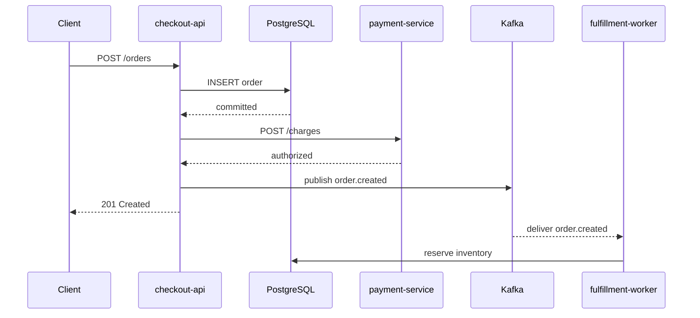
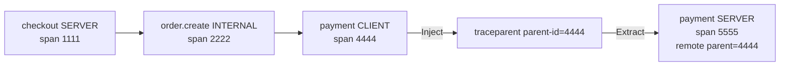

# Сквозной пример trace: HTTP, PostgreSQL и очередь

## Содержание

- [Сценарий](#сценарий)
- [Synchronous trace](#synchronous-trace)
- [Как читать идентификаторы](#как-читать-идентификаторы)
- [Что происходит с traceparent](#что-происходит-с-traceparent)
- [Что экспортирует приложение](#что-экспортирует-приложение)
- [Async processing: parent или link](#async-processing-parent-или-link)
- [Retries, batch и fan-out](#retries-batch-и-fan-out)
- [Корреляция с logs](#корреляция-с-logs)
- [Почему trace бывает неполным](#почему-trace-бывает-неполным)
- [Как проверить пример в UI](#как-проверить-пример-в-ui)
- [Interview-ready answer](#interview-ready-answer)

Этот пример собирает механику tracing в один flow: API создает заказ, обращается к PostgreSQL и payment service, а затем публикует событие для worker. Синхронная часть остается одним trace; отложенная обработка показана отдельным linked trace, чтобы явно обсудить async trade-off.

---

## Сценарий

Компоненты:

- `checkout-api` принимает `POST /orders`;
- PostgreSQL сохраняет заказ;
- `payment-service` авторизует платеж по HTTP;
- producer публикует `order.created`;
- `fulfillment-worker` позже резервирует товар.



Здесь две разные временные модели:

- HTTP и SQL calls блокируют request и естественно образуют parent/child chain;
- worker может запуститься через секунды, повториться или обработать batch, поэтому его связь с request требует явной modeling policy.

---

## Synchronous trace

Пусть API trace получил ID:

```text
4bf92f3577b34da6a3ce929d0e0e4736
```

Waterfall может выглядеть так:

```text
trace_id=4bf92f3577b34da6a3ce929d0e0e4736

POST /orders                              184ms  span=1111111111111111
└─ order.create                           168ms  span=2222222222222222
   ├─ INSERT orders                        54ms  span=3333333333333333
   ├─ POST payment-service/charges         82ms  span=4444444444444444
   │  └─ POST /charges                     74ms  span=5555555555555555
   └─ publish order.created                12ms  span=6666666666666666
```

Линии отражают причинную вложенность, а не обязательную последовательность. На реальном waterfall start/end timestamps показывают, какие children пересекались по времени.

Что видно:

- `POST /orders` — `SERVER` span `checkout-api`;
- `order.create` — `INTERNAL` span use case;
- SQL и outgoing HTTP — `CLIENT` spans;
- `POST /charges` — remote `SERVER` span `payment-service`;
- publish — `PRODUCER` span;
- client/server payment spans отличаются: первый измеряет наблюдение caller, второй — обработку callee, поэтому их durations не обязаны совпасть.

184ms — duration server span, а не сумма всех children. У parent есть собственная работа и интервалы между calls; параллельные children вообще нельзя складывать для получения wall-clock latency.

---

## Как читать идентификаторы

| Поле | Размер в W3C/OTel | Scope | Для чего нужно |
| --- | --- | --- | --- |
| `trace_id` | 16 bytes / 32 hex symbols | Общий для trace | Собирает spans в один trace |
| `span_id` | 8 bytes / 16 hex symbols | Уникален для span | Идентифицирует операцию |
| Parent span ID | 8 bytes / 16 hex symbols | Ссылка на непосредственного parent | Строит дерево |
| Trace flags | 1 byte | Переносится downstream | В частности, sampled bit |
| `tracestate` | Vendor-specific list | Переносится downstream | Дополнительное sampling/vendor state |

У payment server span:

```text
trace_id  = 4bf92f3577b34da6a3ce929d0e0e4736
span_id   = 5555555555555555
parent_id = 4444444444444444
```

Parent — outgoing HTTP client span, а не API server span `1111...`. Хорошая instrumentation создает client span до `Inject`, поэтому downstream получает точную process-boundary связь:

```text
checkout CLIENT span -> payment SERVER span
```

Если отправитель передаст только `trace_id`, backend поймет принадлежность к trace, но потеряет корректную parentage и sampling state. Поэтому вручную придумывать `X-Trace-ID` как замену W3C context недостаточно.

---

## Что происходит с traceparent

Перед вызовом payment service `checkout-api` создает client span `4444...` и inject-ит его SpanContext:

```http
traceparent: 00-4bf92f3577b34da6a3ce929d0e0e4736-4444444444444444-01
```

Формат:

```text
version-trace_id-parent_id-trace_flags
```

Payment service выполняет `Extract` и создает новый server span:

```text
remote parent: 4444444444444444
new span_id:   5555555555555555
```

`01` означает, что sampled bit установлен. Это propagated decision/hint, а не криптографическая гарантия доставки trace: downstream и telemetry pipeline все равно могут применить защитные ограничения или потерять данные.

Полный sync flow:



Incoming context с public edge нельзя считать доверенным identity. Клиент способен подделать header; система может валидировать/сбрасывать context на trust boundary и никогда не должна использовать trace fields для authorization.

---

## Что экспортирует приложение

SDK экспортирует structured span records, а не request body и не «готовую картинку trace». Backend собирает trace по IDs и timestamps.

Условное представление одного span:

```json
{
  "resource": {
    "service.name": "checkout-api",
    "deployment.environment.name": "production"
  },
  "instrumentation_scope": "go.opentelemetry.io/contrib/instrumentation/net/http/otelhttp",
  "trace_id": "4bf92f3577b34da6a3ce929d0e0e4736",
  "span_id": "4444444444444444",
  "parent_span_id": "2222222222222222",
  "name": "POST",
  "kind": "CLIENT",
  "start_time": "2026-08-05T12:00:00.071Z",
  "end_time": "2026-08-05T12:00:00.153Z",
  "status": "UNSET",
  "attributes": {
    "http.request.method": "POST",
    "server.address": "payment-service",
    "server.port": 8080
  }
}
```

Это учебный JSON, а не точный OTLP/JSON wire payload. Реальный OTLP использует protobuf schema, resource spans, scope spans и numeric timestamps.

Каждый процесс отправляет свои spans независимо:

```text
checkout-api SDK ----\
payment-service SDK ---+--> OTel Collector --> Tempo
worker SDK -----------/
```

Collector/Tempo не требуют, чтобы все spans пришли одним batch. Они коррелируют записи по `trace_id`, но late/missing spans могут временно или постоянно давать неполную картину.

---

## Async processing: parent или link

Producer span `6666...` завершается до ответа API. Worker может начать работу через 850ms и обрабатывать ее 238ms. Есть два допустимых способа моделирования.

### Продолжить тот же trace

Consumer извлекает producer context и использует его как remote parent:

```text
trace A: API ... -> PRODUCER -> CONSUMER -> worker operations
```

Плюсы:

- один end-to-end trace;
- простой переход от request к consumer;
- удобно для короткого one-message flow.

Минусы:

- trace duration включает queue delay и может сильно превышать HTTP request;
- replay/retry удлиняет и усложняет дерево;
- batch с несколькими messages не имеет единственного честного parent;
- sampling decision исходного request определяет видимость worker.

### Создать новый trace с link

В нашем примере worker начинает trace:

```text
trace_id=7bba9f33312b3dbb8b2c2c62bb7abe2

process order.created                      238ms  span=7777777777777777
└─ inventory.reserve                       201ms  span=8888888888888888
   └─ UPDATE inventory                     173ms  span=9999999999999999

link:
    trace_id=4bf92f3577b34da6a3ce929d0e0e4736
    span_id=6666666666666666
```

Плюсы:

- background lifecycle отделен от request;
- batch может добавить несколько links;
- retry/replay легче представить отдельными attempts;
- worker sampling можно настроить независимо.

Минусы:

- UI/backend должен поддерживать навигацию по links;
- investigation проходит через два traces;
- команда должна согласовать policy, иначе похожие flows моделируются по-разному.

Практический выбор:

| Ситуация | Обычно удобнее |
| --- | --- |
| Один message, обработка почти сразу, нужен единый critical path | Parent/child continuation |
| Долгая задержка, durable job, replay | Новый trace + link |
| Batch из нескольких messages | Новый span/trace + несколько links |
| Fan-in из независимых requests | Links |

Это не выбор между «правильно» и «неправильно». Главное — единая политика и instrumentation, которая действительно переносит полный SpanContext.

---

## Retries, batch и fan-out

### Retry

Каждая попытка — отдельная операция и отдельный `span_id`:

```text
payment.authorize
├─ attempt 1  ERROR  timeout
└─ attempt 2  UNSET  200
```

Parent use-case может быть успешным, даже если первая попытка failed. Записывайте bounded `retry.attempt`, final outcome и events, но не называйте spans `attempt-<random-id>`.

Не переиспользуйте span после `End` и не отправляйте один и тот же `span_id` для повторной доставки.

### Batch consumer

Если worker обрабатывает 100 messages одним вызовом, один из их contexts не должен случайно становиться parent всего batch. Варианты:

- batch consumer span со links ко всем message contexts;
- отдельный process span на message, если volume и стоимость позволяют;
- batch span + spans только для failed/slow items, если backend model и sampling это поддерживают.

Количество links и spans имеет SDK/backend limits. Огромный batch может потребовать aggregate attributes и отдельные per-item logs/metrics вместо сотен links.

### Fan-out

Когда один request запускает несколько параллельных calls, все client spans — children одного parent. Их durations пересекаются, поэтому:

```text
parent wall time != sum(child durations)
```

Критический путь определяется временной шкалой, а не самым большим арифметическим итогом по service.

---

## Корреляция с logs

Structured logger может извлечь текущие IDs из Go context:

```go
func WithTrace(ctx context.Context, logger *slog.Logger) *slog.Logger {
    spanContext := trace.SpanContextFromContext(ctx)
    if !spanContext.IsValid() {
        return logger
    }

    return logger.With(
        "trace_id", spanContext.TraceID().String(),
        "span_id", spanContext.SpanID().String(),
    )
}
```

Пример лога:

```json
{
  "level": "ERROR",
  "msg": "inventory reservation failed",
  "service": "fulfillment-worker",
  "trace_id": "7bba9f33312b3dbb8b2c2c62bb7abe2",
  "span_id": "8888888888888888",
  "order_id": "ord_84721",
  "error_kind": "insufficient_stock"
}
```

`order_id` здесь допустим только как пример opaque domain ID при одобренной privacy policy. Не добавляйте его автоматически во все telemetry signals.

Correlation workflow:

```text
alert / metric exemplar
    -> trace A (HTTP)
    -> producer span link
    -> trace B (worker)
    -> log by trace_id + span_id
```

Одного `request_id` недостаточно для distributed tracing: он может помочь поиску логов, но не несет parent span и sampling flags.

---

## Почему trace бывает неполным

Missing span не всегда означает баг business code. Возможные причины:

| Симптом | Вероятная причина | Что проверить |
| --- | --- | --- |
| Downstream начал новый trace | Нет Inject/Extract или propagators различаются | Headers/metadata и instrumentation обеих сторон |
| Есть client span, нет server span | Downstream не instrumented или его exporter failed | Service SDK, Collector receive/export metrics |
| Виден server span без client parent | Proxy/service mesh изменил context или caller не instrumented | Hop-by-hop headers и trust-boundary policy |
| Trace обрывается перед shutdown | Batch не flushed | Shutdown order и deadline |
| Ошибки редко находятся | Head sampling отбросил trace | Sampling policy и sampled flag |
| Tail trace неполный | Spans попали в разные sampling shards или пришли поздно | Trace-aware routing, decision wait, dropped spans |
| Нет worker связи | Message headers потеряны или broker client не inject/extract | Serialization и retry/DLQ path |

Также проверьте clock synchronization: backend обычно рисует spans по timestamps разных hosts. Сильный clock skew может создавать визуально невозможный waterfall, хотя parentage корректна.

---

## Как проверить пример в UI

Открыв trace, идите сверху вниз:

1. Проверьте `service.name`, environment и root operation.
2. Сравните root duration с ожидаемым HTTP timing.
3. Найдите самый длинный участок критического пути, а не просто самый длинный span во всем trace.
4. Сравните outgoing `CLIENT` и downstream `SERVER` spans: gap может указывать на network/proxy/queueing.
5. Проверьте error status и exception events.
6. Убедитесь, что route names templated и attributes не содержат PII.
7. Перейдите по link к worker trace или найдите его по linked trace ID.
8. По `trace_id`/`span_id` откройте correlated logs.

Не делайте вывод по одному trace о масштабе проблемы. После локализации вернитесь к metrics и определите, сколько requests затронуто.

---

## Interview-ready answer

**1. Как связаны `trace_id`, `span_id` и parent span ID?**

- `trace_id` — объединяет все spans одного execution path.
- `span_id` — идентифицирует одну конкретную операцию.
- Parent span ID — указывает на непосредственную вызвавшую операцию и строит дерево.

**2. Как context проходит через синхронный remote call?**

- Caller — создает `CLIENT` span и inject-ит его SpanContext в transport headers.
- Callee — извлекает context и создает `SERVER` span с тем же `trace_id` и новым `span_id`.
- Parentage — parent ID server span равен ID client span, а не более раннего handler span.

**3. Как связать producer и consumer через очередь?**

- Single message — короткую обработку можно продолжить как child message creation context.
- Long-running job — отдельный trace со link лучше отделяет background lifecycle от HTTP request.
- Batch — один span не может иметь несколько parents, поэтому contexts отдельных messages передаются через links.

**4. Как моделировать retries и коррелировать traces с logs?**

- Retry — каждая попытка получает новый `span_id` и bounded attempt attribute.
- Logs — structured записи содержат текущие `trace_id` и `span_id` для перехода к trace.
- Security — tracing context можно подделать, поэтому его нельзя использовать для authorization.
