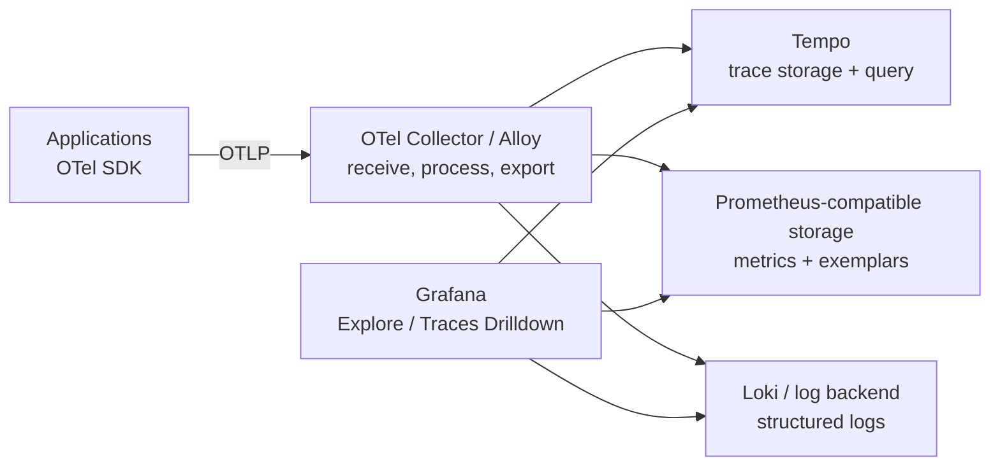
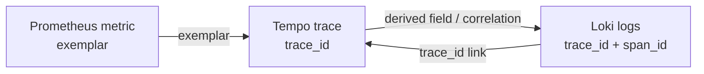

# Grafana Tempo и расследование по traces

## Содержание

- [Роль Tempo в observability stack](#роль-tempo-в-observability-stack)
- [Как найти нужный trace](#как-найти-нужный-trace)
- [Практический TraceQL](#практический-traceql)
- [Как читать waterfall](#как-читать-waterfall)
- [Investigation workflow](#investigation-workflow)
- [Synchronous и asynchronous latency](#synchronous-и-asynchronous-latency)
- [Service graphs и span metrics](#service-graphs-и-span-metrics)
- [Связь с metrics и logs](#связь-с-metrics-и-logs)
- [Диагностика пропавших spans](#диагностика-пропавших-spans)
- [Чего Tempo не дает сам по себе](#чего-tempo-не-дает-сам-по-себе)
- [Типичные ошибки расследования](#типичные-ошибки-расследования)
- [Interview-ready answer](#interview-ready-answer)

Tempo — trace backend: он принимает, хранит и ищет traces, а Grafana дает UI, TraceQL и переходы между telemetry signals. Его главная ценность не в красивом waterfall, а в возможности проверить конкретную гипотезу о critical path, failure propagation или потерянном context.

---

## Роль Tempo в observability stack



Не смешивайте роли:

- OpenTelemetry создает и транспортирует telemetry;
- Collector/Alloy обрабатывает pipeline;
- Tempo хранит и ищет traces;
- Grafana визуализирует и связывает data sources;
- Prometheus-compatible backend хранит aggregate metrics;
- Loki или другой log backend хранит logs.

Приложение может экспортировать прямо в Tempo-compatible OTLP endpoint, но production pipeline через Collector/Alloy обычно удобнее для batching, routing, redaction и sampling.

---

## Как найти нужный trace

Есть три основных входа.

### По точному trace ID

Это самый точный путь. `trace_id` приходит из:

- structured log;
- response/debug metadata по утвержденной policy;
- support ticket или error report;
- link другого trace.

Exact lookup не требует угадывать attributes, но trace мог быть не sampled, удален retention policy или потерян pipeline.

### Из метрики через exemplar

Latency histogram может содержать exemplar с `trace_id`. В Grafana точка на графике ведет к конкретному trace, попавшему в наблюдение.

Важно: exemplar — один пример из множества. Он помогает начать investigation, но не доказывает, что найденный trace представляет весь p95/p99 population.

### Через search / TraceQL

Если ID неизвестен, ищите по сочетанию:

- time range;
- `resource.service.name`;
- environment/namespace;
- route или span name;
- duration;
- status/error;
- bounded domain attribute.

Начинайте с узкого time window и service. Поиск «все ошибки за 30 дней» дороже, медленнее и чаще упирается в result limits.

---

## Практический TraceQL

TraceQL выбирает spans и traces по intrinsic fields, resource/span attributes и структуре trace.

### Операция конкретного сервиса

```traceql
{
    resource.service.name = "checkout-api" &&
    span:name = "POST /orders"
}
```

Если production и staging лежат в одном tenant, добавьте environment attribute. Его точное имя должно совпадать с resource schema вашей instrumentation.

### Slow traces

```traceql
{ trace:rootService = "checkout-api" && trace:duration > 1s }
```

`trace:duration` измеряется как интервал от самого раннего start до самого позднего end среди найденных spans trace. В async trace он может включать queue delay и быть намного больше duration HTTP root span.

### Error spans

```traceql
{
    resource.service.name = "payment-service" &&
    span:status = error
}
```

Результат зависит от корректной error policy instrumentation. Если код вызывает только `RecordError`, но не ставит status, такой запрос его не найдет.

### Ошибка downstream после frontend span

```traceql
{ resource.service.name = "checkout-api" } >> { span:status = error }
```

Оператор `>>` ищет descendant relationship, а не просто два несвязанных spans в одном временном окне.

### Trace с PostgreSQL

```traceql
{ resource.service.name = "checkout-api" } && { span.db.system.name = "postgresql" }
```

Перед копированием query откройте реальный span и проверьте attribute names. Semantic conventions и instrumentation versions могут отличаться; Tempo не переименует старые attributes автоматически.

### По link между async traces

```traceql
{ link:traceID = "4bf92f3577b34da6a3ce929d0e0e4736" }
```

Так можно найти worker trace, который связан с producer span исходного HTTP trace.

Практика построения query:

1. Начать с service и короткого time range.
2. Добавить operation/status/duration.
3. Проверить один результат и реальные attributes.
4. Только потом использовать structural operators и широкие conditions.

TraceQL — investigation language, а не замена PromQL для стабильных SLO dashboards.

---

## Как читать waterfall

Waterfall — временная шкала, а не flame graph и не profiler.

### Начните с root и critical path

Спросите:

1. Какая операция считается пользовательским request/job?
2. Какова ее wall-clock duration?
3. Какая последовательность spans определяет самый поздний ответ?
4. Где есть gaps без child spans?

Самый широкий span не всегда root cause. Он может просто оборачивать детей или ждать параллельную работу.

### Parent duration не равна сумме children

```text
parent: 0ms -------------------------------- 100ms
child A:    10ms -------- 60ms
child B:          30ms -------- 80ms
```

Children суммарно занимают 100ms, но пересекаются на 30ms. Parent wall time остается 100ms. «Self time» нужно считать по объединению child intervals, а не вычитать простую сумму.

### Сравнивайте client/server пару

Для remote HTTP call обычно есть:

```text
caller CLIENT span:  82ms
callee SERVER span:  74ms
```

Разница включает network, proxies, queueing, serialization и instrumentation boundaries. Это не точное измерение one-way network latency. Clock skew между hosts тоже может исказить визуальное положение spans.

### Ищите gaps

Длинный участок parent без child spans может означать:

- CPU/business work без instrumentation;
- ожидание lock/channel;
- неинструментированный dependency;
- scheduler pause или GC;
- потерянный context;
- просто намеренно крупную internal operation.

Trace формулирует следующую гипотезу. Для CPU/allocations нужен profiler, для lock contention — runtime/block/mutex profiles и metrics.

### Читайте status и events в контексте

Ошибка child span не обязана сделать root failed: retry мог завершиться успешно или операция была best-effort. И наоборот, root `Error` без failed child может означать domain/handler error либо неполную instrumentation.

Проверяйте:

- status description;
- exception events;
- HTTP/gRPC status attributes;
- retry attempts;
- cancellation/deadline;
- correlated logs.

---

## Investigation workflow

Рассмотрим alert: p95 `POST /orders` вырос с 300ms до 1.4s.

### 1. Подтвердить aggregate-сигнал

В metrics проверьте:

- affected route и environment;
- error rate;
- начало и длительность деградации;
- все pods или один instance;
- downstream RED metrics;
- deploy/config events рядом по времени.

Не переходите сразу к случайному trace: сначала сузьте population.

### 2. Получить несколько traces

Лучший вариант — exemplars из slow buckets. Если их нет, TraceQL:

```traceql
{
    resource.service.name = "checkout-api" &&
    span:name = "POST /orders" &&
    span:duration > 1s
}
```

Сравните несколько slow traces с несколькими normal traces. Один outlier может быть cold start, retry или отдельный tenant и не объяснять общий p95.

### 3. Найти diverging span

Допустим, slow traces показывают:

```text
POST /orders                    1.42s
└─ order.create                 1.37s
   ├─ INSERT orders              55ms
   ├─ POST payment/charges      1.24s
   └─ publish order.created      14ms
```

DB и broker стабильны, payment client span доминирует. Теперь сравните payment server span:

- server тоже 1.2s — проблема внутри payment service;
- server 100ms, client 1.24s — исследуйте connection pool, DNS, proxy, network, retries и clock skew;
- server span отсутствует — проверьте propagation, sampling и telemetry pipeline, прежде чем винить сеть.

### 4. Перейти в logs и metrics downstream

По `trace_id`/`span_id` найдите payment logs. По metrics проверьте масштаб: saturation pool, dependency latency, error rate. Trace локализует hop, а aggregate signals подтверждают гипотезу.

### 5. Зафиксировать доказательство

В incident timeline сохраните:

- query/time range;
- trace IDs без sensitive payload;
- affected services/routes;
- сравнение normal vs slow;
- подтверждающие metrics/logs;
- неизвестные и sampling caveats.

Формулировка «в одном trace payment был медленный» слабее, чем «в 8 из 10 sampled slow traces client span payment занимал >80% critical path; payment server latency и pool saturation выросли одновременно».

---

## Synchronous и asynchronous latency

Для HTTP request root span обычно близок к user-visible server latency. Для queue flow нужно разделять:

```text
end-to-end event latency = queue delay + processing duration + retries/backoff
```

Producer span измеряет publish call, а не время до завершения consumer. Consumer/process span измеряет обработку, но queue delay виден только если есть message creation/enqueue timestamp либо trace structure, которая корректно связывает этапы.

Async investigation questions:

- Когда message был создан и когда processing начался?
- Это первая доставка или retry/replay?
- Один message или batch?
- Producer context продолжен parent/child или через link?
- Где заканчивается broker responsibility и начинается worker queueing?
- Не исказил ли trace duration долгий idle gap?

Не называйте producer span «Kafka занял 20 секунд», если 15ms ушло на publish, а 19.985s message ждал consumer capacity. Это разные operational bottlenecks.

---

## Service graphs и span metrics

Service graph — aggregate-представление отношений между services, построенное из traces. В Grafana/Tempo для него нужны сгенерированные metrics: Tempo metrics-generator или Alloy обрабатывает spans и пишет series в Prometheus-compatible backend.

```text
traces -> metrics generator -> Prometheus-compatible storage -> Grafana service graph
```

Поэтому сообщение `No service graph data` не доказывает отсутствие traces. Возможны:

- metrics-generator/Alloy не настроен;
- Tempo data source не связан с metrics data source;
- client/server или producer/consumer pairs неполны;
- отсутствуют корректные `service.name`/span kinds;
- sampling удалил одну сторону edge;
- high cardinality или processor limits привели к drops.

Service graph показывает topology, request rate, error rate и latency по edges, но это derived metrics. Sampling и неполные traces могут смещать значения. Для SLO используйте authoritative application metrics либо явно доказанную sampling-aware методологию.

---

## Связь с metrics и logs

Хорошо настроенная Grafana navigation сокращает ручное копирование IDs:



Проверьте end-to-end:

- application histogram действительно записывает exemplars при sampled context;
- Prometheus-compatible storage сохраняет exemplars;
- Grafana data source знает Tempo target;
- logs содержат IDs как structured fields, а не только внутри message;
- formatting IDs совпадает: lowercase hex без префиксов;
- retention windows signals пересекаются.

Если logs хранятся 30 дней, а traces 24 часа, старый log link закономерно не откроет trace.

---

## Диагностика пропавших spans

Идите по pipeline, а не только по UI:

```text
instrumentation -> SDK processor/queue -> exporter -> Collector receiver
    -> Collector processors/queue -> Tempo ingest -> query/search -> Grafana
```

### На стороне приложения

- provider зарегистрирован до создания instrumented clients;
- нужный sampler записывает trace;
- span завершен;
- context передан в call;
- provider успевает shutdown/flush;
- exporter endpoint/TLS/headers корректны;
- SDK queue не переполнена.

### На transport boundary

- `traceparent`/metadata/message headers присутствуют после inject;
- proxy/broker serializer их не удаляет;
- downstream использует совместимый propagator;
- context не сбрасывается policy на trust boundary;
- retry/DLQ копирует нужные headers осознанно.

### В Collector

- receiver принимает spans;
- processors не фильтруют нужный service;
- memory limiter, batch и queues не дропают данные;
- tail sampling получил полный trace и принял ожидаемое решение;
- exporter retries/queue выдерживают outage Tempo;
- internal telemetry Collector наблюдается отдельно.

### В Tempo/Grafana

- tenant/auth headers совпадают при write и query;
- time range и timezone корректны;
- exact trace lookup и TraceQL search проверены отдельно;
- retention еще не удалила trace;
- data source указывает на нужное environment/tenant;
- search result limit не скрывает нужный trace.

Telemetry pipeline работает с потерями; цель диагностики — найти конкретный hop и измерить loss, а не предполагать, что «Grafana не показывает» равно «SDK не создал».

---

## Чего Tempo не дает сам по себе

Tempo не заменяет:

- Prometheus для точного aggregate rate/error/latency и SLO alerting;
- logs для подробного domain context и audit trail;
- profiler для CPU, allocations, goroutine/lock contention;
- synthetics/RUM для user-perceived frontend experience;
- business event storage для exactly-once/audit semantics.

Trace — sampled operational evidence. Он не является полным журналом всех бизнес-операций и не должен использоваться как audit database.

---

## Типичные ошибки расследования

### Делать вывод по одному trace

Один trace генерирует гипотезу. Сверьте ее с несколькими traces и aggregate metrics.

### Складывать durations children

Параллельные spans пересекаются. Анализируйте critical path и intervals.

### Считать client-server difference чистой сетью

В разнице есть разные instrumentation boundaries, proxies, queues и clock skew.

### Искать только `status = error`

Instrumentation могла не выставить status, а business failure мог остаться `Unset`. Добавьте protocol/domain attributes и logs.

### Считать отсутствие span доказательством отсутствия call

Sampling, propagation bugs, exporter loss и retention тоже дают missing span.

### Использовать TraceQL как SLO engine

Trace search полезен для investigation, но sampled traces и query cost делают Prometheus metrics надежнее для continuous alerting.

---

## Interview-ready answer

**1. Какую роль выполняет Tempo?**

- Tempo — хранит и ищет distributed traces.
- Grafana — предоставляет Explore, TraceQL и переходы между traces, metrics и logs.
- OpenTelemetry — создает и экспортирует telemetry, но не является trace storage.

**2. Как расследовать latency через traces?**

- Шаг 1 — определить route, time window и affected population по metrics.
- Шаг 2 — перейти по exemplar или найти несколько slow traces через TraceQL.
- Шаг 3 — сравнить normal и slow traces и локализовать diverging span на critical path.
- Шаг 4 — подтвердить гипотезу downstream metrics и correlated logs.

**3. Как правильно читать waterfall?**

- Critical path — определяет wall-clock latency; durations параллельных children нельзя просто складывать.
- Client/server pair — разница включает network, proxies, queueing, разные boundaries и возможный clock skew.
- Missing span — может означать propagation bug, sampling или telemetry loss, а не отсутствие вызова.

**4. Что важно помнить про service graphs и поиск?**

- Service graph — derived metrics из traces, для которых нужны metrics-generator/Alloy и Prometheus-compatible storage.
- Sampling — влияет на полноту traces и может смещать derived statistics.
- TraceQL — подходит для investigation, а continuous SLO alerting обычно строится на Prometheus metrics.
