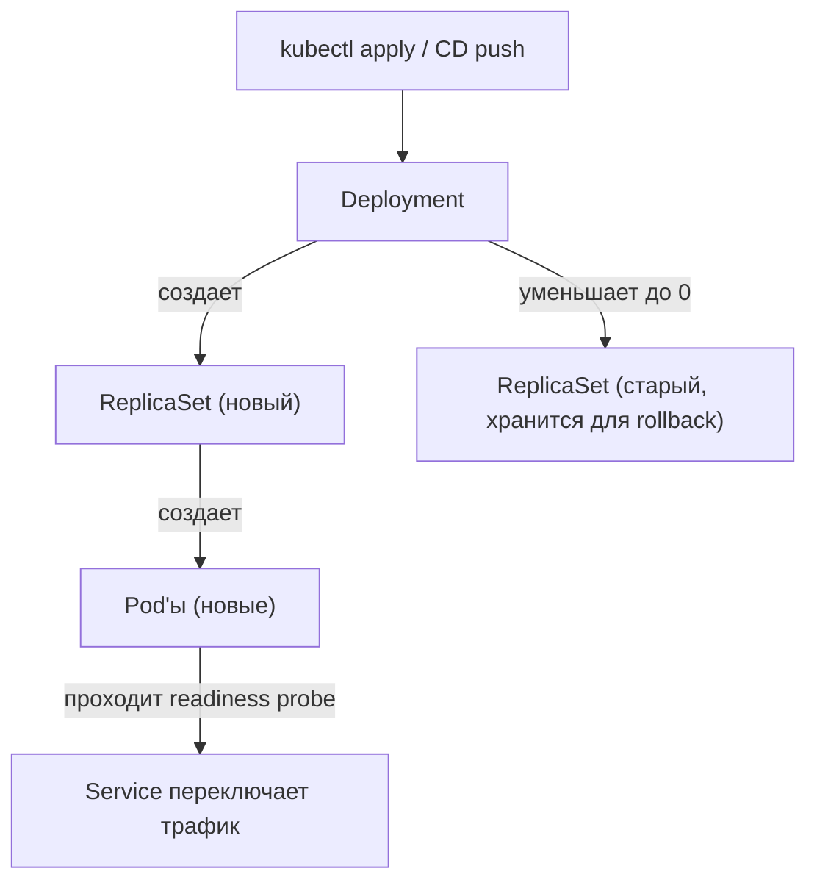

# Core Objects And Deployment Flow

## Содержание

- [Deployment](#deployment)
- [ReplicaSet](#replicaset)
- [Service](#service)
- [ConfigMap и Secret](#configmap-и-secret)
- [HPA](#hpa)
- [PodDisruptionBudget](#poddisruptionbudget)
- [Deployment flow](#deployment-flow)
- [Interview-ready answer](#interview-ready-answer)

## Deployment

`Deployment` — основной объект для stateless сервиса. Описывает желаемое состояние: image, число реплик, resource limits, probes, стратегию обновления.

```yaml
apiVersion: apps/v1
kind: Deployment
metadata:
  name: api-server
spec:
  replicas: 3
  selector:
    matchLabels:
      app: api-server
  strategy:
    type: RollingUpdate
    rollingUpdate:
      maxSurge: 1        # сколько Pod'ов можно добавить сверх replicas во время rollout
      maxUnavailable: 0  # ни один Pod не должен пропасть во время rollout
  template:
    metadata:
      labels:
        app: api-server
    spec:
      containers:
        - name: api
          image: myrepo/api-server:v1.2.3
          ports:
            - containerPort: 8080
          resources:
            requests:
              cpu: "100m"
              memory: "128Mi"
            limits:
              cpu: "500m"
              memory: "256Mi"
          readinessProbe:
            httpGet:
              path: /readyz
              port: 8080
            initialDelaySeconds: 5
            periodSeconds: 5
          livenessProbe:
            httpGet:
              path: /healthz
              port: 8080
            initialDelaySeconds: 15
            periodSeconds: 10
          env:
            - name: DB_DSN
              valueFrom:
                secretKeyRef:
                  name: api-secrets
                  key: db_dsn
            - name: APP_ENV
              valueFrom:
                configMapKeyRef:
                  name: api-config
                  key: app_env
      terminationGracePeriodSeconds: 30
```

Ключевые параметры:
- `replicas` — желаемое число Pod'ов;
- `maxUnavailable: 0` — zero-downtime rollout: новый Pod поднимается и проходит readiness, потом убивается старый;
- `resources.requests` — минимальные ресурсы для планировщика (без этого HPA не работает);
- `resources.limits` — жесткий потолок (превышение memory = `OOMKilled`);
- `terminationGracePeriodSeconds` — время на graceful shutdown перед SIGKILL.

## ReplicaSet

`ReplicaSet` создается Deployment автоматически. Держит нужное число Pod'ов живыми. Каждый новый deploy (изменение template) создает новый ReplicaSet — старый сохраняется с `replicas: 0` для возможности rollback.

Прямое создание ReplicaSet не нужно: всегда используй Deployment.

## Service

`Service` дает стабильную точку доступа к Pod'ам. Pod'ы могут пересоздаваться с новыми IP — Service скрывает эту нестабильность.

```yaml
apiVersion: v1
kind: Service
metadata:
  name: api-server
spec:
  selector:
    app: api-server
  ports:
    - port: 80
      targetPort: 8080
  type: ClusterIP
```

Типы Service:
- `ClusterIP` — доступен только внутри кластера (default, для межсервисного взаимодействия);
- `NodePort` — открывает порт на каждой ноде;
- `LoadBalancer` — запрашивает облачный LB для внешнего трафика.

Внутри кластера Service доступен по DNS: `api-server.namespace.svc.cluster.local` или просто `api-server` в том же namespace.

## ConfigMap и Secret

`ConfigMap` хранит non-secret конфигурацию. `Secret` — чувствительные данные (base64-encoded; в etcd без дополнительной настройки хранятся как plaintext — для production рекомендуется encryption at rest или внешний vault).

```yaml
apiVersion: v1
kind: ConfigMap
metadata:
  name: api-config
data:
  app_env: "production"
  log_level: "info"
  max_connections: "50"
```

```yaml
apiVersion: v1
kind: Secret
metadata:
  name: api-secrets
type: Opaque
data:
  db_dsn: cG9zdGdyZXM6Ly91c2VyOnBhc3NAaG9zdC9kYg==  # base64
```

Два способа пробросить в контейнер:

**Как env vars** (как в примере Deployment выше) — просто, сразу видны в `kubectl exec`. Минус: смена значения требует rollout Pod'ов.

**Как volume mount** — файл в контейнере; при обновлении ConfigMap файл обновляется в живом Pod без rollout (задержка ~1 минута), но приложение должно уметь его перечитывать.

```yaml
spec:
  containers:
    - name: api
      volumeMounts:
        - name: config-volume
          mountPath: /etc/app/config
  volumes:
    - name: config-volume
      configMap:
        name: api-config
```

Правило: image должен быть immutable — никаких hardcoded env-specific значений в образе.

## HPA

`HorizontalPodAutoscaler` автоматически меняет число реплик на основе метрик.

```yaml
apiVersion: autoscaling/v2
kind: HorizontalPodAutoscaler
metadata:
  name: api-server
spec:
  scaleTargetRef:
    apiVersion: apps/v1
    kind: Deployment
    name: api-server
  minReplicas: 2
  maxReplicas: 10
  metrics:
    - type: Resource
      resource:
        name: cpu
        target:
          type: Utilization
          averageUtilization: 70
```

HPA работает только если Pod'ы имеют `resources.requests`. Без requests метрика утилизации не считается.

Ограничение: при резком spike задержка на spin-up новых Pod'ов составляет ~30–60 секунд — Go-сервисы с быстрым стартом справляются лучше, чем JVM-приложения.

## PodDisruptionBudget

`PodDisruptionBudget` (PDB) ограничивает число Pod'ов, которые можно одновременно убрать при voluntary disruption — drain ноды, обновление кластера, eviction.

```yaml
apiVersion: policy/v1
kind: PodDisruptionBudget
metadata:
  name: api-server-pdb
spec:
  minAvailable: 2
  selector:
    matchLabels:
      app: api-server
```

Без PDB при `kubectl drain node` все Pod'ы на ноде могут быть убраны одновременно — даже если у тебя 3 реплики, 2 из которых на этой ноде.

## Deployment flow



При rolling update (`maxUnavailable: 0`, `maxSurge: 1`):
1. Создается новый ReplicaSet.
2. Стартует один новый Pod.
3. Kubernetes ждет, пока readiness probe успешно пройдет.
4. Только после этого удаляется один старый Pod.
5. Повторять до полной замены.

Откат:

```bash
kubectl rollout undo deployment/api-server
kubectl rollout undo deployment/api-server --to-revision=3
kubectl rollout history deployment/api-server
```

## Interview-ready answer

Базовая цепочка: Deployment управляет ReplicaSet, ReplicaSet держит Pod'ы живыми. Service дает стабильный DNS и балансирует трафик — Pod'ы могут пересоздаваться с новыми IP, Service это скрывает. ConfigMap и Secret хранят runtime-конфиг отдельно от image. При rolling update Kubernetes создает новый ReplicaSet и постепенно переключает трафик, дожидаясь readiness probe перед удалением старых Pod'ов — поэтому readiness probe критичен для zero-downtime deploy. HPA масштабирует число реплик по CPU или custom metrics, но требует наличия resources.requests. PDB гарантирует, что при maintenance кластера не упадет слишком много Pod'ов одновременно.
