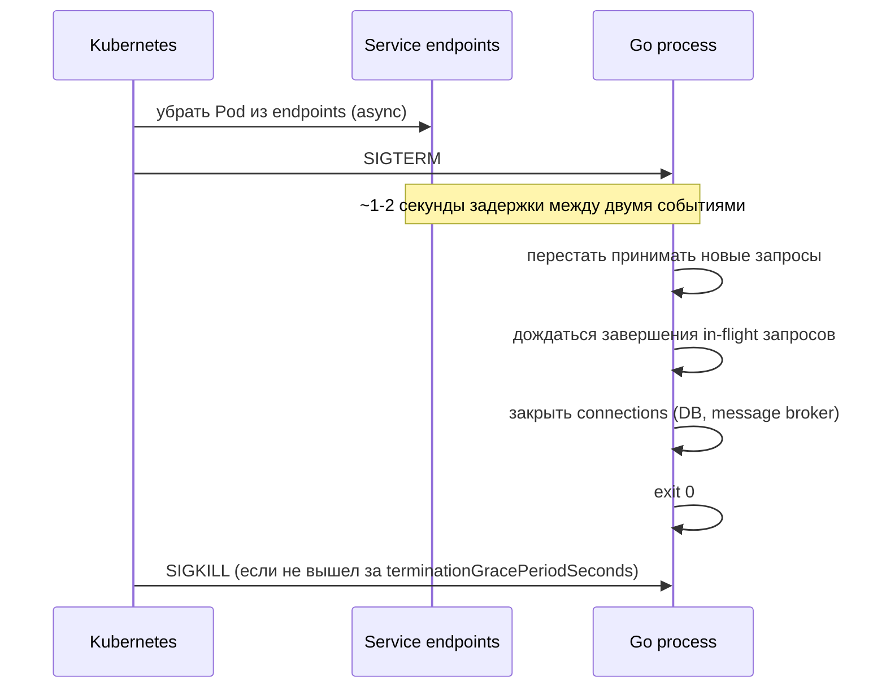

# Probes и Graceful Shutdown в Go

Этот файл — Go-специфичная часть Kubernetes: как реализовать health endpoints, как обрабатывать SIGTERM и как правильно завершать работу без потери запросов.

## Содержание

- [Три типа probes](#три-типа-probes)
- [Readiness vs Liveness: в чем разница](#readiness-vs-liveness-в-чем-разница)
- [Startup probe: для медленных сервисов](#startup-probe-для-медленных-сервисов)
- [Go HTTP handlers для probes](#go-http-handlers-для-probes)
- [Что проверять в readiness](#что-проверять-в-readiness)
- [Graceful shutdown: как SIGTERM доходит до Go](#graceful-shutdown-как-sigterm-доходит-до-go)
- [Полный graceful shutdown в Go](#полный-graceful-shutdown-в-go)
- [Resources, limits и Go runtime](#resources-limits-и-go-runtime)
- [Interview-ready answer](#interview-ready-answer)

## Три типа probes

| Probe | Когда срабатывает | Эффект при провале |
|---|---|---|
| `startupProbe` | при старте контейнера, до первого успеха | перезапуск контейнера |
| `readinessProbe` | периодически во время работы | Pod убирается из endpoints Service |
| `livenessProbe` | периодически во время работы | перезапуск контейнера |

Типы проверок: `httpGet`, `tcpSocket`, `exec` (команда в контейнере), `grpc`.

## Readiness vs Liveness: в чем разница

**readinessProbe** отвечает на вопрос "готов ли Pod принимать трафик прямо сейчас".

Провал readiness НЕ перезапускает контейнер — он только убирает Pod из Service endpoints. Это правильное поведение для временной недоступности: приложение перегружено, connection pool исчерпан, dependency временно недоступна.

**livenessProbe** отвечает на вопрос "жив ли контейнер вообще".

Провал liveness — это признак неисправимого состояния: deadlock, hang, zombie process. Kubernetes перезапускает контейнер. Если liveness проверяет то же, что readiness, — при временной перегрузке сервис начнет циклически перезапускаться, вместо того чтобы подождать и восстановиться.

Правило:
- `readinessProbe` — проверяет готовность принимать трафик (может временно провалиться);
- `livenessProbe` — проверяет только базовую жизнеспособность процесса, порог должен быть мягким.

Плохо: делать livenessProbe, которая проверяет доступность базы данных. DB временно недоступна → liveness провалится → контейнер перезапустится → DB все еще недоступна → бесконечный CrashLoopBackOff.

## Startup probe: для медленных сервисов

Go-сервисы стартуют быстро, но иногда нужна инициализация: загрузка кэша, прогрев соединений, database migration.

`startupProbe` дает приложению время на старт до того, как начнут работать readiness и liveness:

```yaml
startupProbe:
  httpGet:
    path: /healthz
    port: 8080
  failureThreshold: 30  # 30 попыток
  periodSeconds: 2      # каждые 2 секунды = до 60 секунд на старт
```

После первого успешного `startupProbe` Kubernetes переключается на `readinessProbe` и `livenessProbe`.

## Go HTTP handlers для probes

Стандартный подход: два отдельных endpoint.

```go
package main

import (
    "context"
    "net/http"
    "sync/atomic"
)

type HealthHandler struct {
    ready atomic.Bool // выставляется в true после завершения инициализации
    db    DBPinger
}

// /healthz — liveness: процесс жив, HTTP работает
func (h *HealthHandler) Liveness(w http.ResponseWriter, r *http.Request) {
    w.WriteHeader(http.StatusOK)
}

// /readyz — readiness: готов ли принимать трафик
func (h *HealthHandler) Readiness(w http.ResponseWriter, r *http.Request) {
    if !h.ready.Load() {
        http.Error(w, "not ready: initializing", http.StatusServiceUnavailable)
        return
    }

    ctx, cancel := context.WithTimeout(r.Context(), 2*time.Second)
    defer cancel()

    if err := h.db.PingContext(ctx); err != nil {
        http.Error(w, "not ready: db unavailable", http.StatusServiceUnavailable)
        return
    }

    w.WriteHeader(http.StatusOK)
}
```

Регистрация на отдельном административном порту (не на основном API):

```go
adminMux := http.NewServeMux()
adminMux.HandleFunc("/healthz", health.Liveness)
adminMux.HandleFunc("/readyz", health.Readiness)

adminServer := &http.Server{
    Addr:    ":9090",
    Handler: adminMux,
}
```

Почему отдельный порт:
- admin-трафик не попадает в access logs основного API;
- можно не добавлять auth middleware на /healthz;
- Service selector может указывать на основной порт, а probe — на admin.

YAML для двух портов:

```yaml
containers:
  - name: api
    ports:
      - name: http
        containerPort: 8080
      - name: admin
        containerPort: 9090
    readinessProbe:
      httpGet:
        path: /readyz
        port: admin
      initialDelaySeconds: 5
      periodSeconds: 5
      failureThreshold: 3
    livenessProbe:
      httpGet:
        path: /healthz
        port: admin
      initialDelaySeconds: 15
      periodSeconds: 10
      failureThreshold: 3
```

## Что проверять в readiness

Хороший readiness endpoint проверяет только то, без чего сервис не может обрабатывать запросы:

- connection pool к базе данных — `db.PingContext`;
- cache разогрет (если сервис не работает без него);
- флаг завершения инициализации.

Не стоит проверять:
- внешние сервисы, которые могут временно быть недоступны (тогда readiness будет провалена при проблемах у зависимостей, а не у нашего сервиса);
- бизнес-метрики типа "очередь пустая".

## Graceful shutdown: как SIGTERM доходит до Go

При `kubectl delete pod` или rolling update Kubernetes посылает `SIGTERM` главному процессу в контейнере.

Последовательность событий:



Проблема без graceful shutdown: Pod уже получил SIGTERM и начал завершаться, но Service endpoints обновляются с задержкой ~1–2 секунды. В этот момент новые запросы ещё могут приходить в Pod — и получать connection refused.

Решение: добавить небольшой `sleep` перед началом shutdown или настроить `preStop` hook.

## Полный graceful shutdown в Go

```go
package main

import (
    "context"
    "log/slog"
    "net/http"
    "os"
    "os/signal"
    "syscall"
    "time"
)

func main() {
    health := &HealthHandler{db: db}
    health.ready.Store(false)

    // основной сервер
    apiServer := &http.Server{
        Addr:    ":8080",
        Handler: apiRouter(),
    }

    // admin-сервер для probes
    adminServer := &http.Server{
        Addr:    ":9090",
        Handler: adminRouter(health),
    }

    // запускаем серверы в горутинах
    go func() {
        if err := apiServer.ListenAndServe(); err != http.ErrServerClosed {
            slog.Error("api server error", "err", err)
            os.Exit(1)
        }
    }()
    go func() {
        if err := adminServer.ListenAndServe(); err != http.ErrServerClosed {
            slog.Error("admin server error", "err", err)
            os.Exit(1)
        }
    }()

    // завершение инициализации — Pod становится ready
    health.ready.Store(true)
    slog.Info("server ready")

    // ждем сигнала
    quit := make(chan os.Signal, 1)
    signal.Notify(quit, syscall.SIGTERM, syscall.SIGINT)
    <-quit

    slog.Info("shutdown signal received")

    // сначала снимаем readiness — Pod уходит из Service endpoints
    health.ready.Store(false)

    // небольшая пауза: даем kube-proxy/iptables обновить endpoints
    time.Sleep(5 * time.Second)

    // останавливаем серверы с таймаутом
    ctx, cancel := context.WithTimeout(context.Background(), 20*time.Second)
    defer cancel()

    if err := apiServer.Shutdown(ctx); err != nil {
        slog.Error("api server shutdown error", "err", err)
    }
    if err := adminServer.Shutdown(ctx); err != nil {
        slog.Error("admin server shutdown error", "err", err)
    }

    // закрываем другие ресурсы: DB pool, message broker, background workers
    db.Close()

    slog.Info("shutdown complete")
}
```

Ключевые шаги:
1. `health.ready.Store(false)` — Pod выходит из endpoints Service;
2. `time.Sleep(5s)` — ждем, пока kube-proxy распространит изменение;
3. `server.Shutdown(ctx)` — ждем завершения in-flight запросов, не принимаем новые;
4. закрываем DB pool и другие ресурсы.

Манифест для согласованности с `terminationGracePeriodSeconds`:

```yaml
spec:
  terminationGracePeriodSeconds: 30  # должно быть > sleep(5) + Shutdown timeout
  containers:
    - name: api
      lifecycle:
        preStop:
          exec:
            command: ["/bin/sh", "-c", "sleep 5"]  # альтернатива sleep в коде
```

`preStop` hook выполняется до отправки SIGTERM — это гарантирует паузу даже если код приложения не делает sleep.

## Resources, limits и Go runtime

`requests` и `limits` влияют на Go runtime напрямую.

**Memory**: превышение `limits.memory` → `OOMKilled`. Go GC работает относительно агрессивно, но если сервис держит большие буферы или кэши, нужно правильно выбирать `GOGC` или задать `GOMEMLIMIT`:

```yaml
env:
  - name: GOMEMLIMIT
    value: "200MiB"  # чуть ниже limits.memory = 256Mi
```

`GOMEMLIMIT` (Go 1.19+) заставляет GC работать агрессивнее до достижения лимита — это снижает риск OOMKill при memory spike.

**CPU**: `limits.cpu` — это throttle, не изоляция. Go runtime видит все ядра ноды через `runtime.NumCPU()`. При жестком CPU throttle (e.g., `limits.cpu: 100m` на 4-ядерной ноде) горутины планировщика не получают достаточно времени, что приводит к latency spikes.

Решение:

```yaml
env:
  - name: GOMAXPROCS
    value: "1"  # явно ограничить
```

Или использовать библиотеку `go.uber.org/automaxprocs`, которая автоматически устанавливает `GOMAXPROCS` на основе CPU quota.

Рекомендации:
- `requests.cpu` = нормальная нагрузка;
- `limits.cpu` = 2–4× от requests или не устанавливать (controversial);
- `requests.memory` ≈ `limits.memory` для предсказуемости планировщика;
- задавать `GOMEMLIMIT` чуть ниже `limits.memory`.

## Interview-ready answer

Readiness probe отвечает за то, готов ли Pod принимать трафик: при провале Pod убирается из Service endpoints без перезапуска. Liveness probe отвечает за жизнеспособность процесса: при провале контейнер перезапускается. Нельзя проверять в liveness то же, что в readiness — иначе временная недоступность зависимости вызовет CrashLoopBackOff. В Go реализую два HTTP endpoint на отдельном admin-порту: `/healthz` для liveness просто возвращает 200, `/readyz` проверяет DB ping и флаг готовности. При SIGTERM сначала сбрасываю readiness, жду ~5 секунд пока kube-proxy обновит endpoints, потом вызываю `server.Shutdown` с контекстом — это позволяет дообработать in-flight запросы. Для Go нужно настроить `GOMEMLIMIT` чуть ниже `limits.memory` и проверить `GOMAXPROCS` при CPU throttling — иначе scheduler Go runtime будет видеть все ядра ноды при реально выделенных 200m CPU.
