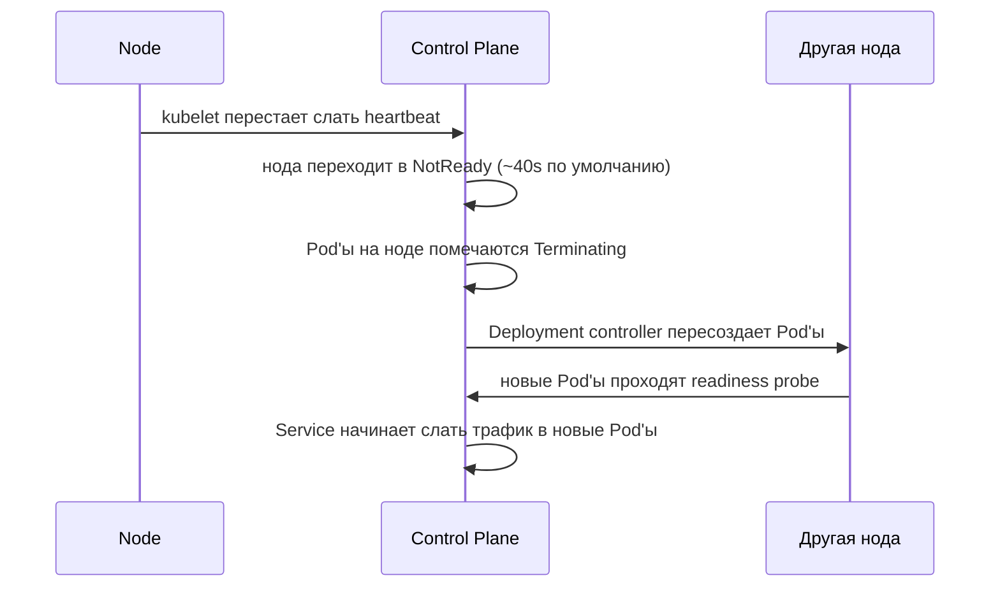

# Node Failure, Rollout And Config Delivery

## Содержание

- [Что такое Node](#что-такое-node)
- [Что происходит при падении ноды](#что-происходит-при-падении-ноды)
- [Почему несколько реплик и разные ноды](#почему-несколько-реплик-и-разные-ноды)
- [Rolling update стратегия](#rolling-update-стратегия)
- [Probes и их роль в rollout](#probes-и-их-роль-в-rollout)
- [Config delivery](#config-delivery)
- [Interview-ready answer](#interview-ready-answer)

## Что такое Node

`Node` — машина (VM, физический сервер, cloud instance), на которой реально запускаются Pod'ы.

Компоненты на каждой ноде:
- `kubelet` — агент, который запускает и следит за Pod'ами по указанию control plane;
- container runtime (containerd, CRI-O);
- `kube-proxy` или CNI-плагин для сетевого слоя.

Control plane (kube-apiserver, etcd, scheduler, controller-manager) обычно живет отдельно от worker nodes.

## Что происходит при падении ноды



Важные тайминги по умолчанию:
- нода считается `NotReady` через ~40 секунд без heartbeat;
- Pod'ы эвакуируются через `node-monitor-grace-period` + `pod-eviction-timeout` — суммарно до ~5–6 минут в стандартной конфигурации.

Это время можно сократить через tolerations и настройку controller manager, но для большинства сервисов важнее иметь несколько реплик.

## Почему несколько реплик и разные ноды

Одна реплика — single point of failure:
- Pod упал → downtime до пересоздания (~секунды, но трафик теряется);
- нода упала → downtime до эвакуации (~5 минут).

Две реплики на разных нодах:
- Pod упал → Service немедленно переключает трафик на вторую реплику;
- нода упала → Service переключает трафик, новый Pod поднимается в фоне.

Чтобы реплики гарантированно оказались на разных нодах:

```yaml
spec:
  affinity:
    podAntiAffinity:
      requiredDuringSchedulingIgnoredDuringExecution:
        - labelSelector:
            matchLabels:
              app: api-server
          topologyKey: kubernetes.io/hostname
```

Без `podAntiAffinity` scheduler может разместить все реплики на одной ноде — тогда её падение положит весь сервис.

## Rolling update стратегия

```yaml
strategy:
  type: RollingUpdate
  rollingUpdate:
    maxSurge: 1        # временно разрешить replicas+1 Pod'ов
    maxUnavailable: 0  # нельзя иметь меньше replicas Pod'ов
```

`maxUnavailable: 0` + `maxSurge: 1` — самая безопасная стратегия:
- сначала поднимается новый Pod;
- проходит readiness probe;
- только после этого убивается старый.

Замедляет rollout, но гарантирует zero-downtime.

`maxUnavailable: 1` + `maxSurge: 0` — быстрее, но временно одной реплики нет.

Откат:

```bash
kubectl rollout undo deployment/api-server
kubectl rollout undo deployment/api-server --to-revision=3
kubectl rollout history deployment/api-server
```

## Probes и их роль в rollout

Kubernetes использует три типа probe:

| Probe | Что делает при провале |
|---|---|
| `readinessProbe` | убирает Pod из endpoints Service (трафик не идет) |
| `livenessProbe` | перезапускает контейнер |
| `startupProbe` | блокирует liveness/readiness до готовности приложения |

Для rolling update критичен `readinessProbe`: Kubernetes не удаляет старый Pod, пока новый не пройдет readiness.

Без readiness probe — трафик идет в Pod сразу после старта контейнера, до того как приложение реально готово принимать запросы. Результат: 502/503 в начале каждого deploy.

Подробно про реализацию probes в Go и graceful shutdown — в [04-probes-and-graceful-shutdown.md](./04-probes-and-graceful-shutdown.md).

## Config delivery

Нормальный CI/CD flow:

1. CI собирает image без environment-specific значений — image immutable.
2. Конфиги живут в `ConfigMap`, секреты в `Secret`.
3. CD деплоит манифесты через `kubectl apply` или Helm.
4. При изменении Deployment или ConfigMap делается rollout.

Два способа получить значение в Pod:

**Env vars** — просто, сразу видны в `kubectl exec`. Смена значения требует rollout.

**Volume mount** — при обновлении ConfigMap файл обновляется в живом Pod без rollout (задержка ~1 минута). Приложение должно уметь перечитывать файл.

Для секретов в production многие команды предпочитают внешние менеджеры (HashiCorp Vault, AWS Secrets Manager) с CSI-драйвером — тогда секрет в etcd не хранится в plaintext.

Практическое правило: никаких `APP_ENV=production` в Dockerfile, никакого hardcoded DSN в image.

## Interview-ready answer

При падении ноды kubelet перестает слать heartbeat, control plane переводит ноду в `NotReady`, Deployment controller пересоздает Pod'ы на других нодах. Суммарно это занимает несколько минут, поэтому критично иметь минимум 2 реплики на разных нодах — Service тогда немедленно переключает трафик на живые Pod'ы. При rolling update `maxUnavailable: 0` гарантирует zero-downtime: новый Pod обязан пройти readiness probe до удаления старого. Конфиг хранится в ConfigMap и Secret, не в image. Graceful shutdown и корректные probes — обязательные условия для deploy без потери запросов.
