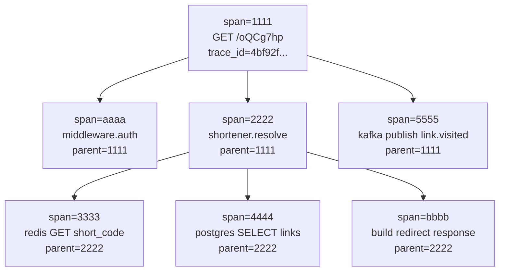

# Push Model, TraceId And Spans Example

Этот файл нужен как practical-вход в tracing: что именно backend отправляет наружу, где появляется `trace_id`, что такое `span_id`, и как выглядит иерархия spans на реальном запросе.

## Содержание

- [Главная мысль](#главная-мысль)
- [Push model: кто кому отправляет traces](#push-model-кто-кому-отправляет-traces)
- [Что реально уходит из backend](#что-реально-уходит-из-backend)
- [`trace_id`, `span_id`, `parent_span_id`](#trace_id-span_id-parent_span_id)
- [Пример иерархии spans](#пример-иерархии-spans)
- [Как trace context идет между сервисами](#как-trace-context-идет-между-сервисами)
- [Минимальный Go-псевдокод](#минимальный-go-псевдокод)
- [Как писать `trace_id` в logs](#как-писать-trace_id-в-logs)
- [Как читать это в Tempo/Grafana](#как-читать-это-в-tempografana)
- [Practical Rule](#practical-rule)

## Главная мысль

`Trace` — это не один лог и не одна метрика.

`Trace` — это дерево операций одного конкретного запроса или события.

Например пользователь открыл short link:

```text
GET /oQCg7hp
  -> проверить cache
  -> сходить в Postgres
  -> записать analytics event в Kafka
  -> вернуть redirect
```

В tracing это будет один `trace_id`, внутри которого несколько `span_id`.

## Push model: кто кому отправляет traces

Traces обычно работают по push-модели.

Это значит:
- не Tempo приходит в backend и не "скрейпит" traces;
- backend сам создает spans;
- OpenTelemetry SDK складывает завершенные spans в batch;
- exporter отправляет batch наружу по `OTLP`;
- дальше spans принимает `OpenTelemetry Collector` или сразу trace backend, например `Tempo`.

Типичная схема:

```text
Go backend
  creates spans
  ends spans
  batches spans
  pushes OTLP
    |
    v
OpenTelemetry Collector
  receives OTLP
  filters/samples/enriches
  exports traces
    |
    v
Tempo / Jaeger / vendor backend
  stores traces
    |
    v
Grafana / UI
  shows waterfall
```

Для локальной разработки часто делают проще:

```text
Go backend -> OTLP exporter -> Tempo -> Grafana
```

Для production чаще лучше так:

```text
Go backend -> OTLP exporter -> OTel Collector -> Tempo
```

Почему через collector удобнее:
- можно централизованно включать sampling;
- можно чистить лишние attributes;
- можно маршрутизировать traces в разные backends;
- приложение меньше знает про конкретный observability backend.

Важно: в отличие от `Prometheus`, который обычно сам забирает metrics через pull/scrape, traces чаще отправляются приложением наружу через push/export.

## Что реально уходит из backend

Когда span завершился, SDK отправляет не "весь request", а structured telemetry object.

Условно один span выглядит так:

```json
{
  "trace_id": "4bf92f3577b34da6a3ce929d0e0e4736",
  "span_id": "00f067aa0ba902b7",
  "parent_span_id": "7a2190356c3fc94b",
  "name": "postgres SELECT links",
  "kind": "client",
  "start_time": "2026-04-10T13:52:38.100Z",
  "end_time": "2026-04-10T13:52:38.145Z",
  "status": "ok",
  "attributes": {
    "db.system": "postgresql",
    "db.operation": "SELECT",
    "db.name": "shortener",
    "operation": "links.find_by_short_code"
  }
}
```

Обычно не надо отправлять:
- body запроса;
- password/token/API key;
- email/phone без явной причины;
- raw SQL с пользовательскими данными;
- огромные payloads.

## `trace_id`, `span_id`, `parent_span_id`

Три поля, которые надо понимать:

| Поле | Что означает |
| --- | --- |
| `trace_id` | общий id всего execution path |
| `span_id` | id конкретного шага внутри trace |
| `parent_span_id` | id родительского span, из которого начался текущий span |

Пример:

```text
trace_id = 4bf92f3577b34da6a3ce929d0e0e4736

span_id=1111 name="GET /{short_code}" parent=null
span_id=2222 name="shortener.resolve" parent=1111
span_id=3333 name="redis GET short_code" parent=2222
span_id=4444 name="postgres SELECT links" parent=2222
span_id=5555 name="kafka publish link.visited" parent=2222
```

У всех spans один `trace_id`, но разные `span_id`.

`parent_span_id` превращает плоский список spans в дерево.

## Пример иерархии spans

Пример для URL shortener:

```text
Trace: 4bf92f3577b34da6a3ce929d0e0e4736

GET /oQCg7hp                                      82ms  span=1111
├─ middleware.auth                                2ms   span=aaaa parent=1111
├─ shortener.resolve                             63ms   span=2222 parent=1111
│  ├─ redis GET short_code                        4ms   span=3333 parent=2222
│  ├─ postgres SELECT links                      48ms   span=4444 parent=2222
│  └─ build redirect response                     1ms   span=bbbb parent=2222
└─ kafka publish link.visited                    12ms   span=5555 parent=1111
```

Как это читать:
- root span `GET /oQCg7hp` показывает полное время запроса;
- `shortener.resolve` занял большую часть времени;
- внутри него видно, что `postgres SELECT links` занял 48ms;
- Kafka publish не блокировал resolve, но был частью request path;
- если Kafka publish упал, error status будет на span `kafka publish link.visited`.

Такой waterfall легче держать в голове, чем абстрактное "у нас есть distributed tracing".

Та же идея как схема:



## Как trace context идет между сервисами

Если backend вызывает другой backend, ему нужно передать trace context.

Для HTTP это обычно header `traceparent`.

Пример:

```http
traceparent: 00-4bf92f3577b34da6a3ce929d0e0e4736-00f067aa0ba902b7-01
```

Формат упрощенно:

```text
00-{trace_id}-{parent_span_id}-{flags}
```

Что происходит:

```text
service-a receives request
  trace_id = 4bf92f...
  current span_id = 1111

service-a calls service-b
  injects traceparent header

service-b receives request
  extracts trace_id = 4bf92f...
  creates new span_id = 9999
  parent_span_id = 1111 or propagated remote parent
```

Если header не прокинуть:
- service B создаст новый unrelated trace;
- в Grafana не будет end-to-end дерева;
- расследование превратится обратно в ручной поиск по логам.

## Минимальный Go-псевдокод

Это не copy-paste production setup, а схема, чтобы понять механику.

```go
func (h *Handler) Redirect(w http.ResponseWriter, r *http.Request) {
	ctx := r.Context()

	ctx, span := h.tracer.Start(ctx, "GET /{short_code}",
		trace.WithAttributes(
			attribute.String("http.route", "/{short_code}"),
			attribute.String("operation", "redirect"),
		),
	)
	defer span.End()

	shortCode := chi.URLParam(r, "short_code")

	link, err := h.service.Resolve(ctx, shortCode)
	if err != nil {
		span.RecordError(err)
		span.SetStatus(codes.Error, "resolve failed")
		http.Error(w, "not found", http.StatusNotFound)
		return
	}

	http.Redirect(w, r, link.URL, http.StatusFound)
}
```

Service layer:

```go
func (s *Service) Resolve(ctx context.Context, shortCode string) (*Link, error) {
	ctx, span := s.tracer.Start(ctx, "shortener.resolve",
		trace.WithAttributes(
			attribute.String("short_code", shortCode),
		),
	)
	defer span.End()

	link, err := s.repo.FindByShortCode(ctx, shortCode)
	if err != nil {
		span.RecordError(err)
		span.SetStatus(codes.Error, "repo failed")
		return nil, err
	}

	if err := s.events.PublishLinkVisited(ctx, link.ID); err != nil {
		span.RecordError(err)
		// Тут бизнес-решение: ошибка publish может быть warning, а не request failure.
	}

	return link, nil
}
```

Repository span:

```go
func (r *Repo) FindByShortCode(ctx context.Context, shortCode string) (*Link, error) {
	ctx, span := r.tracer.Start(ctx, "postgres SELECT links",
		trace.WithAttributes(
			attribute.String("db.system", "postgresql"),
			attribute.String("db.operation", "SELECT"),
			attribute.String("operation", "links.find_by_short_code"),
		),
	)
	defer span.End()

	return r.queryLink(ctx, shortCode)
}
```

Критичная деталь: везде передается тот же `ctx`.

Плохо:

```go
link, err := s.repo.FindByShortCode(context.Background(), shortCode)
```

Так ты отрезаешь child span от parent span.

Хорошо:

```go
link, err := s.repo.FindByShortCode(ctx, shortCode)
```

## Как писать `trace_id` в logs

Чтобы перейти из логов в trace, удобно добавлять `trace_id` и иногда `span_id` в structured logs.

Псевдокод:

```go
func LoggerFromContext(ctx context.Context, base *slog.Logger) *slog.Logger {
	sc := trace.SpanContextFromContext(ctx)
	if !sc.IsValid() {
		return base
	}

	return base.With(
		"trace_id", sc.TraceID().String(),
		"span_id", sc.SpanID().String(),
	)
}
```

Тогда лог выглядит так:

```json
{
  "level": "WARN",
  "msg": "async link.visited publish failed",
  "service": "shortener",
  "operation": "publish_link_visited",
  "trace_id": "4bf92f3577b34da6a3ce929d0e0e4736",
  "span_id": "5555555555555555",
  "error": "kafka: no such host"
}
```

Практический workflow:
- увидел ошибку в Kibana/Loki;
- скопировал `trace_id`;
- открыл этот trace в Tempo/Grafana;
- увидел весь waterfall вокруг ошибки.

## Как читать это в Tempo/Grafana

Когда открываешь trace, не начинай с каждого attribute.

Сначала смотри:

1. Сколько занял root span.
2. Какой child span самый широкий.
3. Есть ли span со status `error`.
4. Есть ли долгие sequential spans, которые можно распараллелить.
5. Есть ли retries/timeouts.
6. Есть ли missing spans, которые указывают на потерянный `ctx` или propagation.

Если в логах есть только `request_id`, но нет `trace_id`, связать logs и traces будет тяжелее.

Если в traces есть `trace_id`, но logs его не пишут, поиск тоже будет неудобным.

Нормальная production-схема:

```text
metrics show symptom
  -> logs give trace_id/error details
  -> trace shows exact slow/failing span
```

## Practical Rule

Для собеседования и production reasoning достаточно держать такую модель:

- backend сам push'ит завершенные spans через OTLP;
- `trace_id` общий для всего запроса;
- `span_id` уникален для каждого шага;
- `parent_span_id` строит дерево;
- `context.Context` в Go переносит текущий span внутри процесса;
- `traceparent`/metadata/message headers переносят trace между процессами;
- logs должны писать `trace_id`, чтобы из ошибки быстро перейти в trace.
