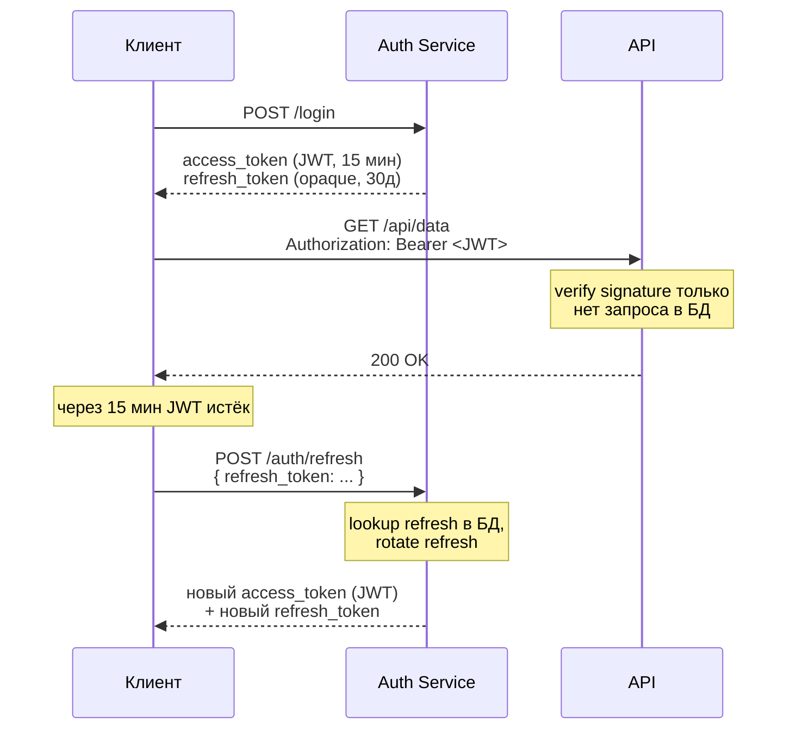

# JWT (JSON Web Token)

JWT — подписанный токен, внутри которого закодированы данные. Сервер не хранит его у себя — он только проверяет подпись.

## Содержание

- [Структура JWT](#структура-jwt)
- [Подпись: симметричная vs асимметричная](#подпись-симметричная-vs-асимметричная)
- [Стандартные claims](#стандартные-claims)
- [Выпуск и верификация в Go](#выпуск-и-верификация-в-го)
- [Access token + Refresh token](#access-token--refresh-token)
- [Проблема ревокации](#проблема-ревокации)
- [Где хранить в браузере](#где-хранить-в-браузере)
- [Частые ошибки](#частые-ошибки)

---

## Структура JWT

JWT состоит из трёх частей, разделённых точкой: `header.payload.signature`

```
eyJhbGciOiJSUzI1NiIsInR5cCI6IkpXVCJ9
.
eyJzdWIiOiJ1c2VyLTEyMyIsImVtYWlsIjoiYWxpY2VAZXhhbXBsZS5jb20iLCJyb2xlIjoiYWRtaW4iLCJpYXQiOjE3MDAwMDAwMDAsImV4cCI6MTcwMDAwMDkwMH0
.
SflKxwRJSMeKKF2QT4fwpMeJf36POk6yJV_adQssw5c
```

Каждая часть — base64url (не шифрование, просто кодирование). **Header и payload читаемы без ключа.**

```go
// Декодировать payload вручную (для отладки)
parts := strings.Split(token, ".")
payload, _ := base64.RawURLEncoding.DecodeString(parts[1])
fmt.Println(string(payload))
// {"sub":"user-123","email":"alice@example.com","role":"admin","iat":1700000000,"exp":1700000900}
```

**Вывод:** не класть в JWT sensitive данные (пароли, секреты, PII сверх необходимого). Payload виден любому.

**Три части:**

```json
// Header — алгоритм и тип токена
{
  "alg": "RS256",
  "typ": "JWT"
}

// Payload — claims (данные)
{
  "sub": "user-123",
  "email": "alice@example.com",
  "role": "admin",
  "iat": 1700000000,
  "exp": 1700000900
}

// Signature — HMAC/RSA подпись header+payload
// Проверяет что токен не изменён и выдан именно этим сервером
```

---

## Подпись: симметричная vs асимметричная

**HS256 (HMAC-SHA256) — симметричная:**
- один секретный ключ для подписи и для верификации
- кто умеет проверять — умеет и подписывать
- подходит когда один сервис выдаёт и проверяет токены

```
Выдача:   signature = HMAC-SHA256(header+payload, secret)
Проверка: HMAC-SHA256(header+payload, secret) == signature?
```

**RS256 (RSA-SHA256) — асимметричная:**
- приватный ключ (только у auth service) для подписи
- публичный ключ (можно раздать всем) для верификации
- подходит для microservices: каждый сервис может проверять токен не зная приватный ключ

```
Выдача:   signature = RSA_sign(header+payload, private_key)
Проверка: RSA_verify(header+payload, signature, public_key)?
```

**Как выбрать:**
- один сервис → HS256 проще
- gateway подписывает, другие сервисы проверяют → RS256 (публичный ключ можно раздать через JWKS endpoint)

---

## Стандартные claims

| Claim | Полное имя | Значение |
|---|---|---|
| `sub` | subject | ID пользователя — основной идентификатор |
| `iss` | issuer | Кто выдал токен (`https://auth.example.com`) |
| `aud` | audience | Для кого токен (`https://api.example.com`) |
| `exp` | expiration | Unix timestamp истечения — **обязательно** |
| `iat` | issued at | Unix timestamp выдачи |
| `nbf` | not before | Токен невалиден до этого момента |
| `jti` | JWT ID | Уникальный ID токена (для blacklist) |

Кастомные claims добавляются рядом:
```json
{
  "sub": "user-123",
  "exp": 1700000900,
  "role": "admin",
  "org_id": "org-456",
  "scopes": ["read:users", "write:posts"]
}
```

---

## Выпуск и верификация в Go

Популярная библиотека: `github.com/golang-jwt/jwt/v5`

```go
import (
    "github.com/golang-jwt/jwt/v5"
    "crypto/rsa"
    "os"
    "time"
)

type Claims struct {
    jwt.RegisteredClaims
    // Кастомные claims
    Role   string   `json:"role"`
    OrgID  string   `json:"org_id"`
    Scopes []string `json:"scopes"`
}

// Загрузка ключей
func loadRSAKeys() (private *rsa.PrivateKey, public *rsa.PublicKey, err error) {
    privPEM, err := os.ReadFile(os.Getenv("JWT_PRIVATE_KEY_FILE"))
    if err != nil {
        return nil, nil, err
    }
    private, err = jwt.ParseRSAPrivateKeyFromPEM(privPEM)
    if err != nil {
        return nil, nil, err
    }
    pubPEM, err := os.ReadFile(os.Getenv("JWT_PUBLIC_KEY_FILE"))
    if err != nil {
        return nil, nil, err
    }
    public, err = jwt.ParseRSAPublicKeyFromPEM(pubPEM)
    return
}
```

### Выпуск токена

```go
func (s *TokenService) IssueAccessToken(userID, role, orgID string) (string, error) {
    now := time.Now()
    claims := Claims{
        RegisteredClaims: jwt.RegisteredClaims{
            Subject:   userID,
            Issuer:    "https://auth.example.com",
            Audience:  jwt.ClaimStrings{"https://api.example.com"},
            IssuedAt:  jwt.NewNumericDate(now),
            ExpiresAt: jwt.NewNumericDate(now.Add(15 * time.Minute)), // короткий TTL!
            ID:        uuid.New().String(),
        },
        Role:  role,
        OrgID: orgID,
    }

    token := jwt.NewWithClaims(jwt.SigningMethodRS256, claims)
    return token.SignedString(s.privateKey)
}
```

### Верификация токена

```go
func (s *TokenService) Verify(raw string) (*Claims, error) {
    token, err := jwt.ParseWithClaims(raw, &Claims{},
        func(token *jwt.Token) (interface{}, error) {
            // Проверить алгоритм — защита от "alg: none" атаки
            if _, ok := token.Method.(*jwt.SigningMethodRSA); !ok {
                return nil, fmt.Errorf("unexpected signing method: %v", token.Header["alg"])
            }
            return s.publicKey, nil
        },
        jwt.WithIssuer("https://auth.example.com"),
        jwt.WithAudience("https://api.example.com"),
        jwt.WithExpirationRequired(),
    )
    if err != nil {
        return nil, fmt.Errorf("invalid token: %w", err)
    }

    claims, ok := token.Claims.(*Claims)
    if !ok || !token.Valid {
        return nil, errors.New("invalid claims")
    }
    return claims, nil
}
```

### Middleware для HTTP

```go
func JWTMiddleware(svc *TokenService) func(http.Handler) http.Handler {
    return func(next http.Handler) http.Handler {
        return http.HandlerFunc(func(w http.ResponseWriter, r *http.Request) {
            raw := extractBearerToken(r)
            if raw == "" {
                http.Error(w, "unauthorized", http.StatusUnauthorized)
                return
            }

            claims, err := svc.Verify(raw)
            if err != nil {
                http.Error(w, "unauthorized", http.StatusUnauthorized)
                return
            }

            // Положить claims в контекст — следующий хэндлер читает
            ctx := context.WithValue(r.Context(), claimsKey, claims)
            next.ServeHTTP(w, r.WithContext(ctx))
        })
    }
}

func extractBearerToken(r *http.Request) string {
    auth := r.Header.Get("Authorization")
    if !strings.HasPrefix(auth, "Bearer ") {
        return ""
    }
    return strings.TrimPrefix(auth, "Bearer ")
}

// Хелпер для получения claims в хэндлере
func ClaimsFromContext(ctx context.Context) (*Claims, bool) {
    c, ok := ctx.Value(claimsKey).(*Claims)
    return c, ok
}
```

---

## Access token + Refresh token

Короткий access token (15 мин) + долгий opaque refresh token (30 дней):



```go
// Refresh token — opaque, хранится в БД как хеш (как session)
func (s *AuthService) Refresh(ctx context.Context, rawRefresh string) (accessToken string, newRefresh string, err error) {
    hash := sha256Hex(rawRefresh)

    rt, err := s.repo.GetRefreshToken(ctx, hash)
    if err != nil || time.Now().After(rt.ExpiresAt) {
        return "", "", ErrInvalidRefreshToken
    }

    // Ротация — старый refresh инвалидируется, выдаётся новый
    if err := s.repo.DeleteRefreshToken(ctx, hash); err != nil {
        return "", "", err
    }

    user, _ := s.users.GetByID(ctx, rt.UserID)
    accessToken, _ = s.IssueAccessToken(user.ID, user.Role, user.OrgID)
    newRefresh, _ = s.issueRefreshToken(ctx, user.ID)
    return accessToken, newRefresh, nil
}
```

**Refresh token rotation:** при каждом обновлении старый refresh удаляется, выдаётся новый. Если старый refresh использован повторно — признак кражи токена → инвалидировать всю семью токенов.

---

## Проблема ревокации

JWT валиден до `exp` — нельзя "отозвать" токен сделав запрос в БД.

**Решения:**

**1. Короткий TTL (15 мин):** пользователь максимум 15 минут будет иметь доступ после logout. Простое решение, подходит для большинства случаев.

**2. Blacklist в Redis:**

```go
func (s *TokenService) Revoke(ctx context.Context, jti string, expiresAt time.Time) error {
    ttl := time.Until(expiresAt)
    if ttl <= 0 {
        return nil  // уже истёк
    }
    return s.redis.Set(ctx, "jwt:revoked:"+jti, "1", ttl).Err()
}

func (s *TokenService) Verify(raw string) (*Claims, error) {
    claims, err := s.parseAndVerify(raw)
    if err != nil {
        return nil, err
    }

    // Проверить blacklist — один Redis lookup вместо DB lookup
    revoked, _ := s.redis.Exists(ctx, "jwt:revoked:"+claims.ID).Result()
    if revoked > 0 {
        return nil, ErrTokenRevoked
    }
    return claims, nil
}
```

**3. Version в claims + БД:**

```go
// В JWT: "token_version": 3
// В БД у пользователя: token_version = 3
// При смене пароля/logout: token_version++ → все старые токены невалидны
// Один SELECT на верификацию, но инвалидирует ВСЕ токены пользователя сразу
```

---

## Где хранить в браузере

| Хранилище | XSS риск | CSRF риск | Итог |
|---|---|---|---|
| `localStorage` | высокий (JS читает) | нет | не использовать для auth |
| `sessionStorage` | высокий (JS читает) | нет | не использовать для auth |
| `HttpOnly cookie` | нет (JS не читает) | есть (нужен SameSite/CSRF) | рекомендуется |
| `memory` (JS переменная) | низкий | нет | хорошо, но теряется при перезагрузке |

**Рекомендованный паттерн:**
- Access token — в памяти (JS variable): короткоживущий, теряется при reload — нормально, есть refresh
- Refresh token — в `HttpOnly Secure SameSite=Strict` cookie: JS не читает, CSRF не страшен при Strict

---

## Частые ошибки

**1. Доверять без проверки подписи:**
```go
// Никогда не декодировать payload без верификации
parts := strings.Split(token, ".")
data, _ := base64.RawURLEncoding.DecodeString(parts[1])
// Атакующий может подменить payload!
```

**2. Не проверять алгоритм (`alg: none` атака):**
```go
// Уязвимые библиотеки принимали токен с alg:none без подписи
// Всегда явно указывать ожидаемый метод при верификации
jwt.ParseWithClaims(raw, claims, keyFunc,
    jwt.WithValidMethods([]string{"RS256"}),  // только этот алгоритм
)
```

**3. Длинный TTL access token:**
```go
// Плохо — если токен утечёт, у атакующего доступ на 24 часа
ExpiresAt: jwt.NewNumericDate(now.Add(24 * time.Hour))

// Хорошо — короткий TTL, refresh token для продления
ExpiresAt: jwt.NewNumericDate(now.Add(15 * time.Minute))
```

**4. Sensitive данные в payload:**
```json
{
  "sub": "user-123",
  "password_hash": "$2a$12$...",   ← НЕЛЬЗЯ
  "credit_card": "4111...",         ← НЕЛЬЗЯ
  "role": "admin"                   ← ОК
}
```

**5. Не проверять `aud`:** токен выданный для сервиса A может быть использован на сервисе B если не проверять audience.
