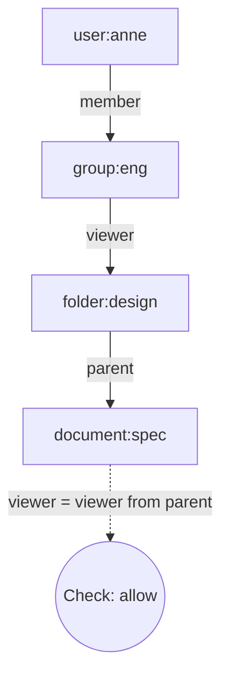

# Авторизация и RBAC

Аутентификация (authn) — "кто это?". Авторизация (authz) — "что этому субъекту можно?". Это две независимые задачи, и решаются разным кодом.

Аутентификация работает один раз — при входе или при верификации токена. Авторизация работает на **каждый** защищённый запрос: даже если пользователь предъявил валидный токен, ему нужно ещё проверить, имеет ли он право на конкретное действие над конкретным ресурсом.

## Содержание

- [Authn vs Authz: чёткая граница](#authn-vs-authz-чёткая-граница)
- [Модели контроля доступа](#модели-контроля-доступа)
- [Принципы безопасной авторизации](#принципы-безопасной-авторизации)
- [RBAC: роли и разрешения](#rbac-роли-и-разрешения)
- [Откуда берутся права при проверке](#откуда-берутся-права-при-проверке)
- [Хранение ролей](#хранение-ролей)
- [Слои авторизации: PEP и PDP](#слои-авторизации-pep-и-pdp)
- [Авторизация по роли в middleware](#авторизация-по-роли-в-middleware)
- [Resource-level авторизация](#resource-level-авторизация)
- [ABAC и политики](#abac-и-политики)
- [ReBAC и Zanzibar](#rebac-и-zanzibar)
- [Паттерны проверки доступа](#паттерны-проверки-доступа)
- [Частые ошибки](#частые-ошибки)

---

## Authn vs Authz: чёткая граница

| | Authentication | Authorization |
|---|---|---|
| Вопрос | кто это? | что можно? |
| Когда | при входе / верификации токена | на каждый защищённый запрос |
| Результат | identity (user_id, role, claims) | allow / deny |
| Ошибка | `401 Unauthorized` | `403 Forbidden` |
| Источник правды | пароль / OAuth provider / mTLS | политика приложения (роли, ACL) |

**Важно различать коды ответа:**
- `401` — "субъект не опознан, нужны credentials" (или они невалидны/истекли)
- `403` — "субъект опознан, но это действие ему запрещено"

Путаница между ними — типичная ошибка. Если пользователь авторизован токеном, но не имеет прав — это `403`, не `401`.

---

## Модели контроля доступа

Существует несколько устоявшихся моделей. На практике в backend-системах используются в основном RBAC и ABAC, иногда ReBAC.

**DAC (Discretionary Access Control)** — владелец ресурса сам решает, кому давать доступ. Классический пример — файловая система Unix (chmod, chown). В web-приложениях встречается как "share with user" в Google Docs.

**MAC (Mandatory Access Control)** — права назначаются централизованно, владелец не может их переопределить. Используется в военных и государственных системах (Bell-LaPadula, SELinux). В обычных backend-сервисах почти не встречается.

**RBAC (Role-Based Access Control)** — пользователю назначается роль, роль связана с разрешениями. Самая распространённая модель в b2b/SaaS. Покрывает 80% потребностей.

**ABAC (Attribute-Based Access Control)** — решение принимается на основе атрибутов (subject, action, resource, environment). Гибче RBAC, но сложнее в поддержке. Применяется когда правила зависят от множества параметров (время суток, локация, статус ресурса).

**ReBAC (Relationship-Based Access Control)** — права выводятся из связей в графе ("user X is a member of team Y, which owns folder Z"). Google Zanzibar — известная реализация. Хорошо подходит для социальных сетей и shared-resource систем (Notion, Figma).

В реальности эти модели смешиваются: RBAC для базовых ролей + ABAC/ReBAC для тонких правил.

---

## Принципы безопасной авторизации

**Principle of Least Privilege (PoLP)** — пользователь должен иметь минимум прав, необходимых для его задач. Не давать `admin` если достаточно `editor`. Не выдавать `delete:*` если нужно только `delete:own_posts`.

**Deny by default** — если правило явно не разрешает действие — оно запрещено. Никогда не строить логику "разрешить всё, кроме X" — забытый случай станет дырой.

**Separation of Duties** — критические операции требуют участия более одного актора. Например, выпуск секретов в Vault может требовать двух approvers.

**Defense in Depth** — авторизация на нескольких слоях. Если gateway пропустил запрос — сервис всё равно проверяет. Если сервис ошибся — БД через RLS (row-level security) не отдаст чужие данные.

**Fail Closed** — при ошибке системы (БД недоступна, политика не загрузилась) отказывать в доступе, не открывать. Это контр-интуитивно — кажется лучше "не блокировать пользователей" — но open-by-default превращает любой сбой в утечку.

**Authorize at the boundary closest to the resource** — финальная проверка должна быть рядом с данными, не на gateway. Gateway может ошибиться, route может быть забыт — но если репозиторий всегда фильтрует по `owner_id`, IDOR невозможен.

---

## RBAC: роли и разрешения

**RBAC (Role-Based Access Control)** — модель из трёх сущностей:

```
Пользователь → Роль → Разрешения
user-123      → admin → ["read:users", "write:users", "delete:users"]
user-456      → editor → ["read:users", "write:posts"]
user-789      → viewer → ["read:posts"]
```

**Зачем посредник в виде роли?** Чтобы массово менять права группы пользователей. Если у вас 10000 editor'ов и нужно дать им новое разрешение `read:analytics` — добавляете его роли, не каждому пользователю. Без ролей — UPDATE по 10000 строк и десинк между БД и кэшами.

**Permissions vs Roles в коде.** Антипаттерн — проверять роль напрямую (`if role == "admin"`). Правильно — проверять разрешение (`if hasPermission("delete:users")`). Тогда добавление новой роли с этим же правом не требует менять код хэндлера. Роль — это группа разрешений, а не самостоятельная единица контроля.

**Гранулярность разрешений.** Слишком крупные (`manage:users`) — не дают тонко настроить роль. Слишком мелкие (`read:user.email`, `read:user.name`) — взрывная сложность. Разумная середина: `<action>:<resource>` где action ∈ {read, write, delete, create, update}, resource — entity (`users`, `posts`, `orders`).

Модель в Go:

```go
type Role string

const (
    RoleAdmin   Role = "admin"
    RoleEditor  Role = "editor"
    RoleViewer  Role = "viewer"
)

// Permission — мелкозернистое разрешение, предпочтительнее чем role check напрямую
type Permission string

const (
    PermReadUsers   Permission = "read:users"
    PermWriteUsers  Permission = "write:users"
    PermDeleteUsers Permission = "delete:users"
    PermReadPosts   Permission = "read:posts"
    PermWritePosts  Permission = "write:posts"
)

// Маппинг роль → разрешения — вариант с захардкоженными значениями.
// Подробнее об альтернативах (кэш из БД, scopes в JWT) — см. раздел ниже.
var rolePermissions = map[Role]map[Permission]struct{}{
    RoleAdmin: {
        PermReadUsers: {}, PermWriteUsers: {}, PermDeleteUsers: {},
        PermReadPosts: {}, PermWritePosts: {},
    },
    RoleEditor: {PermReadUsers: {}, PermReadPosts: {}, PermWritePosts: {}},
    RoleViewer: {PermReadPosts: {}},
}

func HasPermission(role Role, perm Permission) bool {
    _, ok := rolePermissions[role][perm]
    return ok
}
```

---

## Откуда берутся права при проверке

При каждом HTTP-запросе middleware делает два вида проверок:

1. **Роль пользователя** (`claims.Role`) — берётся из JWT токена. Декодируется при верификации подписи, никакого I/O.
2. **Маппинг роль → разрешения** (`rolePermissions[role]`) — вот здесь нужно решить, откуда брать данные.

Этот выбор — компромисс между тремя осями: **скорость проверки** (есть ли I/O на запрос), **актуальность данных** (как быстро применяются изменения), **операционная сложность** (нужен ли кэш, синхронизация, миграции).

### Вариант 1: статически в коде

```go
var rolePermissions = map[Role][]Permission{
    RoleAdmin:  {PermReadUsers, PermWriteUsers, PermDeleteUsers},
    RoleEditor: {PermReadPosts, PermWritePosts},
    RoleViewer: {PermReadPosts},
}
```

Нет I/O вообще. Смена прав требует деплоя — это не баг, а фича: изменение security-политики проходит через код-ревью и историю в git. Подходит большинству систем — права меняются редко, и когда меняются — это значимое событие, заслуживающее формальной проверки.

### Вариант 2: загрузка при старте + in-memory кэш с TTL

Если бизнес требует менять права в рантайме (admin-панель управления ролями) — права хранятся в БД, но не читаются на каждый запрос. Сервис кэширует их в памяти и периодически обновляет.

```go
type RBACService struct {
    mu          sync.RWMutex
    permissions map[Role]map[Permission]struct{} // set для O(1) lookup
    loadedAt    time.Time
    ttl         time.Duration
    repo        PermissionRepository
}

func (s *RBACService) HasPermission(ctx context.Context, role Role, perm Permission) (bool, error) {
    s.mu.RLock()
    if time.Since(s.loadedAt) < s.ttl {
        _, ok := s.permissions[role][perm]
        s.mu.RUnlock()
        return ok, nil
    }
    s.mu.RUnlock()

    s.mu.Lock()
    defer s.mu.Unlock()
    // Double-check после получения write lock
    if time.Since(s.loadedAt) < s.ttl {
        _, ok := s.permissions[role][perm]
        return ok, nil
    }
    if err := s.reload(ctx); err != nil {
        return false, err
    }
    _, ok := s.permissions[role][perm]
    return ok, nil
}

func (s *RBACService) reload(ctx context.Context) error {
    rows, err := s.repo.LoadAll(ctx)
    if err != nil {
        return err
    }
    m := make(map[Role]map[Permission]struct{})
    for _, row := range rows {
        if m[row.Role] == nil {
            m[row.Role] = make(map[Permission]struct{})
        }
        m[row.Role][row.Permission] = struct{}{}
    }
    s.permissions = m
    s.loadedAt = time.Now()
    return nil
}
```

Один запрос в БД раз в N минут на весь сервис (не на каждый HTTP-запрос). TTL 1-5 минут — изменения вступают в силу без деплоя с небольшой задержкой. Альтернатива TTL — push-инвалидация через Redis pub/sub или watch на etcd: когда права меняются, всем инстансам приходит уведомление, и они перезагружают кэш сразу.

### Вариант 3: права в JWT claims (scopes)

При выпуске токена сразу записать права — тогда при верификации не нужен никакой lookup:

```go
// При логине — один запрос в БД для загрузки прав, зашить в токен
func (s *TokenService) IssueAccessToken(user *User) (string, error) {
    perms, err := s.rbac.LoadPermissions(user.Role)
    if err != nil {
        return "", err
    }
    claims := Claims{
        RegisteredClaims: ...,
        Role:   user.Role,
        Scopes: perms,  // ["read:users", "write:posts", ...]
    }
    ...
}

// При каждом запросе — чистая проверка среза, нет I/O
func HasScope(claims *Claims, perm Permission) bool {
    for _, s := range claims.Scopes {
        if s == string(perm) {
            return true
        }
    }
    return false
}
```

Минус: изменение прав роли вступает в силу только при следующем refresh токена (через ~15 мин). Если пользователю отозвали права — он будет иметь их до конца access token TTL. Для критических случаев — комбинировать с blacklist (см. JWT revocation).

Дополнительный минус: токен раздувается. 50 разрешений × 20 байт = 1KB только на scopes, что уходит в каждый HTTP-запрос. Имеет смысл хранить в JWT именно роль (1 поле), а маппинг роль→permissions — в коде или кэше.

### Когда что выбирать

| | Вариант 1 (код) | Вариант 2 (кэш) | Вариант 3 (JWT) |
|---|---|---|---|
| I/O на запрос | нет | нет (кэш) | нет |
| Смена прав | деплой | TTL задержка | refresh задержка |
| Сложность | минимум | средняя | токен раздувается |
| Аудит изменений | git history | таблица + audit log | git history |
| Масштабирование | тривиально | нужна синхронизация | тривиально |

На практике: большинство сервисов используют вариант 1 или 3. Вариант 2 нужен если бизнес требует менять права в рантайме без деплоя.

---

## Хранение ролей

Роль пользователя — отдельный вопрос от маппинга роль→permissions. Она привязана к конкретному `user_id` и должна откуда-то браться при каждом запросе.

**В JWT claims** — роль зашита в токен при выдаче. Stateless, без I/O, но устаревает до refresh.

```go
type Claims struct {
    jwt.RegisteredClaims
    Role   Role     `json:"role"`
    Scopes []string `json:"scopes,omitempty"` // опционально: явные разрешения
}

// Роль берётся прямо из токена — нет запроса в БД
claims, _ := tokenSvc.Verify(raw)
if !HasPermission(claims.Role, PermWritePosts) {
    http.Error(w, "forbidden", http.StatusForbidden)
    return
}
```

**Минус:** роль закодирована в токене на весь его TTL. Смена роли вступает в силу только при обновлении токена (через refresh). Если у пользователя был `admin` и его понизили до `viewer` — он будет admin'ом до истечения access token. Для критических изменений нужен blacklist или очень короткий TTL.

**В БД + opaque session** — актуальные роли при каждом запросе:

```go
type Session struct {
    UserID    string
    Role      Role
    ExpiresAt time.Time
}

// При каждом запросе: SELECT session → получить актуальную роль
session, err := sessionStore.Get(ctx, token)
// Если роль изменилась — новое значение вступает немедленно
```

Цена — DB/Redis lookup на каждый запрос. Плюс — мгновенная ревокация и смена роли. Это фундаментальный trade-off: stateless токены против stateful sessions.

**Гибрид:** роль в JWT для быстрых проверок + version counter в claims. При смене роли — increment version в БД. На критических операциях (например, `delete:users`) сервис делает дополнительную проверку version в БД, на обычных — доверяет токену.

---

## Слои авторизации: PEP и PDP

В академической литературе по контролю доступа есть два базовых понятия:

- **PEP (Policy Enforcement Point)** — место, где решение применяется (middleware, хэндлер, репозиторий). Перехватывает запрос и спрашивает у PDP "можно?".
- **PDP (Policy Decision Point)** — место, где решение принимается (функция `HasPermission`, casbin enforcer, OPA). Получает контекст и возвращает allow/deny.

Разделение важно: enforcement points могут быть размазаны по всему приложению, но логика принятия решений — в одном месте. Меняется политика — меняется PDP, не PEP.

В микросервисной архитектуре есть несколько типичных слоёв enforcement:

```
Внешний клиент
     │
     ▼
[ Gateway/Ingress ] ← coarse-grained: аутентификация, rate-limit, tenant isolation
     │
     ▼
[ Service middleware ] ← role/permission checks
     │
     ▼
[ Service handler ] ← resource-level (owner check, business rules)
     │
     ▼
[ Repository / DB RLS ] ← последняя линия: row-level security
```

Каждый слой решает свою задачу. Gateway не должен знать о бизнес-правилах "может ли пользователь X редактировать пост Y". Хэндлер не должен повторять проверки роли, которые уже сделал middleware.

Defense in depth — это не дублирование, а разные уровни ответственности. Если один слой пропустит атаку, следующий должен её остановить.

---

## Авторизация по роли в middleware

Middleware — типичный PEP для coarse-grained проверок (по роли, по permission). Он отсекает 80% запросов до того, как они дойдут до бизнес-логики.

```go
// RequireRole — middleware для route-level защиты
func RequireRole(roles ...Role) func(http.Handler) http.Handler {
    allowed := make(map[Role]struct{}, len(roles))
    for _, r := range roles {
        allowed[r] = struct{}{}
    }

    return func(next http.Handler) http.Handler {
        return http.HandlerFunc(func(w http.ResponseWriter, r *http.Request) {
            claims, ok := ClaimsFromContext(r.Context())
            if !ok {
                http.Error(w, "unauthorized", http.StatusUnauthorized)
                return
            }

            if _, ok := allowed[claims.Role]; !ok {
                http.Error(w, "forbidden", http.StatusForbidden)
                return
            }

            next.ServeHTTP(w, r)
        })
    }
}

// RequirePermission — middleware по конкретному разрешению
func RequirePermission(perm Permission) func(http.Handler) http.Handler {
    return func(next http.Handler) http.Handler {
        return http.HandlerFunc(func(w http.ResponseWriter, r *http.Request) {
            claims, ok := ClaimsFromContext(r.Context())
            if !ok {
                http.Error(w, "unauthorized", http.StatusUnauthorized)
                return
            }

            if !HasPermission(claims.Role, perm) {
                http.Error(w, "forbidden", http.StatusForbidden)
                return
            }

            next.ServeHTTP(w, r)
        })
    }
}
```

**RequireRole vs RequirePermission.** Предпочитайте permission-based middleware: оно гибче. Если завтра появится новая роль `super_editor` с правом `write:posts` — RequirePermission продолжит работать без изменений в коде хэндлеров. RequireRole пришлось бы расширять везде.

Применение на роутере:

```go
mux := http.NewServeMux()

// Публичные
mux.Handle("GET /posts", handleListPosts)

// Только авторизованные пользователи
mux.Handle("GET /profile", JWTMiddleware(svc)(handleGetProfile))

// По роли
mux.Handle("GET /admin/users",
    JWTMiddleware(svc)(RequireRole(RoleAdmin)(handleListUsers)))

// По разрешению — гибче: admin и editor оба могут
mux.Handle("POST /posts",
    JWTMiddleware(svc)(RequirePermission(PermWritePosts)(handleCreatePost)))

mux.Handle("DELETE /posts/{id}",
    JWTMiddleware(svc)(RequirePermission(PermDeleteUsers)(handleDeletePost)))
```

---

## Resource-level авторизация

Route-level middleware ("только admin") недостаточно. Оно отвечает на вопрос "может ли пользователь делать действия этого типа?", но не "может ли он делать это с конкретным ресурсом?".

**Пример проблемы.** Middleware `RequirePermission(PermWritePosts)` пропустит editor'а к endpoint'у `PUT /posts/{id}`. Но editor должен редактировать только свои посты, не чужие. Эта проверка возможна только когда мы знаем, чей именно пост — то есть после загрузки ресурса из БД.

Это и есть **IDOR (Insecure Direct Object Reference)** — одна из самых частых уязвимостей в OWASP Top 10 (Broken Access Control). Атакующий меняет ID в URL и получает чужие данные, потому что приложение не проверило ownership.

Типичные паттерны защиты:

### Владелец ресурса

```go
func (h *PostHandler) Update(w http.ResponseWriter, r *http.Request) {
    postID := r.PathValue("id")
    claims, _ := ClaimsFromContext(r.Context())

    post, err := h.repo.GetByID(r.Context(), postID)
    if err != nil {
        http.Error(w, "not found", http.StatusNotFound)
        return
    }

    // Пользователь может редактировать только свои посты
    // Admin — может всё
    if post.AuthorID != claims.Subject && claims.Role != RoleAdmin {
        http.Error(w, "forbidden", http.StatusForbidden)
        return
    }

    // ... обновить пост
}
```

### Tenant isolation (multi-tenant)

В SaaS-системах данные разных клиентов лежат в одной БД. Без правильной фильтрации запрос одного tenant'а вернёт данные другого — это самая катастрофическая категория утечек ("multi-tenant isolation breach").

```go
type Claims struct {
    jwt.RegisteredClaims
    Role   Role   `json:"role"`
    OrgID  string `json:"org_id"`  // клиент/организация
}

func (h *UserHandler) List(w http.ResponseWriter, r *http.Request) {
    claims, _ := ClaimsFromContext(r.Context())

    // Всегда фильтровать по org_id из токена — нельзя запрашивать данные другой организации
    users, err := h.repo.ListByOrg(r.Context(), claims.OrgID)
    // Никогда: h.repo.List(r.Context())  ← утечка между tenant'ами
    ...
}
```

Защита на уровне БД через **Row-Level Security (RLS)** — последняя линия обороны: даже если код забудет передать org_id, PostgreSQL не отдаст чужие строки.

```sql
-- В PostgreSQL: политика автоматически фильтрует по текущему org_id
ALTER TABLE users ENABLE ROW LEVEL SECURITY;
CREATE POLICY users_isolation ON users
    USING (org_id = current_setting('app.current_org_id')::uuid);
```

### Scope-based (API keys и OAuth)

В отличие от ролей, scopes описывают намерения клиента, а не статус пользователя. OAuth-токен может иметь `read:profile`, но не `write:profile` — даже если пользователь admin. Это полезно для third-party интеграций: пользователь даёт стороннему приложению ограниченный доступ.

```go
// В JWT scopes могут быть явно заданы (OAuth/API keys)
type Claims struct {
    jwt.RegisteredClaims
    Scopes []string `json:"scopes"`
}

func HasScope(claims *Claims, scope string) bool {
    for _, s := range claims.Scopes {
        if s == scope {
            return true
        }
    }
    return false
}

func RequireScope(scope string) func(http.Handler) http.Handler {
    return func(next http.Handler) http.Handler {
        return http.HandlerFunc(func(w http.ResponseWriter, r *http.Request) {
            claims, ok := ClaimsFromContext(r.Context())
            if !ok || !HasScope(claims, scope) {
                http.Error(w, "forbidden", http.StatusForbidden)
                return
            }
            next.ServeHTTP(w, r)
        })
    }
}

// Использование
mux.Handle("GET /users", JWTMiddleware(svc)(RequireScope("read:users")(handleListUsers)))
```

---

## ABAC и политики

**ABAC (Attribute-Based Access Control)** — решение принимается на основе атрибутов: кто (subject), что (action), на каком ресурсе (resource), при каких условиях (environment).

Когда RBAC не хватает:
- "менеджер видит сотрудников только своего отдела" — нужен атрибут department у subject и resource
- "счёт можно подтвердить только если сумма меньше дневного лимита" — нужен атрибут amount + currentDayTotal
- "доступ к продакшн-данным только в рабочее время" — нужен атрибут time
- "владелец может расшарить документ другому пользователю" — нужно учитывать связи (это уже ReBAC)

ABAC мощнее RBAC, но плата — сложность отладки. В RBAC легко ответить "почему пользователю отказано" (проверка одного permission). В ABAC решение зависит от множества атрибутов, и в incident-расследовании нужно реконструировать всё окружение запроса.

```go
// Пример: менеджер может видеть только своих подчинённых
type AccessPolicy struct {
    Subject  *Claims
    Action   string
    Resource any
}

type Authorizer interface {
    Allow(ctx context.Context, policy AccessPolicy) bool
}

type UserAccessPolicy struct {
    userRepo UserRepository
}

func (a *UserAccessPolicy) Allow(ctx context.Context, p AccessPolicy) bool {
    switch p.Action {
    case "read":
        target, ok := p.Resource.(*User)
        if !ok {
            return false
        }
        // admin видит всех
        if p.Subject.Role == RoleAdmin {
            return true
        }
        // менеджер видит только своих подчинённых
        if p.Subject.Role == RoleManager {
            return a.userRepo.IsSubordinate(ctx, p.Subject.Subject, target.ID)
        }
        // пользователь видит только себя
        return p.Subject.Subject == target.ID
    }
    return false
}
```

Для сложных правил — отдельные движки политик:

- **[casbin](https://github.com/casbin/casbin)** — поддерживает RBAC, ABAC, ReBAC через декларативные модели и policy-файлы
- **[OPA (Open Policy Agent)](https://www.openpolicyagent.org/)** — внешний сервис, политики на языке Rego, индустриальный стандарт для Kubernetes и cloud-native
- **[Cedar](https://www.cedarpolicy.com/)** (AWS, 2023) — язык политик с формальной верификацией, лежит в основе Amazon Verified Permissions; читается ближе к естественному языку (`permit`/`forbid`), проверяем на противоречия статически

```go
import "github.com/casbin/casbin/v2"

e, _ := casbin.NewEnforcer("model.conf", "policy.csv")

// policy.csv:
// p, admin, /users, GET
// p, admin, /users, DELETE
// p, editor, /posts, GET
// p, editor, /posts, POST

func CasbinMiddleware(e *casbin.Enforcer) func(http.Handler) http.Handler {
    return func(next http.Handler) http.Handler {
        return http.HandlerFunc(func(w http.ResponseWriter, r *http.Request) {
            claims, _ := ClaimsFromContext(r.Context())
            ok, _ := e.Enforce(string(claims.Role), r.URL.Path, r.Method)
            if !ok {
                http.Error(w, "forbidden", http.StatusForbidden)
                return
            }
            next.ServeHTTP(w, r)
        })
    }
}
```

**Когда тащить движок политик.** Если в коде накапливается логика "если роль X и условие Y и время Z" — это сигнал что пора выносить в декларативные политики. Главный выигрыш — security-команда может ревьюить и менять политики без правки приложения.

---

## ReBAC и Zanzibar

### Проблема: RBAC не масштабируется по структуре данных

RBAC отвечает на вопрос «какая у тебя **роль**?». Но во многих продуктах доступ зависит не от глобальной роли, а от **связи** пользователя с конкретным объектом: «Аня — редактор *этого* документа», «Борис — участник команды, которой принадлежит *эта* папка». Роль `editor` тут бессмысленна: редактор одного документа не должен трогать чужой.

Когда такие правила пытаются выразить в RBAC, роли начинают комбинаторно размножаться — это называют **role explosion (взрыв ролей)**:

```
editor_project_A, editor_project_B, viewer_project_A_region_EU,
admin_team_42, viewer_folder_root_shared_with_finance, ...
```

Роль перестаёт быть «группой прав» и превращается в «права × объект × регион × отдел». В крупной системе таких ролей становятся тысячи, ими невозможно управлять, и никто уже не может ответить «а кто имеет доступ к этому документу?».

ABAC частично спасает (правило «department subject == department resource»), но плохо выражает **транзитивные связи**: «доступ есть, потому что ты в группе, которая состоит в другой группе, которой расшарили родительскую папку». Это цепочка отношений — граф. Именно её моделирует **ReBAC**.

### Relation-Based Access Control: доступ выводится из графа связей

**ReBAC (Relationship-Based Access Control)** — доступ определяется не ролью и не атрибутами, а **отношениями между субъектами и объектами**, выстроенными в граф. Вопрос звучит так: «существует ли в графе путь, по которому `user:anne` получает отношение `viewer` к `document:spec`?».

Каноническая реализация — **Google Zanzibar** (2019), единая система авторизации почти для всех продуктов Google: Docs, Drive, Calendar, YouTube, Photos, Cloud. Одна система хранит триллионы правил доступа и отвечает на миллионы проверок в секунду с задержкой в единицы миллисекунд. Публичные реализации той же модели: **SpiceDB** (AuthZed) и **OpenFGA** (CNCF-проект, вырос из Auth0/Okta).

### Relation tuple — атом модели

Всё состояние авторизации в Zanzibar — это набор **relation tuples (кортежей отношений)**. Один кортеж читается как факт «у субъекта есть такое-то отношение к такому-то объекту»:

```
document:spec#viewer@user:anne
└──┬──────┘ └─┬──┘ └───┬────┘
 объект     отношение  субъект
```

Читается: «Аня — `viewer` документа `spec`». Субъектом может быть не только пользователь, но и **userset (набор пользователей)** — ссылка на отношение другого объекта:

```
folder:design#viewer@group:eng#member
```

Читается: «все, кто `member` группы `eng`, являются `viewer` папки `design`». Именно userset'ы дают транзитивность: не перечисляем каждого человека, а связываем объекты между собой.

### Schema: правила обхода графа

Кортежи — это факты. **Schema (namespace config)** описывает, как из фактов выводятся права — какие отношения наследуются и через что. Пример на DSL OpenFGA:

```
type user

type group
  relations
    define member: [user]

type folder
  relations
    define viewer: [user, group#member]

type document
  relations
    define parent: [folder]
    # viewer документа = кто назначен напрямую ИЛИ кто viewer родительской папки
    define viewer: [user, group#member] or viewer from parent
```

Ключевая строка — `viewer from parent`: это **userset rewrite (переписывание набора)**, правило наследования. Оно означает «доступ к документу вытекает из доступа к его папке». Один кортеж `folder:design#viewer@group:eng#member` автоматически даёт viewer-доступ ко всем документам внутри `design` — без единого кортежа на сами документы.

Как проверка `document:spec#viewer@user:anne` проходит по графу:



Аня → member группы eng → eng — viewer папки design → design — parent документа spec → значит Аня — viewer spec. Ни одного прямого кортежа «Аня ↔ spec» не понадобилось.

### API: три операции

- **Check** — «есть ли у субъекта отношение к объекту?» → `allow`/`deny`. Основная операция на горячем пути, вызывается на каждый защищённый запрос.
- **Expand** — «кто именно имеет это отношение к объекту?» — разворачивает поддерево графа. Нужно для UI «с кем расшарено» и для аудита.
- **ListObjects** — «к каким объектам данного типа у субъекта есть отношение?» — чтобы показать список «мои документы» без проверки каждого по отдельности.

### Consistency: new enemy problem и zookies

Главная нетривиальность Zanzibar — **согласованность**, и её стоит понимать, потому что именно она отличает ReBAC-систему от «просто ещё одной таблицы прав».

Проблема называется **new enemy problem (проблема нового врага)**. Сценарий: вы **убрали** бывшего сотрудника из группы, а затем добавили в документ секретный контент. Если проверка доступа выполнится по **устаревшему** снимку графа, где он ещё в группе, — он увидит новый секрет. Порядок двух изменений (сначала отзыв доступа, потом публикация) обязан соблюдаться при проверке, иначе отзыв прав «не считается».

Решение Zanzibar — **snapshot reads (чтение из согласованного снимка по времени)** плюс **zookie (zed token, токен согласованности)**. Когда клиент сохраняет контент, вместе с ним он получает и хранит zookie — метку версии графа прав на тот момент. При проверке доступа к этому контенту клиент передаёт zookie обратно, и Zanzibar гарантирует, что Check увидит граф **не старее** этой метки. Так «отзыв доступа перед публикацией» всегда виден проверке.

Практический смысл: ReBAC-авторизация — это распределённая база данных со своими гарантиями согласованности, а не библиотека `if`-ов. Это и цена (отдельный сервис, сеть на Check), и причина, по которой её берут только когда действительно нужен граф.

### Go: как выглядит вызов

Реальные SDK (SpiceDB, OpenFGA) отличаются в деталях, но модель одинакова — писать кортежи и звать Check. Схематично через тонкий интерфейс:

```go
// RelationTuple — факт «у subject есть relation к object».
// subject может быть "user:anne" или userset "group:eng#member".
type RelationTuple struct {
    Object   string // "document:spec"
    Relation string // "viewer"
    Subject  string // "user:anne"
}

type Authorizer interface {
    // Write добавляет/удаляет факты (расшарили, убрали из группы).
    Write(ctx context.Context, add, remove []RelationTuple) error
    // Check обходит граф по правилам schema и отвечает allow/deny.
    Check(ctx context.Context, object, relation, subject string) (bool, error)
}

func (h *DocHandler) Get(w http.ResponseWriter, r *http.Request) {
    claims, _ := ClaimsFromContext(r.Context())
    docID := r.PathValue("id")

    // Вместо owner-check в коде — вопрос графу отношений
    ok, err := h.authz.Check(r.Context(),
        "document:"+docID, "viewer", "user:"+claims.Subject)
    if err != nil {
        http.Error(w, "internal error", http.StatusInternalServerError)
        return
    }
    if !ok {
        http.Error(w, "not found", http.StatusNotFound) // 404, не раскрываем существование
        return
    }
    // ... отдать документ
}
```

Расшаривание документа — это просто запись кортежа, без изменения кода проверки:

```go
// "Аня расшарила spec Борису как editor"
h.authz.Write(ctx, []RelationTuple{{
    Object: "document:spec", Relation: "editor", Subject: "user:boris",
}}, nil)
```

### Когда брать ReBAC, а когда нет

| | Подходит | Избыточно |
| --- | --- | --- |
| Модель доступа | доступ определяется связями и вложенностью (папки, команды, sharing) | доступ определяется глобальной ролью |
| Примеры | Google Docs, Notion, Figma, GitHub (repo → org → team) | внутренняя админка, b2b с фиксированными ролями |
| Цена | отдельный сервис, сеть на каждый Check, согласованность через zookies | не нужна — хватает `HasPermission` в памяти |

Правило то же, что и с остальными паттернами: ReBAC решает конкретную боль — **произвольный sharing и вложенные ресурсы**. Если её нет, граф отношений — это лишняя распределённая система там, где хватило бы RBAC-таблицы. На практике крупные системы комбинируют: RBAC для «сотрудник/админ» + ReBAC для «кто с чем связан».

### RBAC vs ABAC vs ReBAC

| Ось | RBAC | ABAC | ReBAC |
| --- | --- | --- | --- |
| Решение исходит из | роли пользователя | атрибутов (subject/resource/env) | связей в графе |
| Отвечает на | «какая у тебя роль?» | «при каких условиях?» | «в каком ты отношении к объекту?» |
| Sharing/вложенность | плохо (role explosion) | средне | нативно |
| Отладка «почему отказ» | легко (один permission) | сложно (много атрибутов) | средне (путь в графе, есть Expand) |
| Consistency | тривиальна | тривиальна | нетривиальна (zookies) |
| Типичный инструмент | код/casbin | OPA/Rego, Cedar | Zanzibar/SpiceDB/OpenFGA |

---

## Паттерны проверки доступа

### Централизованная функция (PDP)

Антипаттерн — `if`-проверки разбросаны по хэндлерам. Каждое изменение правил требует find/replace по проекту, и легко забыть какое-то место.

Правильный подход — собрать всю логику авторизации в один пакет (`authz`), хэндлеры только спрашивают "можно?".

```go
// authz/authz.go — единое место для всех правил
type Service struct {
    users UserRepository
}

func (s *Service) CanEditPost(ctx context.Context, actor *Claims, postID string) (bool, error) {
    if actor.Role == RoleAdmin {
        return true, nil
    }
    post, err := s.users.GetPost(ctx, postID)
    if err != nil {
        return false, err
    }
    return post.AuthorID == actor.Subject, nil
}

func (s *Service) CanReadUser(ctx context.Context, actor *Claims, targetUserID string) bool {
    return actor.Role == RoleAdmin || actor.Subject == targetUserID
}
```

Использование в хэндлере:

```go
func (h *Handler) UpdatePost(w http.ResponseWriter, r *http.Request) {
    claims, _ := ClaimsFromContext(r.Context())
    postID := r.PathValue("id")

    ok, err := h.authz.CanEditPost(r.Context(), claims, postID)
    if err != nil {
        http.Error(w, "internal error", http.StatusInternalServerError)
        return
    }
    if !ok {
        http.Error(w, "forbidden", http.StatusForbidden)
        return
    }
    // ... обновить пост
}
```

Бонус — функции `Can*` легко тестируются изолированно от HTTP-слоя.

### Не раскрывать факт существования ресурса

Тонкий момент: когда пользователь запрашивает ресурс, к которому у него нет доступа, нужно решить — отдавать `403 Forbidden` или `404 Not Found`.

`403` сообщает атакующему: "ресурс существует, но доступ запрещён". Это утечка информации — атакующий перебором по ID может составить список всех ресурсов в системе.

`404` маскирует наличие ресурса: "не найдено" — то же самое что для несуществующего ID. Атакующий не отличит "нет такого" от "доступ запрещён". Используется для приватных ресурсов (документы, секреты, личные сообщения).

```go
// Если пользователь не имеет доступа к ресурсу — 404, не 403
// Иначе атакующий узнаёт что ресурс существует

func (h *Handler) GetSecret(w http.ResponseWriter, r *http.Request) {
    claims, _ := ClaimsFromContext(r.Context())
    secretID := r.PathValue("id")

    secret, err := h.repo.GetByID(r.Context(), secretID)
    if err != nil {
        http.Error(w, "not found", http.StatusNotFound)
        return
    }

    if secret.OwnerID != claims.Subject {
        // 404, не 403 — не раскрываем что ресурс существует
        http.Error(w, "not found", http.StatusNotFound)
        return
    }

    json.NewEncoder(w).Encode(secret)
}
```

Не везде нужен 404: для public-разделов (`/admin` на сайте) `403` нормально — факт существования и так известен. Маскировка нужна для приватных и redacted ресурсов.

### Аудит решений авторизации

Каждое `forbidden` — потенциальный сигнал атаки или ошибки конфигурации. Логируйте отказы с контекстом: кто, что хотел сделать, на каком ресурсе, какое правило сработало. Это критично для incident-response.

```go
slog.WarnContext(ctx, "authz denied",
    "user_id", claims.Subject,
    "role", claims.Role,
    "action", "delete",
    "resource_type", "post",
    "resource_id", postID,
    "reason", "not_owner",
)
```

Аномалия "10000 forbidden от одного user_id за минуту" — почти всегда атака или баг.

---

## Частые ошибки

**1. Проверять роль по строке вместо константы:**
```go
// Хрупко — опечатка не поймается компилятором
if claims.Role == "admim" { ... }   // ← опечатка

// Правильно
if claims.Role == RoleAdmin { ... }
```

**2. Доверять user_id из тела запроса:**

Authority должно браться из проверенного источника (токен, сессия), не из пользовательского ввода. Это нарушение базового принципа: клиент не доверенный.

```go
// Плохо — клиент может передать чужой user_id
var req struct {
    UserID string `json:"user_id"`
}
json.NewDecoder(r.Body).Decode(&req)
user, _ := h.repo.Get(ctx, req.UserID)  // ← можно читать данные любого пользователя!

// Правильно — брать из токена
claims, _ := ClaimsFromContext(r.Context())
user, _ := h.repo.Get(ctx, claims.Subject)
```

**3. Отсутствие проверки владельца — IDOR:**

OWASP Top 10 #1 в 2021 — Broken Access Control. Большинство случаев — именно IDOR.

```go
// Плохо — любой авторизованный пользователь получает любой документ
func GetDocument(w http.ResponseWriter, r *http.Request) {
    docID := r.PathValue("id")
    doc, _ := h.repo.GetByID(ctx, docID)  // ← Insecure Direct Object Reference
    json.NewEncoder(w).Encode(doc)
}

// Правильно — + фильтр по владельцу
doc, err := h.repo.GetByIDAndOwner(ctx, docID, claims.Subject)
```

**4. Логика авторизации в слое данных:**
```go
// Плохо — правила разбросаны по репозиториям
func (r *Repo) GetPostsForUser(ctx context.Context, userID, requestorID string) ([]*Post, error) {
    if userID == requestorID || isAdmin(requestorID) { ... }
    // ← авторизация зарыта в SQL-слое, не тестируется отдельно
}

// Правильно — авторизация в сервисном слое или выделенном authz пакете
// репозиторий только хранит данные
```

Исключение — RLS на уровне БД как defense-in-depth. Это не замена авторизации в коде, а дополнительный слой.

**5. Нет проверки доступа на mutation:**

Парадоксально, но писать проверки на чтение помнят чаще, чем на запись. На POST/PUT/DELETE забывают потому что "запрос идёт от авторизованного пользователя — значит можно".

Авторизация должна быть на каждое действие, особенно опасное. Mutation без owner check — прямой путь к "удалю чужой пост по знанию ID".

**6. Time-of-check vs time-of-use (TOCTOU):**

Между проверкой "можно ли" и самим действием состояние может измениться — например, пользователь только что лишился доступа.

```go
// Плохо — race между проверкой и удалением
if h.authz.CanDelete(ctx, user, postID) {
    h.repo.Delete(ctx, postID)  // ← между этими строками права могли отозвать
}

// Правильно — проверять и действовать атомарно
// в БД: DELETE FROM posts WHERE id=$1 AND author_id=$2
result, err := h.repo.DeleteIfOwner(ctx, postID, user.Subject)
```

Для мутаций безопаснее всего комбинировать проверку и действие в одном SQL-запросе с условием — БД обеспечит атомарность.

**7. Confused deputy:**

Сервис A имеет право что-то делать с ресурсом X. Сервис B вызывает A от имени пользователя U — но A проверяет свои собственные права, не права U. В итоге B "одолжил" свои привилегии.

Защита: при service-to-service вызовах пробрасывать identity исходного пользователя (через JWT, header X-User-Id с подписью) и проверять его права, а не свои.
