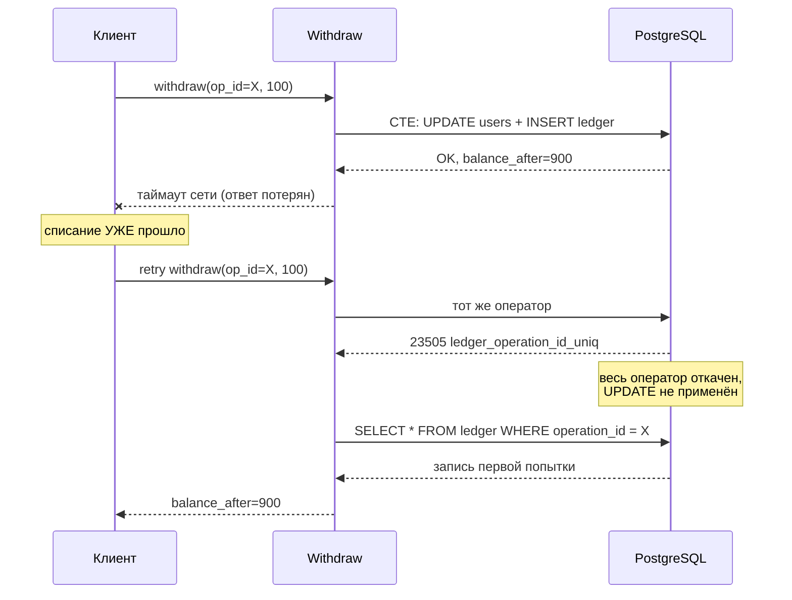

# Задача 3: Списание баланса и ledger

## Содержание

- [Формулировка](#формулировка)
- [Изначальный код](#изначальный-код)
- [Уточняющие вопросы](#уточняющие-вопросы)
- [Разбор проблем](#разбор-проблем)
- [Решение уровня 1](#решение-уровня-1)
- [Ledger как источник правды](#ledger-как-источник-правды)
- [Reference implementation](#reference-implementation)
- [Перевод между счетами](#перевод-между-счетами)
- [Сверка и эксплуатация](#сверка-и-эксплуатация)
- [Тесты](#тесты)
- [Чеклист ревью финансового кода](#чеклист-ревью-финансового-кода)
- [Interview-ready answer](#interview-ready-answer)
- [Связанные материалы](#связанные-материалы)

Задача проверяет разбор кода, который меняет деньги. В отличие от задач на
конкурентность, где основной риск — утечка goroutine, здесь цена дефекта другая:
расхождение баланса с реальностью, двойное списание или потерянное списание.
Ошибки распределены по трём слоям: компиляция, работа с транзакцией и модель
данных. Последний слой обычно и определяет уровень ответа — исправленная функция
всё ещё хранит деньги как перезаписываемое поле, из которого невозможно
восстановить, как баланс стал таким.

Материал ориентирован на Go 1.25+, `database/sql` и `jackc/pgx` v5,
PostgreSQL 16–17. Поведение SQL описано по документации PostgreSQL; конкретные
коды ошибок (`23505`, `40001`, `40P01`) стабильны между версиями.

---

## Формулировка

Провести code review функции списания баланса. Ожидаемый контракт:

- списывает `amount` со счёта `userID`;
- отказывает, если средств не хватает;
- возвращает баланс после операции;
- безопасна при конкурентных вызовах для одного пользователя.

Сначала следует проверить компиляцию и корректность транзакции, затем — модель
хранения денег и повторяемость операции.

---

## Изначальный код

```go
func withdrawBalance(db *sql.DB, userID int32, amount float32) (float32, error) {
    tx.BeginTransaction("ISOLATION LEVEL READ COMMITED")
    err = tx.QueryRow(`SELECT balance FROM users WHERE user_id = $1 FOR UPDATE`, userID).Scan(&oldBalance)

    if oldBalance < amount {
        return oldBalance, fmt.Errorf("insufficient funds")
    }

    _, err = tx.Exec(`UPDATE users SET balance = balance - $1 WHERE user_id = $2`, amount, userID)
    var newBalance float32
    err = tx.QueryRow(`SELECT balance FROM users WHERE user_id = $1`, userID).Scan(&newBalance)

    return newBalance, nil
}
```

Код не компилируется, поэтому часть дефектов — гипотетические: они проявятся
после того, как код будет приведён к рабочему виду. Это нормальная ситуация для
bug hunt: дефекты раскрываются слоями.

---

## Уточняющие вопросы

1. Валюта одна или несколько? От этого зависит, достаточно ли одного столбца
   `balance` и по какому измерению держится инвариант нулевой суммы.
2. Допустим ли отрицательный баланс (овердрафт, кредитный лимит)?
3. Есть ли у операции внешний идентификатор — заказ, ставка, платёж? Без него
   невозможно сделать вызов идемпотентным.
4. Как вызывается функция: синхронный HTTP-запрос или обработчик сообщения из
   очереди? Во втором случае повторная доставка гарантирована и идемпотентность
   обязательна.
5. Нужна ли история операций (выписка, аудит, разбор спора с клиентом)?
6. Какой объём: сколько операций в секунду и сколько их накапливается на одном
   активном счёте за год?
7. Списание всегда одиночное или бывают переводы между счетами и списания с
   комиссией?

---

## Разбор проблем

### 1. Код не компилируется

| Строка | Проблема |
| --- | --- |
| `tx.BeginTransaction(...)` | `tx` нигде не объявлен; метода `BeginTransaction` в `database/sql` нет |
| `err = ...` | `err` и `oldBalance` не объявлены — нужен `:=` |
| `"ISOLATION LEVEL READ COMMITED"` | опечатка в `COMMITTED`; уровень изоляции задаётся не строкой |

Корректное начало транзакции:

```go
tx, err := db.BeginTx(ctx, &sql.TxOptions{Isolation: sql.LevelReadCommitted})
```

Отдельно к сигнатуре: `userID int32` ограничивает счёт значением ~2.1 млрд, а
типовая схема использует `BIGSERIAL`/`BIGINT`. Расхождение типа в Go и в БД —
источник тихого переполнения при росте таблицы.

### 2. Транзакция не завершается

Нет `Commit` — списание не сохранится вообще. Нет `defer tx.Rollback()` — при
выходе по `insufficient funds` транзакция остаётся открытой до тех пор, пока
соединение не будет закрыто или переиспользовано пулом.

Что происходит с открытой транзакцией в PostgreSQL:

- соединение не возвращается в пул в чистом состоянии; под нагрузкой пул
  выедается, новые запросы ждут свободного соединения;
- строка остаётся заблокированной блокировкой, взятой `SELECT ... FOR UPDATE`;
  все конкурентные списания этого же пользователя выстраиваются в очередь;
- сессия висит в состоянии `idle in transaction` — видно в `pg_stat_activity`;
- `xmin` открытой транзакции удерживает горизонт видимости, поэтому autovacuum
  не может очистить мёртвые версии строк во **всей** БД, а не только в `users`.

Идиома, закрывающая все ветви выхода:

```go
tx, err := db.BeginTx(ctx, opts)
if err != nil {
    return fmt.Errorf("begin: %w", err)
}
defer tx.Rollback() // после успешного Commit вернёт sql.ErrTxDone — безопасно
```

`sql.ErrTxDone` — сентинельная ошибка `database/sql`, означающая «транзакция уже
завершена». Именно поэтому `defer tx.Rollback()` можно ставить безусловно: на
успешном пути он выполняется после `Commit` и не делает ничего. У `pgx` v5
аналог называется `pgx.ErrTxClosed`.

### 3. Ни одна ошибка не проверена

`err` присваивается трижды и не читается ни разу. Два конкретных сценария:

- **Пользователя нет.** `QueryRow(...).Scan(...)` возвращает `sql.ErrNoRows`,
  `oldBalance` остаётся нулём, срабатывает ветка `oldBalance < amount`, и клиент
  получает «недостаточно средств» вместо «пользователь не найден». Техническая
  ошибка замаскирована под бизнес-результат — самый дорогой вид дефекта, потому
  что мониторинг его не видит.
- **`UPDATE` не выполнился** (нарушен constraint, deadlock, обрыв соединения).
  Функция возвращает `nil` и «новый» баланс, вызывающая сторона считает списание
  успешным и, например, отгружает товар.

### 4. Деньги хранятся во `float32`

`float32` — это IEEE 754 binary32: 24 бита мантиссы, примерно 7 значащих
десятичных цифр. Начиная с 2^24 = 16 777 216 соседние представимые числа
отстоят друг от друга больше чем на единицу, поэтому прибавление единицы не
меняет значение.

Замер на реальном коде (go1.26.5, darwin/arm64, Apple M3 Max):

```go
var b float32 = 16_777_216 // 2^24
fmt.Printf("%.2f + 1 = %.2f\n", b, b+1)
// 16777216.00 + 1 = 16777216.00 — единица потеряна

// Баланс 100 000.00, 10 000 списаний по 1.10
var bal float32 = 100_000
for i := 0; i < 10_000; i++ {
    bal -= 1.10
}
fmt.Printf("%.6f\n", bal) // 88984.375000 вместо 89000.000000
```

Дрейф — **15.625 в плюс клиенту** на десяти тысячах мелких операций. Тот же цикл
на `float64` даёт `89000.000000` с погрешностью около `6e-8`, на `int64` в
копейках — точное `8900000`.

Распространённая формулировка «`0.1 + 0.2 != 0.3`» для `float32` как раз не
воспроизводится: при округлении до binary32 обе стороны совпадают, и сравнение
возвращает `true`. Это делает проблему коварнее — точечная проверка «вроде
сходится» ничего не доказывает, деньги теряются на накоплении.

**Как правильно:**

- `int64` в минимальных единицах (копейки, центы, сатоши), в БД `BIGINT`. Запас
  `int64` — примерно 9.2·10^18 минимальных единиц, то есть 9.2·10^16 рублей;
- либо `NUMERIC` в БД и `shopspring/decimal` / `pgtype.Numeric` в Go, если нужна
  произвольная точность и деление с округлением по правилам домена.

Количество знаков после запятой определяется валютой по ISO 4217 и не равно двум
универсально: у JPY и KRW знаков нет, у KWD и BHD их три. Для криптовалют с
8–18 знаками целые в минимальных единицах — единственный практичный вариант.

### 5. `amount` не валидируется

```go
amount = -100
// balance - (-100) → баланс УВЕЛИЧИЛСЯ
```

Списание отрицательной суммы — это пополнение. Если значение приходит из
внешнего API или из тела HTTP-запроса, это готовая дыра.

Для float добавляются `NaN` и `Inf`. Все сравнения с `NaN` возвращают `false`:

```go
nan := float32(math.NaN())
fmt.Println(nan < 100)  // false
fmt.Println(nan >= 100) // false
```

То есть проверка `oldBalance < amount` при `amount = NaN` не срабатывает, и
`balance - NaN` превращает баланс в `NaN` навсегда. На целых типах этот класс
ошибок исчезает вместе с типом.

### 6. Нет `context.Context`

Ни таймаута, ни отмены. Клиент отвалился по сети — транзакция с блокировкой
строки продолжает висеть до собственного завершения. Нужны `QueryRowContext` /
`ExecContext` / `BeginTx(ctx, ...)`, а на уровне БД — `statement_timeout` и
`lock_timeout` как страховка от зависших сессий.

### 7. Три round-trip и лишняя блокировка

`SELECT ... FOR UPDATE` → `UPDATE` → `SELECT` — три обращения к БД, и всё это
время строка заблокирована на запись. Длительность блокировки прямо ограничивает
пропускную способность по одному счёту: конкурентные списания сериализуются на
ней.

Читать баланс отдельным запросом после `UPDATE` не нужно — `RETURNING` отдаёт
новое значение тем же оператором.

### 8. Условие проверяется в приложении, а не в БД

Классический read-modify-write: значение прочитано в Go, решение принято в Go,
запись отправлена обратно. Здесь его спасает `FOR UPDATE`, но конструкция
хрупкая — достаточно кому-то убрать `FOR UPDATE` при рефакторинге, и на
`READ COMMITTED` появится lost update. Условие `balance >= amount` должно жить
в самом `UPDATE`.

### 9. API возвращает баланс вместе с ошибкой

`return oldBalance, fmt.Errorf("insufficient funds")` — вызывающая сторона
получает и значение, и ошибку, и вынуждена парсить текст, чтобы отличить
«не хватило средств» от «нет пользователя». Нужны сентинельные ошибки под
`errors.Is`.

### 10. Нет журнала операций

Даже полностью исправленная функция оставляет только текущее значение
`users.balance`. Из него невозможно ответить, из каких операций он сложился,
восстановить состояние на момент времени и доказать корректность при споре.
Отсюда переход к ledger — см. раздел «Ledger как источник правды».

---

## Решение уровня 1

Минимальная исправленная версия: одна операция — один оператор SQL, без явной
транзакции.

```go
var (
    ErrInsufficientFunds = errors.New("insufficient funds")
    ErrUserNotFound      = errors.New("user not found")
    ErrInvalidAmount     = errors.New("invalid amount")
)

// amount и balance — в минимальных единицах (копейках)
func withdrawBalance(ctx context.Context, db *sql.DB, userID, amount int64) (int64, error) {
    if amount <= 0 {
        return 0, fmt.Errorf("%w: %d", ErrInvalidAmount, amount)
    }

    var newBalance int64
    err := db.QueryRowContext(ctx, `
        UPDATE users
        SET balance = balance - $1
        WHERE user_id = $2 AND balance >= $1
        RETURNING balance`,
        amount, userID,
    ).Scan(&newBalance)

    switch {
    case err == nil:
        return newBalance, nil

    case errors.Is(err, sql.ErrNoRows):
        // UPDATE не задел ни одной строки: либо пользователя нет,
        // либо не хватило средств. Различаем отдельным запросом.
        var cur int64
        switch err := db.QueryRowContext(ctx,
            `SELECT balance FROM users WHERE user_id = $1`, userID,
        ).Scan(&cur); {
        case errors.Is(err, sql.ErrNoRows):
            return 0, ErrUserNotFound
        case err != nil:
            return 0, fmt.Errorf("check balance: %w", err)
        }
        return cur, ErrInsufficientFunds

    default:
        return 0, fmt.Errorf("withdraw: %w", err)
    }
}
```

### Почему одного `UPDATE` достаточно

Ключ — поведение `READ COMMITTED` при конкурентной записи в ту же строку.
PostgreSQL действует так: если `UPDATE` дошёл до строки, которую параллельная
транзакция уже изменила и ещё не зафиксировала, он **ждёт** её завершения. После
коммита конкурента PostgreSQL не берёт старую версию строки, а перевычисляет
условие `WHERE` на новой версии (механизм EvalPlanQual). Если условие больше не
выполняется — строка пропускается.

Отсюда два следствия:

- `balance = balance - $1` считается от актуального зафиксированного значения, а
  не от снимка начала оператора — потерянного обновления не возникает;
- `balance >= $1` перепроверяется на свежих данных, поэтому два конкурентных
  списания не могут вдвоём пройти проверку по одному и тому же остатку.

Это свойство **одного оператора**. Оно не распространяется на схему «прочитали в
Go → посчитали → записали»: там между чтением и записью снимок устаревает, и
нужна либо явная блокировка `FOR UPDATE`, либо `REPEATABLE READ` с повтором по
`40001`.

Контраст с исходным кодом:

| Свойство | `SELECT FOR UPDATE` + `UPDATE` + `SELECT` | Атомарный `UPDATE ... RETURNING` |
| --- | --- | --- |
| Round-trip | 3 | 1 |
| Явная транзакция | обязательна | не нужна |
| Длительность блокировки строки | от `SELECT` до `COMMIT` | внутри одного оператора |
| Риск «забыли Commit/Rollback» | есть | отсутствует |
| Где живёт условие достаточности | в коде приложения | в БД |

Уровень 1 корректен, но всё ещё хранит только текущий баланс и не идемпотентен:
повторный вызов спишет второй раз.

---

## Ledger как источник правды

Баланс как перезаписываемое поле для финансов — антипаттерн:

- нет аудита: непонятно, из чего сложилась текущая сумма;
- нельзя восстановить состояние на момент времени;
- невозможно доказать корректность при споре с клиентом или проверке.

Ledger — append-only журнал операций. Каждая операция добавляет строку; строки
не изменяются и не удаляются. Баланс становится производной от журнала: либо
вычисляется из него, либо хранится денормализованно и сверяется с ним.

### Схема

```sql
CREATE TABLE users (
    user_id    BIGSERIAL PRIMARY KEY,
    balance    BIGINT NOT NULL DEFAULT 0 CHECK (balance >= 0), -- в копейках
    updated_at TIMESTAMPTZ NOT NULL DEFAULT now()
);

CREATE TABLE ledger (
    id            BIGSERIAL PRIMARY KEY,
    operation_id  UUID   NOT NULL,                     -- ключ идемпотентности
    user_id       BIGINT NOT NULL REFERENCES users(user_id),
    amount        BIGINT NOT NULL CHECK (amount <> 0), -- знаковое: + приход, − расход
    balance_after BIGINT NOT NULL,                     -- снимок для аудита
    op_type       TEXT   NOT NULL
        CHECK (op_type IN ('deposit','withdrawal','bet','win','refund','adjustment')),
    metadata      JSONB,
    created_at    TIMESTAMPTZ NOT NULL DEFAULT now()
);

CREATE UNIQUE INDEX ledger_operation_id_uniq ON ledger (operation_id);
CREATE INDEX ledger_user_created_idx ON ledger (user_id, created_at DESC, id DESC);
```

### Решения, которые нужно уметь защитить

**`amount` знаковый, а не пара столбцов `debit` / `credit`.** Сверка сводится к
`SUM(amount)`, не нужно помнить, какой столбец в какую сторону. Направление
операции читается из `op_type`, а не из того, в какой столбец попало число.

**`balance` в `users` — денормализованный кэш, а не дубликат правды.** Считать
`SUM(amount)` на каждое чтение нельзя: у активного счёта в биллинге или iGaming
накапливаются сотни тысяч строк, и стоимость чтения растёт линейно по истории.
Кэш обслуживает чтения, ledger обслуживает аудит, между ними — фоновая сверка.

**`balance_after` формально избыточен, но полезен.** Значение выводится из суммы
предыдущих строк, однако его наличие даёт две вещи: выписка строится одним
`SELECT` без оконных функций, а при расхождении сразу видно, **на какой именно
операции** журнал разошёлся с кэшем.

**`op_type` как `TEXT` + `CHECK`, а не `ENUM`.** Добавление значения в
PostgreSQL-`ENUM` делается через `ALTER TYPE ... ADD VALUE` и накладывает
ограничения на использование нового значения в той же транзакции;
`TEXT` + `CHECK` меняется обычным `ALTER TABLE ... DROP/ADD CONSTRAINT`. Если
набор значений заведомо стабилен, `ENUM` экономнее по месту — выбор между
компактностью и лёгкостью миграций.

**`CHECK (balance >= 0)` — последняя линия обороны.** При корректном
`UPDATE ... WHERE balance >= $1` он никогда не срабатывает. Его смысл в том,
что даже запись мимо функции списания (миграция, ручной `UPDATE` из консоли,
новый сервис) не уведёт счёт в минус, а получит ошибку. Если домен допускает
овердрафт, констрейнт формулируется как `balance >= -credit_limit`.

---

## Reference implementation

`UPDATE` баланса и `INSERT` в журнал — в одном операторе через
data-modifying CTE (`WITH`, внутри которого стоит изменяющий данные запрос).

```sql
-- const withdrawQuery = `...`
WITH upd AS (
    UPDATE users
    SET balance = balance - $3, updated_at = now()
    WHERE user_id = $2 AND balance >= $3
    RETURNING balance
)
INSERT INTO ledger (operation_id, user_id, amount, balance_after, op_type)
SELECT $1, $2, -$3, balance, 'withdrawal' FROM upd
RETURNING id, balance_after, created_at
```

Механика по шагам:

1. CTE `upd` выполняет списание и возвращает новый баланс — ноль строк, если
   пользователя нет или средств не хватило.
2. `INSERT ... SELECT ... FROM upd` вставляет запись журнала только при наличии
   строки в `upd`. Пустой `upd` → нулевой `INSERT` → оператор возвращает
   `ErrNoRows`, и баланс при этом не изменён.
3. Оператор один, поэтому его атомарность обеспечивает сам PostgreSQL: явная
   транзакция не нужна. Либо изменились обе таблицы, либо ни одна.
4. Уникальный индекс по `operation_id` не даёт провести одну и ту же операцию
   дважды. Нарушение индекса — ошибка `23505`, откатывающая **весь** оператор,
   включая `UPDATE` из CTE.

```go
type Entry struct {
    ID           int64
    OperationID  uuid.UUID
    UserID       int64
    Amount       int64
    BalanceAfter int64
    OpType       string
    CreatedAt    time.Time
}

func Withdraw(
    ctx context.Context,
    db *pgxpool.Pool,
    opID uuid.UUID,
    userID, amount int64,
) (*Entry, error) {
    if amount <= 0 {
        return nil, fmt.Errorf("%w: %d", ErrInvalidAmount, amount)
    }

    e := &Entry{
        OperationID: opID,
        UserID:      userID,
        Amount:      -amount,
        OpType:      "withdrawal",
    }

    err := db.QueryRow(ctx, withdrawQuery, opID, userID, amount).
        Scan(&e.ID, &e.BalanceAfter, &e.CreatedAt)

    switch {
    case err == nil:
        return e, nil

    case isUniqueViolation(err, "ledger_operation_id_uniq"):
        // Операция уже проводилась: UPDATE откатился вместе с оператором,
        // двойного списания нет. Возвращаем результат первой попытки.
        return findEntry(ctx, db, opID)

    case errors.Is(err, pgx.ErrNoRows):
        return nil, classifyNoRows(ctx, db, userID, amount)

    default:
        return nil, fmt.Errorf("withdraw: %w", err)
    }
}

func isUniqueViolation(err error, constraint string) bool {
    var pgErr *pgconn.PgError
    return errors.As(err, &pgErr) &&
        pgErr.Code == pgerrcode.UniqueViolation && // "23505"
        pgErr.ConstraintName == constraint
}

// Результат ранее выполненной операции — для ответа на повтор.
func findEntry(ctx context.Context, db *pgxpool.Pool, opID uuid.UUID) (*Entry, error) {
    e := &Entry{OperationID: opID}
    err := db.QueryRow(ctx, `
        SELECT id, user_id, amount, balance_after, op_type, created_at
        FROM ledger WHERE operation_id = $1`, opID,
    ).Scan(&e.ID, &e.UserID, &e.Amount, &e.BalanceAfter, &e.OpType, &e.CreatedAt)
    if err != nil {
        return nil, fmt.Errorf("find entry %s: %w", opID, err)
    }
    return e, nil
}

// Редкий путь: разбираемся, почему UPDATE не задел строку.
func classifyNoRows(ctx context.Context, db *pgxpool.Pool, userID, amount int64) error {
    var cur int64
    err := db.QueryRow(ctx,
        `SELECT balance FROM users WHERE user_id = $1`, userID).Scan(&cur)
    switch {
    case errors.Is(err, pgx.ErrNoRows):
        return ErrUserNotFound
    case err != nil:
        return fmt.Errorf("classify: %w", err)
    }
    return fmt.Errorf("%w: have %d, need %d", ErrInsufficientFunds, cur, amount)
}
```

Проверка `ConstraintName` обязательна. Без неё конфликт по любому другому
уникальному индексу этой таблицы будет молча интерпретирован как «операция уже
выполнена», и списание тихо не произойдёт.

### Идемпотентность через индекс, а не через `SELECT`

Проверять «была ли уже такая операция» отдельным `SELECT` перед списанием —
гонка: два конкурентных повтора оба увидят пустой результат и оба спишут.

Корректный механизм опирается на свойство уникального индекса: при вставке
дублирующего ключа, который вставлен, но ещё не зафиксирован другой транзакцией,
вставляющий backend **блокируется** до завершения этой транзакции. Дальше два
исхода — конкурент зафиксировался и повтор получает `23505`, либо конкурент
откатился и повтор проходит штатно.



Без ключа идемпотентности этот сценарий приводит к двойному списанию, причём
воспроизводится он не в тестах, а под сетевыми таймаутами в проде.

### Ловушка: `ON CONFLICT DO NOTHING` в этом CTE

Соблазн заменить обработку ошибки на «мягкий» вариант ломает атомарность:

```sql
-- НЕВЕРНО
WITH upd AS (
    UPDATE users SET balance = balance - $3
    WHERE user_id = $2 AND balance >= $3
    RETURNING balance
)
INSERT INTO ledger (...)
SELECT ... FROM upd
ON CONFLICT (operation_id) DO NOTHING   -- ← дефект
RETURNING id
```

`UPDATE` в CTE уже выполнился. `ON CONFLICT DO NOTHING` подавляет только вставку
в журнал — списание остаётся применённым, а оператор возвращает ноль строк, и
код принимает это за «операция уже была». Результат: повторное списание без
записи в журнале, то есть ровно то расхождение, которое ledger должен ловить.
Ошибка `23505` нужна именно потому, что она откатывает оператор целиком.

---

## Перевод между счетами

CTE решает задачу, где меняется одна строка. Как только нужно списать у одного и
начислить другому (перевод, ставка с комиссией, выплата мерчанту), требуется
явная транзакция.

### Фиксированный порядок блокировок

```
Транзакция 1 (A→B):  захватывает A, затем B
Транзакция 2 (B→A):  захватывает B, затем A
                     ↓
              взаимное ожидание → deadlock
```

PostgreSQL обнаружит цикл и снимет одну из транзакций с ошибкой `40P01`
(`deadlock_detected`) — по умолчанию проверка запускается через `deadlock_timeout`
(1 s). Формально это не потеря данных, но это отказ запроса, всплеск задержек и
алерт. Сортировка идентификаторов перед захватом убирает цикл целиком: все
транзакции берут блокировки в одном и том же порядке.

Однооператорный вариант `SELECT ... WHERE user_id IN ($1,$2) ORDER BY user_id FOR UPDATE`
опирается на то, что узел блокировки в плане окажется над сортировкой. Порядок
захвата в этом случае — свойство выбранного плана, а не гарантия языка. Два
отдельных оператора в явно заданном порядке не зависят от планировщика:

```go
func Transfer(
    ctx context.Context,
    db *pgxpool.Pool,
    opID uuid.UUID,
    from, to, amount int64,
) error {
    if amount <= 0 {
        return fmt.Errorf("%w: %d", ErrInvalidAmount, amount)
    }
    if from == to {
        return errors.New("self-transfer")
    }

    tx, err := db.BeginTx(ctx, pgx.TxOptions{IsoLevel: pgx.ReadCommitted})
    if err != nil {
        return fmt.Errorf("begin: %w", err)
    }
    defer tx.Rollback(ctx) // после Commit вернёт pgx.ErrTxClosed — безопасно

    // 1. Заявка на операцию: уникальность здесь делает весь перевод идемпотентным.
    if _, err := tx.Exec(ctx,
        `INSERT INTO operations (operation_id, kind) VALUES ($1, 'transfer')`,
        opID,
    ); err != nil {
        if isUniqueViolation(err, "operations_pkey") {
            // Транзакция уже в состоянии abort — откатываем и читаем
            // результат первой попытки отдельным запросом.
            _ = tx.Rollback(ctx)
            return nil
        }
        return fmt.Errorf("register operation: %w", err)
    }

    // 2. Блокировки в порядке возрастания user_id — один и тот же для всех
    //    транзакций, поэтому цикл ожидания невозможен.
    first, second := from, to
    if first > second {
        first, second = second, first
    }
    for _, id := range []int64{first, second} {
        if _, err := tx.Exec(ctx,
            `SELECT 1 FROM users WHERE user_id = $1 FOR UPDATE`, id); err != nil {
            return fmt.Errorf("lock %d: %w", id, err)
        }
    }

    // 3. Обе половины перевода — в одной транзакции.
    if err := debit(ctx, tx, opID, from, amount); err != nil {
        return err
    }
    if err := credit(ctx, tx, opID, to, amount); err != nil {
        return err
    }

    if err := tx.Commit(ctx); err != nil {
        return fmt.Errorf("commit: %w", err)
    }
    return nil
}
```

### Где всплывает `23505`

При обычном (не `DEFERRABLE`) уникальном индексе нарушение возникает **в момент
`INSERT`**, а не на `Commit`. Проверять его на `Commit` имеет смысл только для
констрейнтов, объявленных `DEFERRABLE INITIALLY DEFERRED`.

Важное следствие для Go-кода: после любой ошибки PostgreSQL переводит
транзакцию в состояние abort, и все последующие запросы в ней возвращают
«current transaction is aborted». Прочитать результат первой попытки внутри
той же транзакции нельзя — нужен `Rollback` и отдельный запрос. Если требуется
продолжить транзакцию после ожидаемой ошибки, используется `SAVEPOINT` (в pgx —
вложенная транзакция через `tx.Begin(ctx)`).

### Составной ключ идемпотентности

У перевода один `operation_id` порождает две строки журнала, поэтому глобально
уникальный индекс по `operation_id` в `ledger` перестаёт работать. Два выхода:

```sql
-- А. Уникальность в пределах счёта
CREATE UNIQUE INDEX ledger_op_user_uniq ON ledger (operation_id, user_id);

-- Б. Отдельная таблица операций, на которую ссылается журнал
CREATE TABLE operations (
    operation_id UUID PRIMARY KEY,
    kind         TEXT        NOT NULL,
    created_at   TIMESTAMPTZ NOT NULL DEFAULT now()
);
```

Вариант Б чище для составных сценариев (ставка → выигрыш → откат), где одна
бизнес-операция состоит из нескольких записей на разных счетах и с разными
типами: уникальность живёт в одном месте, а журнал остаётся чисто
append-only-таблицей. Он же снимает проблему партиционирования — см. ниже.

---

## Сверка и эксплуатация

### Инвариант «кэш равен журналу»

```sql
SELECT u.user_id,
       u.balance                 AS cached,
       COALESCE(SUM(l.amount),0) AS actual
FROM users u
LEFT JOIN ledger l USING (user_id)
GROUP BY u.user_id, u.balance
HAVING u.balance <> COALESCE(SUM(l.amount), 0);
```

Пустой результат — инвариант держится. Непустой означает, что в `balance` писали
мимо журнала, и это инцидент, а не предупреждение: денормализованное значение
«выглядит правильным» и само по себе ничего не сигналит.

На объёме такой запрос по всей истории нежизнеспособен. Практическая схема —
инкрементальная сверка: периодические снапшоты баланса на отметку времени плюс
сумма записей журнала после неё, и только по счетам с недавним `updated_at`.
Число расходящихся счетов выносится в метрику мониторинга.

Для мультивалютной модели инвариант держится **по каждой валюте отдельно**, а
общая сумма по всем записям системы должна давать ноль внутри валюты — разбор
двойной записи и FX-счетов см. в
[Payment System](../../../05-system-design/interview-cases/11-payment-system.md),
раздел «Ledger: неизменяемый лог».

### Повторы

Списание должно уметь переживать повтор, потому что часть ошибок PostgreSQL
относится к классу «повтори транзакцию»:

- `40001` (`serialization_failure`) — на `REPEATABLE READ` и `SERIALIZABLE`;
- `40P01` (`deadlock_detected`) — на любом уровне изоляции.

Повторять следует только их, с экспоненциальной задержкой и jitter. Ошибки
бизнес-уровня (`insufficient funds`) и нарушения констрейнтов повторять
бессмысленно. Безопасность повтора обеспечивает тот же `operation_id`: вторая
попытка либо доводит операцию до конца, либо упирается в уникальный индекс.

| Уровень изоляции | Поведение при конкурентных списаниях |
| --- | --- |
| `READ COMMITTED` | сам по себе от lost update не защищает; защиту даёт `FOR UPDATE` либо условие внутри `UPDATE ... WHERE balance >= $1` |
| `REPEATABLE READ` | конкурентные операции по одной строке начинают падать с `40001`, обязателен retry |
| `SERIALIZABLE` | корректность любых комбинаций чтений и записей ценой ещё большей доли `40001` |

Для одиночного списания `READ COMMITTED` вместе с атомарным `UPDATE` даёт
корректность без повторов — это самый дешёвый рабочий вариант.

### Партиционирование журнала

`ledger` растёт монотонно и никогда не обновляется — естественный кандидат на
партиционирование по `created_at` (помесячно). Старые партиции уходят в холодное
хранилище, индексы на горячих остаются компактными.

Ограничение, о котором легко забыть: **уникальный индекс на партиционированной
таблице обязан включать ключ партиционирования**. Значит,
`UNIQUE (operation_id)` на таблице, партиционированной по `created_at`,
создать нельзя, а `UNIQUE (operation_id, created_at)` не даёт нужной гарантии —
одну и ту же операцию можно провести в разные месяцы. Отсюда практическое
следствие: ключи идемпотентности живут в отдельной непартиционированной таблице
`operations` (вариант Б выше), либо журнал партиционируется по хэшу от
`operation_id`, что несовместимо с отправкой старых периодов в архив.

### Иммутабельность на уровне прав

Правило «журнал только дописывается» удобно закрепить не соглашением, а правами:

```sql
REVOKE UPDATE, DELETE ON ledger FROM app_user;
```

Оговорка: `REVOKE` не действует на владельца таблицы и на суперпользователя,
поэтому приложение должно ходить в БД под ролью, которая владельцем не является.
Отмена операции оформляется компенсирующей записью с `op_type = 'refund'` и
ссылкой на исходную запись в `metadata`, а не `DELETE`.

---

## Тесты

Логику списания нельзя проверить моком драйвера: проверяется именно поведение
PostgreSQL при конкуренции. Рабочий вариант — `testcontainers-go` с реальным
PostgreSQL и три сценария.

**1. Конкурентные списания не уводят баланс в минус.**

```go
// Баланс 1000 копеек, 100 goroutine пытаются списать по 20.
// Пройти должны ровно 50, остальные — ErrInsufficientFunds.
const (
    start   = 1000
    amount  = 20
    workers = 100
)

var ok, insufficient atomic.Int64
var wg sync.WaitGroup
for i := 0; i < workers; i++ {
    wg.Add(1)
    go func() {
        defer wg.Done()
        _, err := Withdraw(ctx, pool, uuid.New(), userID, amount)
        switch {
        case err == nil:
            ok.Add(1)
        case errors.Is(err, ErrInsufficientFunds):
            insufficient.Add(1)
        default:
            t.Error(err)
        }
    }()
}
wg.Wait()

require.Equal(t, int64(start/amount), ok.Load())        // 50
require.Equal(t, int64(workers-start/amount), insufficient.Load())
require.Equal(t, int64(0), readBalance(t, pool, userID))
```

**2. Повтор с тем же `operation_id` списывает один раз.**

```go
opID := uuid.New()
var wg sync.WaitGroup
for i := 0; i < 10; i++ {          // 10 одновременных повторов
    wg.Add(1)
    go func() { defer wg.Done(); _, _ = Withdraw(ctx, pool, opID, userID, 100) }()
}
wg.Wait()

require.Equal(t, 1, countLedgerRows(t, pool, opID))
require.Equal(t, int64(start-100), readBalance(t, pool, userID))
```

**3. Инвариант сверки после произвольной нагрузки.** Прогнать смесь списаний,
пополнений и повторов, затем выполнить запрос сверки и потребовать пустой
результат.

Тест «баланс не ушёл в минус» ловит проблему изоляции, тест «одна запись на
`operation_id`» — проблему идемпотентности, тест сверки — расхождение кэша с
журналом. Все три детерминированы и не полагаются на `time.Sleep`.

---

## Чеклист ревью финансового кода

- [ ] Деньги в целых минимальных единицах или `NUMERIC`, не в `float`.
- [ ] `amount > 0` проверен до обращения к БД.
- [ ] Все ошибки проверены; `sql.ErrNoRows` отличается от бизнес-ошибки.
- [ ] `context.Context` протянут во все запросы; заданы `statement_timeout` и
      `lock_timeout`.
- [ ] `defer tx.Rollback()` стоит сразу после `BeginTx`.
- [ ] `tx.Commit()` присутствует, и его ошибка проверена.
- [ ] Условие достаточности средств живёт в `UPDATE`, а не в коде приложения.
- [ ] Идемпотентность — уникальный индекс, а не предварительный `SELECT`.
- [ ] Запись в журнал происходит в той же транзакции (или том же операторе), что
      и изменение баланса.
- [ ] Порядок захвата блокировок фиксирован для многострочных операций.
- [ ] `CHECK (balance >= 0)` присутствует в схеме.
- [ ] Сентинельные ошибки пригодны для `errors.Is` у вызывающего.
- [ ] Повторы только на `40001` и `40P01`, с backoff и jitter.
- [ ] Есть фоновая сверка журнала с балансом и метрика расхождений.
- [ ] На журнал отозваны права `UPDATE` / `DELETE`.

---

## Interview-ready answer

**1. Что в этой функции самое опасное?**

- Деньги во `float32`: 24 бита мантиссы дают потерю точности уже около 16.7 млн
  минимальных единиц, а на 10 000 мелких списаний баланс уезжает на заметную
  величину; хранить надо `int64` в копейках или `NUMERIC`.

**2. Почему отсутствие `Commit` и `Rollback` — не просто «забыли строку»?**

- Транзакция остаётся открытой: соединение не возвращается в пул, строка висит
  заблокированной после `FOR UPDATE`, сессия уходит в `idle in transaction`, а
  её `xmin` удерживает горизонт видимости и мешает autovacuum по всей базе.

**3. Зачем `FOR UPDATE`, если уже есть `READ COMMITTED`?**

- `READ COMMITTED` сам по себе не защищает от lost update при чтении и записи
  разными операторами; защиту даёт либо `FOR UPDATE`, либо перенос условия
  внутрь `UPDATE ... WHERE balance >= $1`, и второй вариант предпочтительнее,
  потому что держит блокировку строки только на время одного оператора.

**4. Почему одного `UPDATE ... WHERE balance >= $1` достаточно?**

- В `READ COMMITTED` `UPDATE`, встретив строку, изменённую незафиксированной
  транзакцией, дожидается её и перевычисляет условие `WHERE` на новой версии
  строки, поэтому второе конкурентное списание не может пройти проверку по уже
  израсходованному остатку.

**5. Что делать, если клиент отправил запрос дважды?**

- Клиент передаёт `operation_id`, а уникальный индекс по нему в журнале не даёт
  провести операцию второй раз; предварительный `SELECT` вместо индекса — гонка,
  при которой оба повтора видят пустой результат и оба списывают.

**6. Почему не считать баланс как `SUM` из журнала при каждом чтении?**

- Стоимость чтения растёт линейно по истории счёта, а у активного счёта это
  сотни тысяч строк; практическая схема — денормализованный баланс плюс
  периодические снапшоты и фоновая сверка с журналом.

**7. Как избежать deadlock при переводе между счетами?**

- Захватывать строки в детерминированном порядке, например по возрастанию
  `user_id`; иначе встречные переводы A→B и B→A образуют цикл ожидания и
  PostgreSQL снимает одну из транзакций с `40P01`.

**8. Как откатить ошибочную операцию?**

- Компенсирующей записью в журнале со ссылкой на исходную операцию, а не
  `UPDATE`/`DELETE`: журнал append-only, иначе теряется возможность доказать
  историю.

**9. Какие ошибки имеет смысл повторять?**

- Только `40001` (`serialization_failure`) и `40P01` (`deadlock_detected`) с
  экспоненциальной задержкой и jitter; повтор безопасен именно потому, что
  операция идемпотентна по `operation_id`.

**10. Что мешает партиционировать журнал по времени?**

- Уникальный индекс на партиционированной таблице обязан включать ключ
  партиционирования, поэтому глобальный `UNIQUE (operation_id)` становится
  невозможен, и ключи идемпотентности выносятся в отдельную
  непартиционированную таблицу операций.

---

## Связанные материалы

- [Транзакции и блокировки](../../../06-databases/database-systems-catalog/postgresql/04-transactions-and-locking.md) —
  уровни изоляции, `FOR UPDATE`, deadlock, аномалии.
- [Идемпотентность](../../../05-system-design/reliability-patterns/06-idempotency.md) —
  паттерн Idempotency Key и его реализация в PostgreSQL.
- [Transactional Outbox и идемпотентность](../../../06-databases/database-systems-catalog/postgresql/14-outbox-and-idempotency.md) —
  публикация событий об операции без dual-write.
- [Payment System](../../../05-system-design/interview-cases/11-payment-system.md) —
  двойная запись, мультивалютный ledger, сверка с PSP.
- [Партиционирование](../../../06-databases/database-systems-catalog/postgresql/05-partitioning.md) —
  секционирование растущих таблиц и ограничения индексов.
- [Connection pooling](../../../06-databases/database-systems-catalog/postgresql/09-connection-pooling.md) —
  почему открытая транзакция выедает пул.
- [Retry с backoff](../system-primitives/02-retry-with-backoff.md) — политика
  повторов для `40001` и `40P01`.
