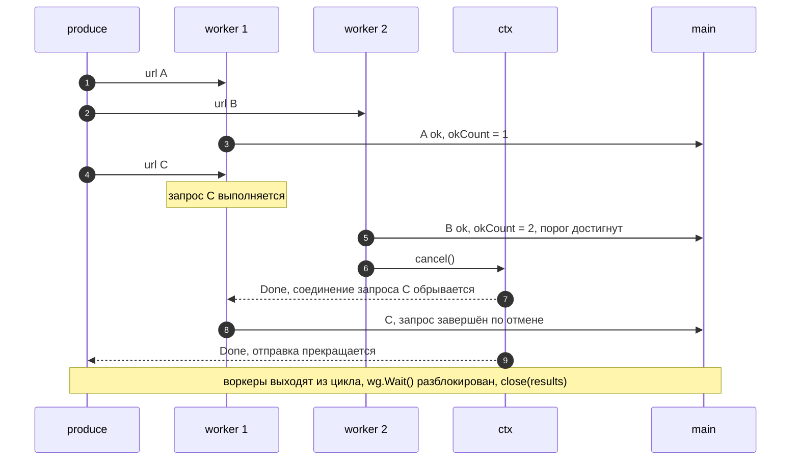

# Задача 9: Проверка списка URL (HTTP-статусы, каналы, ранняя остановка)

## Содержание

- [Формулировка](#формулировка)
- [Уточняющие вопросы](#уточняющие-вопросы)
- [Шаг 1. Последовательный обход](#шаг-1-последовательный-обход)
- [Шаг 2. Goroutine на запрос и печать в main](#шаг-2-goroutine-на-запрос-и-печать-в-main)
- [Шаг 3. Источник неизвестной длины](#шаг-3-источник-неизвестной-длины)
- [Шаг 4. Остановка после двух ok](#шаг-4-остановка-после-двух-ok)
- [Итоговое решение](#итоговое-решение)
- [Шаг 5. Тесты и границы для моков](#шаг-5-тесты-и-границы-для-моков)
- [Подводные камни](#подводные-камни)
- [Возможные расширения](#возможные-расширения)
- [Interview-ready answer](#interview-ready-answer)
- [Связки с другими темами](#связки-с-другими-темами)

Задача выдаётся пошагово: сначала последовательный обход списка, затем каналы,
затем поток неизвестной длины, затем ранняя остановка, затем тесты. Каждый шаг
меняет ровно один инвариант, и интервьюер смотрит, не разваливается ли
предыдущий. Итоговая проверка — «все goroutine завершились, ни один результат не
потерян, отменённые запросы отличимы от неуспешных».

Код проверен на Go 1.26.5, darwin/arm64 (Apple M3 Max); используется `for range N`
(Go 1.22+) и `atomic.Int64` (Go 1.19+).

---

## Формулировка

> Напишите программу, которая:
>
> 1. Поочерёдно выполнит http-запросы по предложенному списку ссылок.
>    - при http-коде ответа `200 OK` печатает `адрес url — ok`;
>    - при коде, отличном от `200 OK`, либо при ошибке печатает `адрес url — not ok`.
> 2. Модифицируйте программу так, чтобы использовались каналы для коммуникации
>    основного потока с горутинами: запросы выполняются в горутинах, печать
>    результатов — в основном потоке.
> 3. Модифицируйте программу так, чтобы нигде не использовалась длина слайса
>    урлов. Урлы приходят из внешнего источника, сколько их будет — заранее
>    неизвестно. Предложите идиоматичный вариант, как программа узнает об
>    окончании списка и передаст об этом сигнал действующим горутинам.
> 4. Модифицируйте программу так, чтобы при получении 2 первых ответов `200 OK`
>    остальные запросы штатно завершались, с печатью сообщения о завершении
>    запроса.
> 5. Какие тесты написали бы? Напишите код теста и интерфейсы, для которых будут
>    генериться моки.

```go
func main() {
    var urls = []string{
        "http://google.com",
        "http://non-existent.domain.tld",
        "http://ya.ru",
        "http://ёёёё",
        "http://yandex.ru",
        "https://www.youtube.com",
    }
}
```

Список в условии специально смешанный: рабочие домены, несуществующий домен
(ошибка DNS), строка с кириллицей (ошибка на этапе разбора URL или соединения).
Ветка «ошибка» — не экзотика, а половина входных данных.

---

## Уточняющие вопросы

1. **`200 OK` или любой 2xx?**
   Условие говорит буквально про `200`. `201`, `204` и редирект, доведённый
   клиентом до `200`, — разные случаи; критерий стоит зафиксировать до кода.

2. **Ошибка транспорта и код `500` печатаются одинаково?**
   По условию да, обе ветки дают `not ok`. Причину имеет смысл сохранить в
   структуре результата, даже если она не печатается.

3. **Нужно ли тело ответа?**
   Нет, достаточно статуса, но `Close` обязателен в любом случае. Дочитывать
   тело ради keep-alive имеет смысл только при многих запросах к одному хосту.

4. **Порядок вывода после шага 2?**
   Конкурентное выполнение порядок не сохраняет. Если порядок входа обязателен —
   это отдельное требование, оно решается индексом и буфером, а не каналом.

5. **Ограничение параллелизма?**
   На шаге 2 список конечный, goroutine на URL допустима. На шаге 3 поток
   бесконечен, поэтому нужен фиксированный пул: иначе число одновременных
   соединений не ограничено ничем.

6. **Что означает «остальные запросы штатно завершались»?**
   Прекращаются и уже выполняющиеся запросы, и ещё не начатые, а программа
   печатает про них отдельное сообщение. Это отмена, а не «дождаться и
   промолчать».

7. **Считаются ли два `200 OK` от одного и того же хоста?**
   Условие не различает; считается число ответов, а не число уникальных хостов.

---

## Шаг 1. Последовательный обход

```go
func check(url string) bool {
    resp, err := http.Get(url)
    if err != nil { // DNS, TCP, TLS, неразбираемый URL
        return false
    }
    defer resp.Body.Close()
    return resp.StatusCode == http.StatusOK
}

func main() {
    urls := []string{"http://google.com", "http://non-existent.domain.tld"}

    for _, u := range urls {
        if check(u) {
            fmt.Printf("%s — ok\n", u)
            continue
        }
        fmt.Printf("%s — not ok\n", u)
    }
}
```

Обязательная деталь здесь одна: **`resp.Body.Close()` при `err == nil`**. Без
него утекают соединение и goroutine чтения ответа.

`http.Get` для MVP достаточно, но у `http.DefaultClient` поле `Timeout` нулевое.
`DefaultTransport` ограничивает только фазы соединения — dial 30 s, TLS-handshake
10 s; на ожидание ответа и чтение тела лимита нет, поэтому сервер, принявший
соединение и замолчавший, держит запрос до обрыва TCP. Ограничение всего запроса
целиком даёт собственный клиент:

```go
client := &http.Client{Timeout: 5 * time.Second}
```

На шаге 4 он появляется в любом случае: `http.Get` не принимает `context`, а без
context отменить выполняющийся запрос нечем.

Отдельный вопрос — дочитывание тела. Транспорт возвращает соединение в
keep-alive пул только при `bodyEOF` (`net/http/transport.go`, вычисление
`alive`), поэтому `Close` на недочитанном теле означает новый TCP- и
TLS-handshake при следующем запросе к тому же хосту. Это оптимизация, а не
корректность: для одного запроса на хост, как в условии, дочитывать нечего и
незачем. Когда запросов к одному хосту много, а тела небольшие, добавляется
ограниченный слив перед `Close`: `io.CopyN(io.Discard, resp.Body, 64<<10)`.

---

## Шаг 2. Goroutine на запрос и печать в main

Требование «печать в основном потоке» задаёт форму: goroutine не печатает, а
отправляет структуру результата в канал, main читает канал и печатает.

```go
type result struct {
    url string
    ok  bool
}

func label(ok bool) string {
    if ok {
        return "ok"
    }
    return "not ok"
}

func main() {
    urls := []string{"http://google.com", "http://non-existent.domain.tld"}
    results := make(chan result)

    var wg sync.WaitGroup
    for _, u := range urls {
        wg.Add(1)
        go func() { // Go 1.22+: переменная цикла своя на итерацию
            defer wg.Done()
            results <- result{url: u, ok: check(u)}
        }()
    }

    go func() { // канал закрывает владелец — после завершения всех отправителей
        wg.Wait()
        close(results)
    }()

    for r := range results { // завершается по close(results)
        fmt.Printf("%s — %s\n", r.url, label(r.ok))
    }
}
```

Почему именно так:

- **`wg.Wait()` вынесен в отдельную goroutine.** В main перед циклом чтения он
  даёт deadlock: отправители блокируются на небуферизованном `results`, а main
  ждёт их завершения.
- **Закрывает канал не воркер, а координатор.** Отправителей несколько,
  повторный `close` — panic. Закрытие после `wg.Wait()` — единственная точка,
  где известно, что отправок больше не будет.
- **`wg.Add(1)` выполняется до `go`.** Внутри goroutine он может не успеть
  выполниться до `Wait`, и канал закроется раньше отправки.
- **Печать через `range` по каналу** заканчивается сама при `close`, без счётчика
  результатов. Это заранее готовит шаг 3, где счётчика не будет.

В Go 1.25 те же три строки короче: `wg.Go(func() { ... })` совмещает `Add(1)`,
`go` и `defer Done()`.

---

## Шаг 3. Источник неизвестной длины

Запрет на длину слайса — это запрет на «прочитать N результатов». Идиоматичная
замена: **вход тоже становится каналом**, а сигналом окончания служит его
закрытие.

```go
// produce отдаёт URL по одному; длину знает только сам источник.
func produce(ctx context.Context, urls []string) <-chan string {
    out := make(chan string)
    go func() {
        defer close(out) // источник знает, что отправок больше не будет
        for _, u := range urls {
            select {
            case out <- u:
            case <-ctx.Done(): // потребители ушли — producer не должен зависнуть
                return
            }
        }
    }()
    return out
}
```

Слайс здесь остаётся только как заглушка источника: `range` по нему длину не
использует, а потребителю она и вовсе недоступна. Замена `produce` на чтение
`bufio.Scanner`, курсора БД или Kafka-консьюмера не меняет ни одной строки ниже
по потоку — сигнатура `<-chan string` та же.

Потребление — фиксированный пул воркеров, читающих один и тот же канал
(fan-out). Число goroutine перестаёт зависеть от размера входа:

```go
func main() {
    ctx, cancel := context.WithCancel(context.Background())
    defer cancel()

    src := []string{
        "http://google.com",
        "http://non-existent.domain.tld",
        "http://ya.ru",
        "http://ёёёё",
        "http://yandex.ru",
        "https://www.youtube.com",
    }

    urls := produce(ctx, src) // дальше про длину никто не знает
    results := make(chan result)

    const workers = 8
    var wg sync.WaitGroup
    for range workers {
        wg.Add(1)
        go func() {
            defer wg.Done()
            for u := range urls { // выходит сам при close(urls)
                results <- result{url: u, ok: check(u)}
            }
        }()
    }
    go func() { wg.Wait(); close(results) }()

    for r := range results {
        fmt.Printf("%s — %s\n", r.url, label(r.ok))
    }
}
```

Цепочка сигналов получается однонаправленной:

```
close(urls) → воркеры выходят из range → wg.Wait() разблокирован → close(results) → range в main завершается
```

Отдельного «стоп-сообщения» не требуется: закрытие канала — это broadcast, его
видят все получатели, в отличие от значения, которое достаётся ровно одному.
Именно поэтому sentinel-значение (`""` как признак конца) хуже: его придётся
отправить по одному на каждого воркера, зная их число.

---

## Шаг 4. Остановка после двух ok

Появляется второй сигнал — уже не «вход закончился», а «результат больше не
нужен». Он идёт в обратную сторону, от потребителя к запросам, и переносится
`context`:

- счётчик успешных ответов — `atomic.Int64`, инкремент возвращает новое
  значение, поэтому ровно одна goroutine увидит `== 2` и вызовет `cancel`;
- `cancel` прекращает и уже выполняющиеся запросы: запрос создаётся через
  `http.NewRequestWithContext`, и транспорт обрывает соединение по `ctx.Done()`;
- ещё не начатые URL до воркеров не доходят — цикл воркера выходит по ветке
  `ctx.Done()`;
- отменённый запрос отличается от неуспешного: `client.Do` возвращает
  `*url.Error`, обёртывающий `context.Canceled`, и результат помечается
  отдельным статусом.

Схема соединений здесь не помогает — она та же, что на шаге 3. Важна
последовательность во времени: кто именно достигает порога и что происходит с
каждым видом запроса после `cancel`. Стрелки к `main` идут через канал
результатов.



Порог достигает `worker 2`, а страдает от отмены запрос в `worker 1` — это
нормально: `cancel` не адресный, он гасит всю группу. Отдельного статуса
заслуживает только исход, а не то, кто именно вызвал `cancel`.

Три статуса вместо булева флага (`ok` / `not ok` / `отменён`) — прямое следствие
пункта 4: сообщение о завершении запроса нельзя напечатать, если отмена
неотличима от сетевой ошибки.

---

## Итоговое решение

```go
package main

import (
    "context"
    "errors"
    "fmt"
    "net/http"
    "sync"
    "sync/atomic"
    "time"
)

// Doer — минимальная часть *http.Client, которая нужна проверке.
// Граница для подмены в тестах: *http.Client её удовлетворяет.
type Doer interface {
    Do(req *http.Request) (*http.Response, error)
}

type Status int

const (
    StatusOK Status = iota
    StatusNotOK
    StatusCanceled
)

type Result struct {
    URL    string
    Status Status
    Code   int
    Err    error // причина not ok: транспорт, разбор URL, отмена
}

// stopAfter — порог из условия: после двух ответов 200 OK
// остальные запросы отменяются.
const stopAfter = 2

type Config struct {
    Client  Doer
    Workers int
}

// Check читает urls до закрытия канала и возвращает канал результатов.
// Контракт: вызывающая сторона вычитывает результаты до закрытия канала.
func Check(ctx context.Context, cfg Config, urls <-chan string) <-chan Result {
    ctx, cancel := context.WithCancel(ctx)
    out := make(chan Result)

    var okCount atomic.Int64
    var wg sync.WaitGroup

    for range cfg.Workers {
        wg.Add(1)
        go func() {
            defer wg.Done()
            for {
                select {
                case <-ctx.Done(): // лимит достигнут или отменил caller
                    return
                case url, ok := <-urls:
                    if !ok { // вход закончился
                        return
                    }
                    res := fetch(ctx, cfg.Client, url)
                    if res.Status == StatusOK && okCount.Add(1) == stopAfter {
                        cancel() // равенство видит ровно одна goroutine
                    }
                    out <- res
                }
            }
        }()
    }

    go func() {
        wg.Wait()
        cancel() // освободить ресурсы context во всех ветках выхода
        close(out)
    }()

    return out
}

func fetch(ctx context.Context, client Doer, url string) Result {
    req, err := http.NewRequestWithContext(ctx, http.MethodGet, url, nil)
    if err != nil { // неразбираемый URL
        return Result{URL: url, Status: StatusNotOK, Err: err}
    }

    resp, err := client.Do(req)
    if err != nil {
        // *url.Error разворачивается до context.Canceled
        if ctx.Err() != nil && errors.Is(err, context.Canceled) {
            return Result{URL: url, Status: StatusCanceled, Err: err}
        }
        return Result{URL: url, Status: StatusNotOK, Err: err}
    }
    defer resp.Body.Close()

    if resp.StatusCode == http.StatusOK {
        return Result{URL: url, Status: StatusOK, Code: resp.StatusCode}
    }
    return Result{URL: url, Status: StatusNotOK, Code: resp.StatusCode}
}

// Run печатает результаты в вызывающей goroutine.
func Run(ctx context.Context, cfg Config, urls <-chan string) {
    for r := range Check(ctx, cfg, urls) {
        switch r.Status {
        case StatusOK:
            fmt.Printf("%s — ok\n", r.URL)
        case StatusCanceled:
            fmt.Printf("%s — запрос завершён по отмене\n", r.URL)
        default:
            fmt.Printf("%s — not ok\n", r.URL)
        }
    }
}

func main() {
    ctx, cancel := context.WithCancel(context.Background())
    defer cancel() // здесь уместен: main живёт столько же, сколько работа

    src := []string{
        "http://google.com",
        "http://non-existent.domain.tld",
        "http://ya.ru",
        "http://ёёёё",
        "http://yandex.ru",
        "https://www.youtube.com",
    }

    cfg := Config{
        Client:  &http.Client{Timeout: 5 * time.Second}, // *http.Client реализует Doer
        Workers: 4,
    }

    Run(ctx, cfg, produce(ctx, src)) // produce — из шага 3
}
```

Реализацию `Doer` писать не нужно: `*http.Client` уже имеет метод
`Do(*http.Request) (*http.Response, error)` и удовлетворяет интерфейсу неявно.
Интерфейс объявлен на стороне потребителя ровно ради подмены в тестах.

Фактический прогон (Go 1.26.5, darwin/arm64):

```
http://non-existent.domain.tld — not ok
http://ёёёё — not ok
http://ya.ru — ok
https://www.youtube.com — ok
http://yandex.ru — запрос завершён по отмене
http://google.com — запрос завершён по отмене
```

Два `ok`, два неуспешных ответа и два отменённых запроса — поведение из пункта 4
условия. Порядок вывода не совпадает с порядком входа, а состав отменённых
запросов от прогона к прогону меняется: он зависит от того, какие URL успели
попасть воркерам к моменту `cancel`.

Свойства, которые стоит проговорить вслух:

| Вопрос | Ответ |
| --- | --- |
| Кто закрывает `out` | Координатор после `wg.Wait()`; воркеры не закрывают канал, которым не владеют единолично. |
| Почему `out <- res` без `select` | Контракт обязывает потребителя дочитать канал до `close`. Вариант с `case <-ctx.Done()` не блокируется, но молча теряет результаты, включая тот, который вызвал отмену. |
| Можно ли после `cancel` начать ещё один запрос | Да: если готовы обе ветки `select`, Go выбирает случайную, и воркер может взять URL. Запрос немедленно завершится с `context.Canceled` и попадёт в отчёт как отменённый — это штатный исход, а не гонка. |
| Что с непрочитанными URL | Остаются в канале. Producer обязан иметь ветку `ctx.Done()` на отправке, иначе после выхода воркеров он заблокируется навсегда. |
| Зачем `cancel()` перед `close(out)` | Нормальное завершение тоже должно освобождать context, иначе висит goroutine `context.WithCancel` до отмены родителя. |
| Почему `errgroup` не использован | `errgroup` удобен при fail-fast по первой ошибке; здесь ошибка — обычный результат, а отмену вызывает успех. Пул + `context` выражают это прямее. |

---

## Шаг 5. Тесты и границы для моков

Тесты на сеть должны быть детерминированными, поэтому подменяется HTTP-вызов, а
не время. Границ подмены три, и выбор между ними — часть ответа.

| Граница | Что подменяется | Что остаётся настоящим | Что проверяет |
| --- | --- | --- | --- |
| `Doer` (интерфейс) | весь вызов целиком | только логика проверки | маппинг статусов, порог остановки, отмена |
| `http.RoundTripper` | транспорт | `http.Client`: редиректы, таймаут, cookie | поведение клиента вокруг ответа |
| `httptest.Server` | сервер | клиент, TCP, keep-alive | интеграция и реальные коды |

Интерфейс для генерации моков — `Doer`: одного метода достаточно, а `*http.Client`
удовлетворяет ему без обёрток. Для `mockgen` он объявляется рядом с
потребителем, а не рядом с реализацией. Руками мок пишется в пять строк —
структура с полями «что вернуть» и метод `Do`:

```go
// fakeClient — заглушка Doer: один сценарий ответа на любой запрос.
type fakeClient struct {
    code int   // код ответа
    err  error // если задана — имитация ошибки транспорта
}

func (f fakeClient) Do(req *http.Request) (*http.Response, error) {
    if err := req.Context().Err(); err != nil {
        // настоящий *http.Client при отменённом context в сеть не идёт
        return nil, &url.Error{Op: "Get", URL: req.URL.String(), Err: err}
    }
    if f.err != nil {
        return nil, f.err
    }
    return &http.Response{StatusCode: f.code, Body: http.NoBody}, nil
}
```

Ветка с `req.Context().Err()` здесь не украшение: без неё отмена неотличима от
обычного ответа, и пункт 4 условия перестаёт проверяться. Состояния у заглушки
нет, поля только читаются — поэтому она безопасна при любом числе воркеров без
мьютексов и атомиков.

Маппинг статусов — табличный тест: по сценарию на подтест, каждому свой клиент.

```go
func TestCheck_StatusMapping(t *testing.T) {
    tests := []struct {
        name   string
        client fakeClient
        want   Status
    }{
        {"200 — ok", fakeClient{code: http.StatusOK}, StatusOK},
        {"500 — not ok", fakeClient{code: http.StatusInternalServerError}, StatusNotOK},
        {"201 — not ok", fakeClient{code: http.StatusCreated}, StatusNotOK},
        {"ошибка транспорта — not ok", fakeClient{err: errors.New("dial tcp: no such host")}, StatusNotOK},
    }

    for _, tt := range tests {
        t.Run(tt.name, func(t *testing.T) {
            cfg := Config{Client: tt.client, Workers: 1}
            got := collect(Check(context.Background(), cfg, feed("http://example")))

            if got["http://example"].Status != tt.want {
                t.Fatalf("status = %v, want %v", got["http://example"].Status, tt.want)
            }
        })
    }
}

func TestCheck_StopsAfterTwoOK(t *testing.T) {
    cfg := Config{Client: fakeClient{code: http.StatusOK}, Workers: 1}
    got := collect(Check(context.Background(), cfg, feed(
        "http://a", "http://b", "http://c", "http://d")))

    var okCount int
    for _, r := range got {
        switch r.Status {
        case StatusOK:
            okCount++
        case StatusCanceled: // остальные завершились по отмене
        default:
            t.Fatalf("%s: неожиданный статус %v", r.URL, r.Status)
        }
    }
    if okCount != 2 {
        t.Fatalf("ok results = %d, want 2 (%v)", okCount, got)
    }
}

func TestCheck_ParentCancel(t *testing.T) {
    ctx, cancel := context.WithCancel(context.Background())
    cancel() // отменён до старта

    cfg := Config{Client: fakeClient{code: http.StatusOK}, Workers: 2}
    for _, r := range collect(Check(ctx, cfg, feed("http://a"))) {
        if r.Status != StatusCanceled {
            t.Fatalf("got %v, want canceled", r)
        }
    }
}

func TestCheck_EmptyStream(t *testing.T) {
    cfg := Config{Client: fakeClient{code: http.StatusOK}, Workers: 3}
    if got := collect(Check(context.Background(), cfg, feed())); len(got) != 0 {
        t.Fatalf("got %v, want no results", got)
    }
}
```

Отдельного счётчика выполненных запросов не нужно: раз отмена даёт собственный
статус, «третий URL до сети не дошёл» уже видно по результату. Если бы третий
запрос выполнился, он вернул бы `200` и `okCount` стал бы равен трём.

Две вспомогательные функции убирают шум из самих проверок:

```go
func feed(urls ...string) <-chan string {
    ch := make(chan string, len(urls))
    for _, u := range urls {
        ch <- u
    }
    close(ch) // сигнал «вход закончился»
    return ch
}

func collect(ch <-chan Result) map[string]Result {
    got := make(map[string]Result)
    for r := range ch { // завершится только если close(out) действительно происходит
        got[r.URL] = r
    }
    return got
}
```

`collect` заодно проверяет отсутствие зависаний: если координатор не закроет
`out`, тест упадёт по таймауту `go test`, а не пройдёт молча.

Интеграционный тест поверх настоящего `*http.Client` покрывает то, что мок
проверить не может, — работу с реальным ответом и телом:

```go
func TestCheck_RealClient(t *testing.T) {
    srv := httptest.NewServer(http.HandlerFunc(func(w http.ResponseWriter, r *http.Request) {
        if r.URL.Path == "/bad" {
            w.WriteHeader(http.StatusBadGateway)
            return
        }
        w.WriteHeader(http.StatusOK)
    }))
    defer srv.Close()

    cfg := Config{Client: &http.Client{Timeout: 2 * time.Second}, Workers: 2}
    got := collect(Check(context.Background(), cfg, feed(srv.URL+"/good", srv.URL+"/bad")))

    if got[srv.URL+"/good"].Status != StatusOK {
        t.Errorf("/good: %v", got[srv.URL+"/good"])
    }
    if got[srv.URL+"/bad"].Status != StatusNotOK {
        t.Errorf("/bad: %v", got[srv.URL+"/bad"])
    }
}
```

Фактический прогон (Go 1.26.5, darwin/arm64, Apple M3 Max):

```
$ go test -race -count=20 ./
ok  	urlcheck	1.331s
```

`-race` обязателен: без него общий счётчик и работа с каналами выглядят
корректно до первого продакшена. `-count=20` вылавливает тесты, которые проходят
только при удачном порядке планировщика.

---

## Подводные камни

- **Молчание про таймаут.** `http.Get` как MVP нормален, но у `DefaultClient`
  нет общего таймаута: ограничены только dial и TLS-handshake, а ожидание
  ответа — нет. Проговорить это стоит до того, как спросят.
- **Отсутствие `resp.Body.Close()`.** Утечка соединения и goroutine чтения
  ответа; `Close` нужен при `err == nil` даже когда тело не читается.
- **`io.ReadAll` ради статуса.** Тело целиком оказывается в памяти без всякой
  надобности: статус доступен сразу, до чтения тела.
- **`close(results)` внутри воркера.** Второй воркер получает panic
  `close of closed channel`; при нескольких отправителях закрывать канал может
  только координатор.
- **`wg.Wait()` в main перед чтением канала.** Deadlock на небуферизованном
  канале: отправители ждут читателя, читатель ждёт отправителей.
- **`wg.Add(1)` внутри goroutine.** `Wait` может пройти раньше, чем `Add`
  выполнится.
- **Чтение ровно `len(urls)` результатов.** На шаге 3 длины нет, а на шаге 4
  часть результатов приходит со статусом «отменён» — счётчик перестаёт совпадать.
- **`context` без `NewRequestWithContext`.** Отмена не доходит до уже открытого
  соединения: программа перестаёт делать новые запросы, но висит на текущих.
- **Проверка `okCount.Load() == 2` вместо результата `Add`.** Два воркера могут
  увидеть одно и то же значение; `Add` возвращает новое значение, и равенство
  наступает ровно один раз.
- **Producer без ветки `ctx.Done()`.** После ранней остановки он навсегда
  блокируется на отправке в канал, который больше никто не читает.
- **Отмена, неотличимая от ошибки.** Пункт 4 требует отдельного сообщения, значит
  `context.Canceled` нужно распознавать через `errors.Is`, а не считать сетевой
  ошибкой.
- **`t.Sleep` вместо барьеров в тестах.** Тест на раннюю остановку, построенный
  на задержках, флакует; счётчик реально выполненных запросов детерминирован.

---

## Возможные расширения

- **Ограничение частоты запросов** к одному хосту — token bucket поверх пула.
- **Повтор при временных ошибках** (5xx, таймаут) с экспоненциальной задержкой и
  jitter; отмена должна прерывать и паузу между попытками.
- **Метрики**: гистограмма latency, счётчики по классам кодов, число активных
  воркеров.
- **`HEAD` вместо `GET`** там, где сервер его поддерживает: экономит тело
  ответа, но часть сайтов отвечает на `HEAD` иначе.
- **Дедупликация одинаковых URL** во входном потоке — `singleflight` или
  множество уже виденных адресов.
- **Ранняя остановка по другому критерию**: N ошибок подряд, дедлайн на весь
  прогон, доля успехов ниже порога. Тогда же `stopAfter` из константы переезжает
  в конфигурацию — но только тогда, а не «на всякий случай».

---

## Interview-ready answer

**1. Как основной поток узнаёт, что список закончился, если длина неизвестна?**

- Вход подаётся каналом, признак окончания — `close` этого канала: воркеры
  выходят из `range`, координатор после `wg.Wait()` закрывает канал результатов,
  и цикл печати в main завершается сам.

**2. Почему закрытие канала лучше стоп-значения?**

- `close` — broadcast, его видят все получатели сразу, тогда как sentinel-значение
  достанется ровно одному воркеру и потребует знать их число.

**3. Кто и когда закрывает канал результатов?**

- Отдельная goroutine-координатор после `wg.Wait()`: отправителей несколько,
  повторный `close` — panic, а до завершения всех отправок закрывать нельзя.

**4. Как остановить остальные запросы после двух ответов `200 OK`?**

- Счётчик `atomic.Int64`: goroutine, чей `Add` вернул порог, вызывает `cancel`
  общего `context`; запросы созданы через `http.NewRequestWithContext`, поэтому
  прерываются и уже выполняющиеся, а не начатые не берутся из входного канала.

**5. Чем отменённый запрос отличается от неуспешного?**

- `client.Do` возвращает `*url.Error`, обёртывающий `context.Canceled`; проверка
  `errors.Is` даёт отдельный статус и отдельное сообщение вместо `not ok`.

**6. Какие интерфейсы мокаются в тестах?**

- Достаточно одного метода `Do(*http.Request) (*http.Response, error)`: его
  удовлетворяет `*http.Client`, а мок — структура с полями «код ответа» и
  «ошибка» плюс проверка `req.Context().Err()`; для проверки самого клиента
  подменяется `http.RoundTripper`, для интеграции поднимается `httptest.Server`.

**7. Какие тесты обязательны?**

- Маппинг статусов (200, не-200, ошибка транспорта), ранняя остановка ровно на
  пороге, отменённый родительский context, пустой поток; всё под `go test -race`
  с повторами.

---

## Связки с другими темами

- [Worker Pool](./01-worker-pool.md) — фиксированный пул, который решает шаг 3.
- [Fan-In / Fan-Out](./03-fan-in-fan-out.md) — распределение одного входного
  канала между воркерами и слияние результатов.
- [Worker Pool: code review](./07-worker-pool-debug.md) — те же ошибки с `close`,
  `WaitGroup` и утечками, но в формате поиска дефектов.
- [K максимальных из канала](./08-kmax-from-channel.md) — отменяемое чтение
  канала через `select` с `ctx.Done()`.
- [Context patterns](../../../01-go-core/concurrency-and-performance/04-context-patterns.md)
  — распространение отмены и работа с `errors.Is` для `context.Canceled`.
- [Sync primitives](../../../01-go-core/concurrency-and-performance/03-sync-primitives.md)
  — `WaitGroup`, атомарные счётчики, `errgroup`.
- [Retry with backoff](../system-primitives/02-retry-with-backoff.md) — повтор
  временных ошибок, если задачу расширяют.
- [HTTP-клиент в Go](../../../08-networking-and-api/protocols/02-http/03-client-in-go.md)
  — таймауты, keep-alive и пул соединений `http.Transport`.
