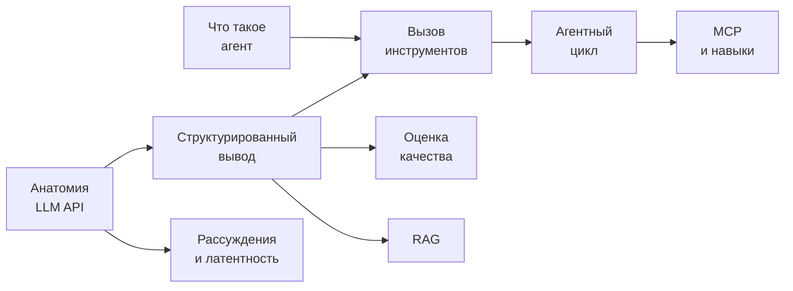

# LLM и AI Integration

## Содержание

- [Что это за раздел](#что-это-за-раздел)
- [Структура](#структура)
- [Порядок чтения](#порядок-чтения)
- [Что должен знать senior backend](#что-должен-знать-senior-backend)
- [Внешние ссылки](#внешние-ссылки)

Интеграция языковых моделей (`LLM`) в backend-сервисы стала обычной частью работы. Раздел не про обучение моделей и не про машинное обучение — он про использование готовых моделей через HTTP API в продакшене: как устроен вызов, как получить предсказуемый результат, сколько это стоит и как понять, что система работает.

---

## Что это за раздел

Четыре вопроса, вокруг которых собран материал:

1. **Как устроен вызов.** Формат запроса и ответа, различия провайдеров, токены, кэширование.
2. **Как получить данные, а не текст.** Схемы, ограничение генерации, валидация.
3. **Как модель действует.** Вызов инструментов, агентный цикл, границы доверия.
4. **Как это эксплуатировать.** Латентность, стоимость, надёжность, измерение качества.

---

## Структура

```text
17-llm-and-ai-integration/
├── learning-repositories-overview.md  обзор внешних учебных репозиториев
├── learning-path/     пошаговый практический маршрут по AI-агентам
├── api-integration/   как устроен вызов модели
├── agents/            вызов инструментов и агентный цикл
├── quality/           измерение качества
└── rag/               поиск по своим данным и генерация ответа
```

**[Обзор учебных репозиториев](./learning-repositories-overview.md)** — сравнение курсов, реализаций LLM с нуля, cookbook и каталогов агентов с рекомендациями по порядку изучения

**[learning-path/](./learning-path/README.md)** — поэтапная практика

- [01. Граница между LLM и агентом](./learning-path/01-agent-foundations.md) — чат-бот, pipeline, workflow, agent loop и критерии выбора
- [02. Когнитивный слой, контекст и инструменты](./learning-path/02-cognition-context-and-tools.md) — выбор контекста, строгие схемы, tool calling и MCP
- [03. Практическая сборка первого агента](./learning-path/03-workshop-first-agent.md) — вертикальный срез Repository Health Agent и матрица сценариев
- [04. Память, состояние и автономность](./learning-path/04-memory-state-and-autonomy.md) — state machine, восстановление, идемпотентность и HITL
- [05. Production](./learning-path/05-production-reliability-and-safety.md) — надёжность, guardrails, stop conditions, observability и evals
- [06. Мультиагентность](./learning-path/06-multi-agent-coordination.md) — топологии, маршрутизация, изоляция состояния и merge-политики

**[api-integration/](./api-integration/README.md)** — анатомия вызова

- [01. Анатомия LLM API](./api-integration/01-llm-api-anatomy.md) — состав запроса и ответа, роли, токены, сравнение провайдеров, где протекает общая абстракция
- [02. Структурированный вывод](./api-integration/02-structured-outputs.md) — схема вместо просьбы, ограничение генерации, закрытые словари
- [03. Рассуждающие модели и латентность](./api-integration/03-reasoning-and-latency.md) — из чего складывается время ответа и как его сокращать

**[agents/](./agents/README.md)** — действие вместо ответа

- [01. Что такое агент](./agents/01-what-is-an-agent.md) — четыре признака, спектр автономности, состав системы, чем агент не является
- [02. Вызов инструментов](./agents/02-tool-calling.md) — протокол, объявление функций, ошибки, граница доверия
- [03. Агентный цикл](./agents/03-agent-loop.md) — реализация цикла, ограничители, рост контекста, когда агент не нужен
- [04. Оркестрация агентами](./agents/04-orchestration.md) — схемы, реальные кейсы, брифинг подагента, частичные отказы, цена оркестрации
- [05. MCP](./agents/05-mcp.md) — стандарт подключения инструментов, локальный и сетевой транспорт, проектирование сервера, границы доверия
- [06. Навыки](./agents/06-skills.md) — постепенное раскрытие, `SKILL.md`, отличие от MCP, промпта и поиска по документам

**[quality/](./quality/README.md)** — измерение

- [01. Оценка качества](./quality/01-evals.md) — золотой набор, уровни проверок, судья-модель, регрессии

**[rag/](./rag/README.md)** — поиск по своим данным

- [01. Основы RAG](./rag/01-rag-fundamentals.md) — зачем, два контура, embeddings, гибридный поиск, оценка качества

### Запланировано

- **api-integration/04. Потоковый режим** — SSE, отмена, отдача длинного ответа по частям, приёмы в ботах
- **api-integration/05. Токеномика** — стоимость, кэширование промпта, пакетный режим, бюджеты
- **reliability/** — повторы, лимиты провайдера, деградация, переключение между провайдерами, наблюдаемость
- **security/** — подмена инструкций, недоверенный ввод, авторизация вызовов
- **patterns/** — офлайн-обогащение данных моделью, замена модели детерминированными правилами, эмбеддинги вне RAG
- **rag/02–06** — embeddings, векторные БД, чанкинг, гибридный поиск, подводные камни

---

## Порядок чтения

Материал выстроен по зависимостям, и порядок имеет значение:

Для последовательного обучения с практикой начать нужно с [пошагового маршрута](./learning-path/README.md). Каждый его этап ссылается на подробные справочные статьи ниже и добавляет инкремент в один сквозной проект.



Начинать нужно с анатомии API: без понимания того, что вызов не хранит состояние и что содержимое ответа приходит списком блоков, остальные темы разбираются вслепую. Схемы из структурированного вывода дальше используются и в инструментах, и в оценке качества. Определение агента читается отдельно от анатомии вызова: оно отвечает не на вопрос «как устроен запрос», а на вопрос «какой класс системы строится».

---

## Что должен знать senior backend

**Базовое**

- вызов модели — HTTP-запрос без состояния, вся история отправляется заново;
- токены, контекстное окно, разница между входом и выходом по цене и по времени;
- причина остановки: полный ответ, обрыв по лимиту, запрос инструмента, отказ.

**Архитектурное**

- когда языковая модель нужна, а когда задача решается правилами;
- офлайн-обработка против вызова в пути пользователя;
- RAG, длинный контекст или дообучение — когда что;
- пайплайн или агент: порядок шагов задан кодом или выбирается моделью;
- где хранится редко нужная инструкция: в системном промпте, в навыке или в поисковом контуре.

**Продакшен**

- структурированный вывод вместо разбора текста;
- повторы с бэкоффом на лимитах провайдера, таймауты, деградация;
- управление стоимостью: пакеты, кэш префикса, лимиты на прогон;
- наблюдаемость: длительность, расход токенов, версия промпта и модели;
- измерение качества до выката, а не по жалобам.

**Безопасность**

- подмена инструкций (`prompt injection`) через пользовательский ввод и через результаты инструментов;
- модель не является границей безопасности: авторизация и валидация в коде;
- хранение ключей провайдера и данные, уходящие наружу.

---

## Внешние ссылки

- [OpenAI API Reference](https://platform.openai.com/docs/api-reference)
- [Anthropic Messages API](https://docs.anthropic.com/en/api/messages)
- [Google Gemini API](https://ai.google.dev/api)
- [Model Context Protocol](https://modelcontextprotocol.io/) — стандарт подключения инструментов
- [pgvector](https://github.com/pgvector/pgvector) — векторный поиск в PostgreSQL
- [Qdrant](https://qdrant.tech/), [Weaviate](https://weaviate.io/) — специализированные векторные БД
