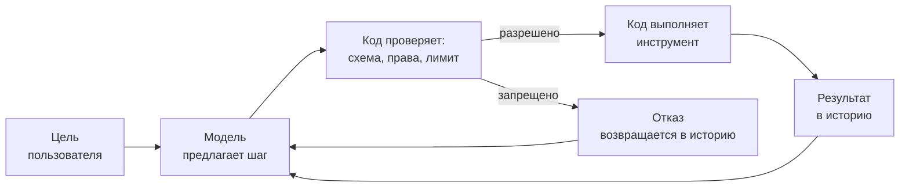
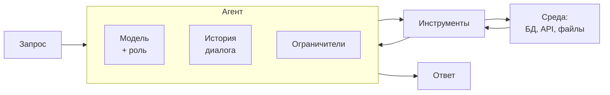

# Что такое агент

## Содержание

- [Почему определение размыто](#почему-определение-размыто)
- [Четыре признака](#четыре-признака)
- [Циклом владеет код](#циклом-владеет-код)
- [Спектр автономности](#спектр-автономности)
- [Из чего собран агент](#из-чего-собран-агент)
- [Чем агент не является](#чем-агент-не-является)
- [Что меняется для бэкенда](#что-меняется-для-бэкенда)
- [Типичные ошибки](#типичные-ошибки)
- [Interview-ready answer](#interview-ready-answer)

Слово «агент» попало в вакансии и презентации раньше, чем получило инженерное определение. Эта статья вводит определение и границы понятия. Механика реализации разобрана в [агентном цикле](./03-agent-loop.md), практическая сборка — в [пошаговом маршруте](../learning-path/01-agent-foundations.md).

---

## Почему определение размыто

Одним и тем же словом называют разные системы: чат-бота с одной подключённой функцией, скрипт с вызовом модели внутри, систему, которая сама расследует инцидент и правит конфигурацию. Общего в них только присутствие языковой модели, а требования к эксплуатации отличаются на порядок.

Различие имеет практическую цену. От ответа «агент или нет» зависит, нужны ли счётчик шагов, бюджет токенов, аудит каждого действия и подтверждение человеком перед необратимой операцией. Пайплайну с вызовом модели внутри всё это не нужно: его поведение известно заранее. Агенту без этого нельзя в продакшен, потому что заранее неизвестно даже количество шагов.

Поэтому определение здесь не терминологическое упражнение, а способ понять, какой набор защит требуется системе.

---

## Четыре признака

Агент — это система, которой задают цель, а не последовательность шагов. Признаков четыре, и нужны все:

- **Цель вместо инструкции.** На входе «разберись, почему упал заказ 12345», а не «сделай запрос A, потом запрос B, потом сложи результаты».
- **Инструменты.** Модель может узнать или изменить что-то за пределами своего текста: сходить в базу, вызвать HTTP-метод, прочитать файл.
- **Цикл.** После результата инструмента модель решает, что делать дальше, и так до финального ответа.
- **Ограничители.** Максимум шагов, бюджет токенов, таймаут, список разрешённых действий.

Проверить определение удобно от обратного: убрать любой признак — получится другая система с другим названием и другой ценой эксплуатации.

| Чего не хватает | Что это на самом деле | Цена ошибки в названии |
| --- | --- | --- |
| инструментов | чат-бот: генерирует текст, ничего не меняет | лишние согласования вокруг системы, которая ничего не делает |
| цикла | одиночный вызов с инструментом: один шаг, дальше решает код | недооценка простой задачи, избыточная архитектура |
| выбора шага моделью | workflow: ветки заданы кодом | попытка чинить недетерминизм там, где его нет |
| ограничителей | не система, а лотерея | неограниченный счёт от провайдера и невозможность остановить прогон |

Последняя строка — не риторика. Цикл без максимума итераций останавливается только тогда, когда модель сама решит остановиться, а это не гарантия.

---

## Циклом владеет код

Формулировка «агент сам сходил в базу и всё починил» скрывает главное. Модель ничего не выполняет. На каждом шаге она возвращает структурированное предложение: имя инструмента и аргументы. Всё остальное делает приложение.

Приложение владеет четырьмя вещами, которые модель не контролирует:

- **Списком инструментов.** Модель не может вызвать то, чего ей не объявили.
- **Проверкой аргументов.** Схема, диапазоны значений, принадлежность объекта пользователю.
- **Авторизацией.** Права проверяются в коде по контексту запроса, а не по тому, что модель написала в аргументах.
- **Счётчиком.** Шаги, токены, время; на исчерпании лимита цикл прекращается независимо от желания модели.

Отсюда следует практический вывод. Заголовок «агент удалил продакшен-базу» описывает не свойство модели, а решение разработчика: в наборе инструментов оказался вызов, выполняющий необратимую операцию без подтверждения. Модель предложила — код выполнил.

---

## Спектр автономности

Между одиночным вызовом и мультиагентной системой лежит ряд, где на каждом шаге растёт автономность и вместе с ней неопределённость.

| Класс системы | Кто задаёт следующий шаг | Что появляется | Чем приходится платить |
| --- | --- | --- | --- |
| Одиночный вызов | никто, шаг ровно один | ответ по тексту запроса | ничем сверх стоимости вызова |
| Вызов с инструментом | код, шаг заранее известен | доступ к внешним данным | нужна валидация аргументов |
| Workflow | код, ветка выбирается по явным правилам | ветвление и обработка исключений | схема разрастается с числом веток |
| Агент | модель, в рантайме | самостоятельное исследование | недетерминизм, стоимость, риск действия |
| Несколько агентов | координатор распределяет задачи | параллельность и изоляция контекста | сборка результатов, частичные отказы |

Ряд не про «лучше — хуже». Движение вправо оправдано ровно тогда, когда порядок шагов действительно нельзя задать заранее. Если можно, workflow дешевле, быстрее и воспроизводим при отладке.

Наличие языковой модели внутри пайплайна не сдвигает систему вправо. Последовательность «получить diff, попросить модель описать изменения, сохранить отчёт» остаётся пайплайном: модель порождает один из промежуточных результатов, но не решает, что делать после него.

---

## Из чего собран агент

Шесть частей, каждая со своим отказом при плохой реализации.

| Часть | Роль | Что ломается при плохой реализации |
| --- | --- | --- |
| Модель | выбирает следующий шаг | слабая модель зацикливается на простых задачах |
| Роль и правила | задают рамку поведения и формат ответа | без явного «чего не делать» модель дополняет задачу по своему усмотрению |
| Инструменты | связывают модель с внешним миром | размытые описания приводят к вызову не того инструмента |
| История | переносит контекст между итерациями | растёт на каждом шаге, поэтому стоимость растёт быстрее числа шагов |
| Ограничители | останавливают цикл | их отсутствие делает стоимость и время прогона неизвестными |
| Среда | база, API, файловая система | без изоляции ошибка модели становится ошибкой продакшена |

Память между запусками в этот список не входит намеренно. Агент без долговременной памяти остаётся агентом: он решает задачу в пределах одного прогона. Память добавляют, когда нужна работа поверх нескольких сессий, и она приносит собственный набор проблем — устаревание записей и накопление неверных фактов.

---

## Чем агент не является

- **Не сервисом с языковой моделью внутри.** Классификатор тикетов вызывает модель, но следующий шаг после классификации выбирает код.
- **Не чат-ботом.** Диалог задаёт человек: следующий шаг определяется новым сообщением, а не решением модели.
- **Не поиском по документам.** RAG подставляет найденные фрагменты в один вызов. Агент появляется, когда модель сама решает, искать ли ещё раз и по какому запросу.
- **Не «умной» системой.** Автономность и качество — разные оси. Агент на слабой модели делает больше самостоятельных шагов и ошибается на каждом.
- **Не гарантией результата.** Один и тот же запрос даёт разные последовательности шагов, поэтому воспроизводимость обеспечивается логированием, а не повтором запуска.

---

## Что меняется для бэкенда

Агент — обычный сервис с недетерминированным планировщиком внутри. Инфраструктурные практики при этом переходят из разряда хорошего тона в условие работоспособности.

| Свойство | Обычный сервис | Агент |
| --- | --- | --- |
| Повтор запроса | тот же путь исполнения | другая последовательность шагов и другой результат |
| Стоимость запроса | предсказуема | зависит от числа итераций, известна только после прогона |
| Отладка | стек вызовов | лог итераций: что предложила модель и что вернул инструмент |
| Тестирование | ожидаемое значение | набор проверок на свойства ответа, разобранный в [оценке качества](../quality/01-evals.md) |
| Отказ инструмента | ошибка наверх | результат с признаком ошибки обратно в модель, чтобы она выбрала другой путь |

Четыре требования, без которых агент не выходит в продакшен:

- **Идемпотентность действий.** Модель может повторить вызов, неверно истолковав предыдущий результат. Запись без ключа идемпотентности превращается в дубль.
- **Бюджеты.** Максимум итераций, потолок токенов, общий таймаут прогона. Все три, а не один на выбор: цикл упирается в разные пределы на разных задачах.
- **Аудит.** Каждая итерация пишется в лог: запрошенный инструмент, аргументы, результат, расход токенов. Без этого разбор жалобы невозможен.
- **Подтверждение перед необратимым.** Состояние сохраняется до вопроса человеку, а не после ответа: между вопросом и ответом процесс может умереть.

---

## Типичные ошибки

### 1. Называть агентом пайплайн

Последовательность шагов задана кодом, а система описывается как агент. Дальше на неё навешивают ограничители и аудит, которые ничего не защищают, и объясняют команде недетерминизм, которого нет.

### 2. Строить агента там, где хватает workflow

Обратная ошибка и более дорогая. Если порядок шагов известен, агент добавляет стоимость, латентность и недетерминизм, не давая взамен ничего.

### 3. Считать модель границей безопасности

Инструкция «не удаляй ничего без подтверждения» — не механизм. Границей является код, который проверяет права и отказывает в вызове.

### 4. Давать инструмент вместо результата

Инструмент `execute_sql` формально даёт агенту всё, но вместе с этим отдаёт ему схему базы, права и возможность написать любой запрос. Инструмент `get_order_status(order_id)` решает ту же задачу с проверяемыми границами.

### 5. Оценивать агента по финальному ответу

Правильный ответ, полученный за восемнадцать шагов вместо трёх, означает сломанный набор инструментов. Видно это только в логе итераций.

### 6. Планировать стоимость по одному прогону

Число шагов зависит от запроса, а история растёт на каждой итерации. Оценка делается по распределению на реальных запросах, а не по удачному примеру из демонстрации.

---

## Interview-ready answer

**1. Что такое агент?**

- Суть — система, которой задают цель, а не последовательность шагов.
- Признаки — цель, инструменты, цикл и ограничители; нужны все четыре.
- Отличие от пайплайна — следующий шаг выбирает модель в рантайме, а не разработчик заранее.
- Реализация — цикл вокруг вызова модели с инструментами и условием выхода, а не отдельная технология.

**2. Кто исполняет действия агента?**

- Исполнитель — приложение; модель только возвращает предложение вызова с аргументами.
- Владение циклом — у кода: список инструментов, проверка схемы, авторизация, счётчик шагов.
- Следствие — опасное действие агента означает опасный инструмент в наборе, а не поведение модели.

**3. Когда агент не нужен?**

- Основной критерий — порядок шагов известен заранее, значит это пайплайн или workflow.
- Цена — агент добавляет недетерминизм, латентность и стоимость, растущую быстрее числа шагов.
- Проверка — если ветки перечисляются на бумаге, они дешевле в коде.

**4. Что меняется в эксплуатации по сравнению с обычным сервисом?**

- Повторы — действия должны быть идемпотентными, потому что модель может вызвать инструмент дважды.
- Бюджеты — максимум итераций, потолок токенов и таймаут прогона одновременно.
- Наблюдаемость — лог каждой итерации, иначе разбор инцидента невозможен.
- Проверка качества — набор проверок на свойства ответа вместо сравнения с эталонной строкой.

**5. Чем автономность отличается от качества?**

- Оси — разные: автономность про то, кто выбирает шаг, качество про то, насколько шаг верный.
- Следствие — агент на слабой модели делает больше самостоятельных шагов и ошибается на каждом.
- Вывод — рост автономности оправдан только тогда, когда порядок шагов действительно нельзя задать заранее.
