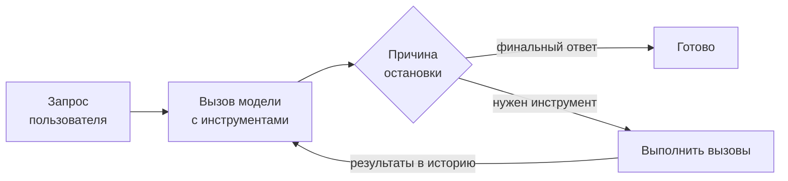
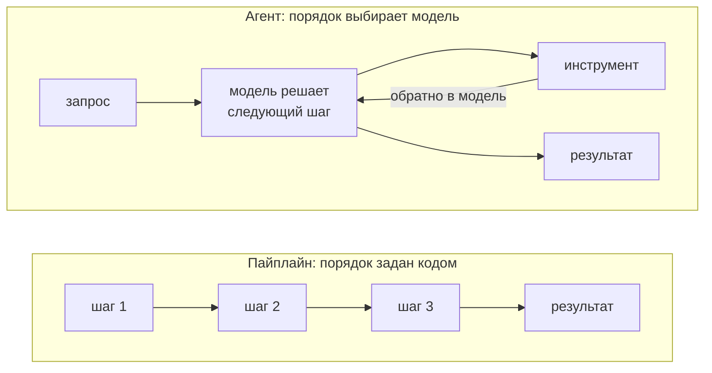

# Агентный цикл

## Содержание

- [Агент как цикл](#агент-как-цикл)
- [Минимальный цикл](#минимальный-цикл)
- [Условия остановки](#условия-остановки)
- [Контекст растёт на каждой итерации](#контекст-растёт-на-каждой-итерации)
- [Управление контекстом](#управление-контекстом)
- [Пайплайн или агент](#пайплайн-или-агент)
- [Человек в цикле](#человек-в-цикле)
- [Несколько агентов](#несколько-агентов)
- [Типичные ошибки](#типичные-ошибки)
- [Interview-ready answer](#interview-ready-answer)

Статья про реализацию: сам цикл, условия выхода и рост контекста. Определение агента и границы понятия разобраны отдельно в [что такое агент](./01-what-is-an-agent.md).

Технически агент — цикл `for` вокруг вызова модели с инструментами и условием выхода. Понимание этого снимает половину вопросов: становится видно, откуда берётся стоимость, где ставить ограничители и в каких случаях агент не нужен вовсе.

---

## Агент как цикл

Разница между одиночным вызовом с инструментами и агентом — только в том, что происходит после возврата результата.

```text
Одиночный вызов:   запрос → заявка на вызов → результат → ответ. Конец.

Агент:             запрос → заявка → результат → заявка → результат → ... → ответ
                            └──────── повторяется, пока модель просит ────────┘
```

Модель на каждом шаге решает сама: попросить ещё один инструмент или дать финальный ответ. Сервис не планирует последовательность — он её исполняет. В этом и состоит отличие агента от пайплайна: **порядок шагов определяется в рантайме моделью, а не заранее разработчиком**.

---

## Минимальный цикл



В псевдокоде это выглядит так:

```text
история := [запрос пользователя]

для итерация от 1 до максимума:
    ответ := вызвать_модель(история, инструменты)
    добавить ответ в историю

    если ответ не содержит заявок на вызов:
        вернуть текст ответа

    для каждой заявки:
        результат := выполнить(заявка)
        добавить результат в историю

вернуть ошибку "превышен лимит итераций"
```

Восемь строк — это и есть агент. Полный рабочий пример на Go с ограничителями — [examples/agent_loop.go](./examples/agent_loop.go).

Всё, что называется агентными фреймворками, добавляет вокруг этого цикла управление контекстом, наблюдаемость, подтверждения и обработку ошибок. Сам цикл не меняется.

---

## Условия остановки

Цикл без ограничителей — это незакрытый кран: он может крутиться, пока не кончатся деньги. Ограничителей нужно четыре, и они независимы.

| Ограничитель | Что защищает | Типичное значение |
|---|---|---|
| Модель дала финальный ответ | штатное завершение | — |
| Максимум итераций | зацикливание на повторяющихся вызовах | 10–25 |
| Бюджет токенов или денег | неограниченный расход | считается по полю расхода |
| Максимальное время | зависание на медленных инструментах | общий дедлайн через `context` |

Отдельная ситуация — **зацикливание**. Модель может вызывать один и тот же инструмент с одними и теми же аргументами по кругу, особенно если инструмент возвращает ошибку, которую она не понимает. Ограничитель по итерациям это ловит, но полезно и логировать повторяющиеся вызовы: одинаковый вызов дважды подряд почти всегда означает, что текст ошибки не помог модели исправиться.

Важно, что при исчерпании лимита нужно возвращать **осмысленный результат**, а не пустоту: частичный ответ с пометкой о незавершённости полезнее, чем ошибка.

---

## Контекст растёт на каждой итерации

Главное экономическое свойство агентного цикла, о котором чаще всего забывают: **вся история отправляется заново на каждой итерации**.

```text
Итерация 1:  [системная][инструменты][запрос]
Итерация 2:  [системная][инструменты][запрос][заявка 1][результат 1]
Итерация 3:  [системная][инструменты][запрос][заявка 1][результат 1][заявка 2][результат 2]
Итерация 4:  [системная][инструменты][запрос][заявка 1][результат 1][заявка 2][результат 2][заявка 3][результат 3]

Токенов на входе:
   ▁▂▃▄▅▆▇█   растёт линейно
Суммарно оплачено:
   ▁▂▄▆█▉▉▉   растёт квадратично от числа итераций
```

Из этого следует:

- **Стоимость агента растёт быстрее числа шагов.** Десять итераций стоят не в десять раз дороже одной, а заметно больше.
- **Объёмные результаты инструментов особенно дороги.** Функция, возвращающая тысячу строк JSON, платится за себя на каждой последующей итерации.
- **Кэширование префикса становится критичным.** Стабильное начало запроса (системная инструкция, объявления инструментов) должно быть неизменным байт в байт, иначе экономии не будет.

Практическое правило для инструментов в агенте: возвращать **сжатый, отобранный результат**, а не сырой ответ API. Двадцать строк с нужными полями вместо трёхсот строк с полным телом ответа — это разница в стоимости всего цикла, а не одного шага.

---

## Управление контекстом

Когда история перестаёт помещаться в контекстное окно, есть три подхода:

- **Обрезка.** Выбрасываются самые старые пары «заявка — результат». Просто и предсказуемо, но теряется ранняя часть работы.
- **Сжатие.** Старая часть заменяется кратким пересказом, сгенерированным той же моделью. Сохраняет смысл, стоит дополнительного вызова и теряет детали.
- **Вынос наружу.** Результаты складываются в файл или базу, а в контексте остаётся ссылка. Модель при необходимости читает нужное отдельным инструментом.

Третий вариант масштабируется лучше всех и заодно решает проблему объёмных результатов: инструмент кладёт большой ответ в хранилище и возвращает модели краткое описание с идентификатором.

---

## Пайплайн или агент

Самый важный вопрос при проектировании, и по умолчанию ответ — пайплайн.



| | Пайплайн | Агент |
|---|---|---|
| Порядок шагов | задан кодом | выбирает модель в рантайме |
| Число вызовов модели | известно заранее | заранее неизвестно |
| Стоимость | предсказуема | зависит от хода выполнения |
| Отладка | обычная, по шагам | сложная: два прогона идут по-разному |
| Тестирование | обычные тесты | нужны сценарии и допуски |
| Когда уместен | шаги известны заранее | набор и порядок шагов зависят от запроса |

Признаки того, что агент избыточен:

- последовательность шагов одинакова при любом входе;
- модель на каждом шаге вызывает ровно один предопределённый инструмент;
- в логах видно, что цикл всегда делает одно и то же число итераций;
- всё, что нужно от модели, — это разобрать вход и выбрать одну из веток.

В этих случаях цикл заменяется обычным кодом с одним-двумя вызовами модели там, где действительно нужна интерпретация. Получается быстрее, дешевле, детерминированнее и тестируемо обычными средствами.

Агент оправдан, когда **набор и порядок действий заранее неизвестны**: исследование, поиск с уточнением, работа с ошибками, где следующий шаг зависит от того, что вернул предыдущий.

---

## Человек в цикле

Для необратимых действий цикл разрывается на подтверждение.

```text
модель просит удалить запись
        ↓
сервис распознаёт действие как требующее подтверждения
        ↓
цикл приостанавливается, состояние сохраняется
        ↓
человек подтверждает или отклоняет
        ↓
результат подтверждения возвращается модели как результат вызова
        ↓
цикл продолжается
```

Что относится к необратимому: удаление данных, платежи и переводы, отправка сообщений от имени пользователя, публикация, изменение настроек, любое обращение к внешней системе с побочным эффектом.

Отказ пользователя возвращается модели как обычный результат вызова с пояснением — тогда она предлагает альтернативу, а не повторяет ту же попытку.

Технически это требует, чтобы состояние цикла было сохраняемым: между приостановкой и подтверждением может пройти сколько угодно времени, и процесс может успеть перезапуститься.

---

## Несколько агентов

Естественное развитие: главный агент делегирует часть работы вспомогательным, каждый со своим набором инструментов и своим контекстом. Это снимает главное ограничение одиночного цикла — вспомогательный агент читает объёмный материал в своём окне, а возвращает координатору только выводы.

Схемы, реальные кейсы, брифинг подагента и обработка частичных отказов разобраны отдельно в [04-orchestration.md](./04-orchestration.md).

Короткое правило: пока задача помещается в контекст и укладывается во время, оркестрация не нужна. Начинать стоит с делегирования однотипной объёмной работы копиям того же агента, а профильных агентов со своими промптами заводить позже.

---

## Типичные ошибки

### 1. Цикл без ограничителя итераций

Модель способна крутиться на повторяющихся вызовах бесконечно. Лимит итераций — обязательное условие, а не опция.

### 2. Возвращать в модель сырой ответ API

Полное тело ответа внешнего сервиса оплачивается заново на каждой следующей итерации. Возвращается отобранное и сжатое.

### 3. Нестабильное начало запроса

Текущее время или случайный идентификатор в системной инструкции обнуляют кэш префикса. В агентном цикле, где префикс отправляется по десять раз, это самая дорогая мелочь.

### 4. Строить агента там, где нужен пайплайн

Если порядок шагов один и тот же при любом входе, цикл только добавляет недетерминированность и стоимость.

### 5. Не сохранять состояние перед подтверждением человека

Подтверждение может прийти через час и на другой инстанс. Цикл, живущий только в памяти процесса, этого не переживёт.

### 6. Не логировать каждую итерацию

Без пошагового лога — какие инструменты вызывались, с какими аргументами, сколько токенов ушло — разобрать поведение агента невозможно: два прогона на одном входе идут по-разному.

---

## Interview-ready answer

**1. Что такое агент технически?**

- Суть — цикл вокруг вызова модели с инструментами: модель просит вызов, сервис выполняет и возвращает результат, повторяется до финального ответа.
- Отличие от пайплайна — порядок шагов определяется моделью в рантайме, а не задан кодом заранее.
- Фреймворки — добавляют вокруг этого цикла управление контекстом, подтверждения и наблюдаемость; сам цикл не меняется.

**2. Какие нужны условия остановки?**

- Штатное — модель вернула финальный ответ без заявок на вызов.
- Ограничители — максимум итераций, бюджет токенов, общий дедлайн; все три независимы.
- Поведение при исчерпании — вернуть частичный результат с пометкой, а не пустую ошибку.

**3. Почему агент дорогой?**

- Механика — вся история отправляется заново на каждой итерации.
- Следствие — суммарная стоимость растёт квадратично от числа шагов, а не линейно.
- Рычаги — сжимать результаты инструментов, держать начало запроса неизменным ради кэша префикса, выносить объёмные данные в хранилище.

**4. Когда агент не нужен?**

- Признак — последовательность шагов одинакова при любом входе.
- Замена — обычный пайплайн с одним-двумя вызовами модели там, где нужна интерпретация.
- Выигрыш — предсказуемая стоимость, обычная отладка и тестируемость.

**5. Как встроить подтверждение человеком?**

- Разрыв — цикл приостанавливается перед необратимым действием: удаление, платёж, отправка сообщения, публикация.
- Состояние — должно быть сохраняемым, потому что подтверждение может прийти позже и на другой инстанс.
- Отказ — возвращается модели как результат вызова с пояснением, чтобы она предложила альтернативу.
