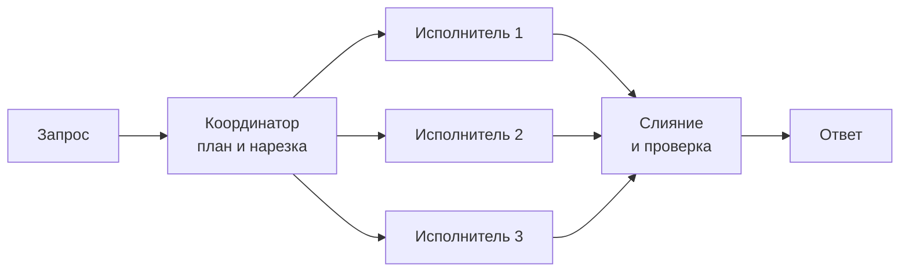
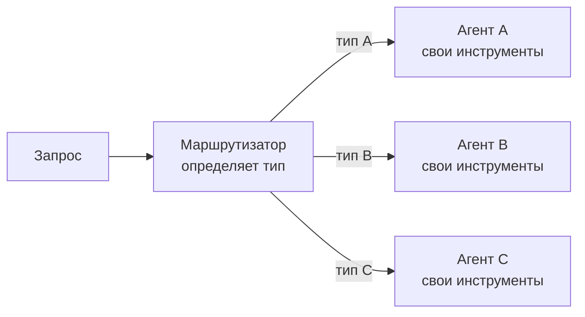

# Оркестрация агентами

## Содержание

- [Что это и зачем](#что-это-и-зачем)
- [Главная причина: контекст, а не ум](#главная-причина-контекст-а-не-ум)
- [Четыре схемы](#четыре-схемы)
- [Реальные кейсы](#реальные-кейсы)
- [Кейсы, которые только выглядят как оркестрация](#кейсы-которые-только-выглядят-как-оркестрация)
- [Брифинг подагента](#брифинг-подагента)
- [Частичные отказы](#частичные-отказы)
- [Что оркестрация стоит](#что-оркестрация-стоит)
- [Наблюдаемость](#наблюдаемость)
- [Порядок внедрения](#порядок-внедрения)
- [Типичные ошибки](#типичные-ошибки)
- [Interview-ready answer](#interview-ready-answer)

Один агент — это цикл вокруг вызова модели с инструментами, разобранный в [03-agent-loop.md](./03-agent-loop.md). Оркестрация надстраивается сверху: над задачей работает несколько агентов, а координатор распределяет работу и собирает результаты. У координатора инструменты не «прочитать файл», а «поручить это другому агенту».

---

## Что это и зачем

Готовые продукты вроде агентных сред разработки уже содержат оркестрацию внутри и управляют ею сами. Инженерная тема начинается там, где координатор пишется под свою задачу: что делегировать, как нарезать, как слить результаты, что делать с упавшим исполнителем и как не разориться.

Разделение ролей:

| | Один агент | Оркестрация |
|---|---|---|
| Кто решает следующий шаг | модель в своём цикле | координатор распределяет, исполнители решают внутри своей части |
| Контекст | один на всю работу | у каждого исполнителя свой |
| Параллельность | нет | независимые части идут одновременно |
| Отладка | цикл по шагам | несколько потоков, сходящихся в одну точку |

---

## Главная причина: контекст, а не ум

Оркестрацию заводят не потому, что несколько моделей «умнее» одной. Причина в том, куда девается прочитанный материал.

```text
Один агент читает двадцать файлов:

  итерация 1   [запрос]
  итерация 2   [запрос][файл 1 целиком]
  итерация 3   [запрос][файл 1 целиком][файл 2 целиком]
  ...
  итерация 21  [запрос][файл 1][файл 2]...[файл 20]
                        └── всё это переотправляется каждый раз ──┘

Оркестрация:

  исполнитель 1  [файл 1 целиком] ──► «нашёл вот это, три строки»
  исполнитель 2  [файл 2 целиком] ──► «нашёл вот это, три строки»
  ...
  координатор    [запрос][20 × три строки]
```

Сырой материал не доезжает до координатора вообще. Его контекст остаётся маленьким независимо от объёма прочитанного — а значит, работа перестаёт упираться в размер окна и перестаёт дорожать квадратично.

Три причины помельче:

- **Параллельность.** Общее время равно самому медленному исполнителю, а не сумме всех.
- **Специализация.** Агент с узким системным промптом и тремя инструментами точнее универсального с тридцатью.
- **Стоимость.** Объёмное чтение отдаётся быстрой дешёвой модели, синтез и проверка остаются у дорогой.

---

## Четыре схемы

### Координатор и исполнители

Разослать подзадачи, дождаться, слить результаты. Самая частая схема и та, с которой стоит начинать.



Применима, когда подзадачи независимы: результат одной не нужен другой. Если между ними есть зависимость, это уже конвейер, и параллельности не будет.

### Маршрутизатор

Классифицировать запрос и отдать одному профильному агенту.



Параллельности здесь нет, зато есть изоляция: у каждого профильного агента свой набор инструментов и свои права. Схема дешёвая — работает ровно один исполнитель.

### Генератор и критик

Один пишет, другой проверяет по критериям, цикл повторяется до прохождения порога или до исчерпания попыток.


Принципиальный момент: у критика **отдельный контекст**. Он не видит, как рассуждал генератор, и оценивает результат, а не намерение. Тот же агент, попрошенный себя проверить, склонен подтверждать собственные выводы.

### Конвейер

Фиксированная последовательность шагов, заданная кодом. Формально это не оркестрация агентами, а обычный workflow — и именно им большинство задач и решается.

---

## Реальные кейсы

### 1. Исследование по многим источникам

**Задача.** Ответить на широкий вопрос, требующий обхода десятков страниц, документов или тикетов: «что известно про эту библиотеку и её альтернативы», «собери всё, что у нас писали про этот инцидент».

**Почему один агент не тянет.** Поиск — операция с огромным входом и маленьким выходом. Один агент забивает окно текстом страниц и к десятому источнику начинает терять первые.

**Как нарезано.** Координатор разбивает вопрос на независимые подвопросы и на каждый запускает исполнителя с инструментами поиска и чтения. Исполнитель возвращает найденное с ссылками на источники.

**Чем платят.** Кратный рост расхода токенов и риск, что два исполнителя принесут противоречащие сведения — координатору нужно уметь это заметить.

Это самый описанный в публичных разборах случай и одновременно самый выгодный: подзадачи действительно независимы, а сжатие входа в выход максимальное.

### 2. Навигация по большой кодовой базе

**Задача.** «Найди все места, где используется этот флаг», «разберись, как устроен модуль оплаты».

**Почему один агент не тянет.** Поиск ответа требует прочитать десятки файлов, из которых в итоговый ответ попадут два.

**Как нарезано.** Координатор делегирует обход по областям кода. Исполнитель читает, возвращает пути и краткие выводы, а не содержимое.

**Чем платят.** Исполнитель без общего контекста может не понять, что именно считать релевантным. Бриф должен нести критерий отбора, а не только направление поиска.

Это ровно та оркестрация, которая встроена в агентные среды разработки: подагенты появились там из-за той же проблемы контекста.

### 3. Ревью изменения несколькими взглядами

**Задача.** Проверить один и тот же дифф на разные классы проблем: гонки и блокировки, безопасность, производительность, совместимость API.

**Почему один агент не тянет.** Тут дело не в контексте, а в фокусе. Агент с инструкцией «проверь всё» проверяет всё поверхностно; агент с инструкцией «ищи только гонки» находит гонки.

**Как нарезано.** Один и тот же дифф уходит нескольким исполнителям с разными системными промптами. Координатор сливает находки, убирает дубли и ранжирует.

**Чем платят.** Дифф отправляется столько раз, сколько ревьюеров — вход дублируется. Плюс появляется этап дедупликации: три ревьюера часто находят одно и то же разными словами.

### 4. Маршрутизация обращений в поддержке

**Задача.** Входящее сообщение пользователя надо отнести к типу и обработать профильной логикой: вопрос по оплате, технический сбой, спор по заказу.

**Почему один агент не тянет.** Не столько «не тянет», сколько не должен: у обработчика возврата средств и у обработчика технического вопроса разные инструменты и разные права. Один агент со всеми инструментами сразу — широкая поверхность для ошибки.

**Как нарезано.** Дешёвый быстрый маршрутизатор определяет тип, дальше работает один профильный агент со своим узким набором функций.

**Чем платят.** Ошибка маршрутизации стоит дорого: запрос уходит агенту, у которого нет нужного инструмента. Нужен запасной путь «не уверен — к человеку».

### 5. Пакетная обработка документов

**Задача.** Извлечь структурированные данные из сотни счетов, договоров или анкет.

**Почему один агент не тянет.** Сто документов в одном контексте не помещаются, а модель на длинном выводе теряет элементы.

**Как нарезано.** Один исполнитель на документ, у каждого своя строгая схема ответа. Координатор проверяет полноту и собирает таблицу.

**Чем платят.** Почти ничем — и это признак того, что оркестрация здесь избыточна. Если исполнители не принимают решений, а просто применяют одну и ту же операцию, это не мультиагентность, а обычный параллельный вызов из кода. Разница появляется, только когда исполнителю нужны инструменты и несколько шагов: сходить в справочник, уточнить, пересчитать.

### 6. Генерация с проверкой: запрос к базе и отчёт

**Задача.** По вопросу на естественном языке составить SQL, выполнить и объяснить результат.

**Почему один агент не тянет.** Модель уверенно пишет синтаксически верный запрос с неверной семантикой: не тот джойн, не тот фильтр по датам.

**Как нарезано.** Генератор пишет запрос, критик с доступом к схеме и к плану выполнения проверяет его против исходного вопроса и возвращает замечания. После прохождения — выполнение и интерпретация.

**Чем платят.** Латентностью: цикл добавляет минимум один лишний обмен, а при трёх итерациях — три. Для интерактивного сценария это заметно, для отчёта по расписанию — нет.

---

## Кейсы, которые только выглядят как оркестрация

Три ситуации, где вместо агентов нужен обычный код:

- **Валидация ответа.** «Агент-валидатор», проверяющий соответствие схеме, — это функция на двадцать строк. Модель тут не нужна и только добавляет недетерминированность.
- **Форматирование результата.** Приведение к нужному виду, сортировка, склейка — код.
- **Фиксированная последовательность.** Извлечь → обогатить → сохранить. Если порядок один и тот же при любом входе, это конвейер: агенты добавят стоимость и уберут предсказуемость.

Признак, который видно в логах: число делегирований всегда одинаковое, и всегда одним и тем же исполнителям. Значит, план не выбирается, а известен заранее — и его место в коде.

---

## Брифинг подагента

Исполнитель **не видит** разговор координатора. Это самая частая причина плохих результатов: задача сформулирована так, будто адресат в курсе контекста.

Задание должно нести всё нужное само по себе:

- **Что сделать** — конкретно, а не «разберись с этим».
- **Где смотреть** — пути, идентификаторы, области поиска.
- **Что считать релевантным** — критерий отбора, иначе исполнитель принесёт не то.
- **В каком виде вернуть** — формат и объём. Без этого приходит эссе вместо трёх строк.
- **Чего не делать** — границы: не менять файлы, не ходить наружу, не расширять область.

Общая память между агентами отсутствует. Если исполнителям нужно обмениваться промежуточными результатами, это делается через явное хранилище — файл, база, объектное хранилище, — а не через надежду, что они «увидят» работу друг друга.

---

## Частичные отказы

В одиночном агенте отказ один: цикл упал. В оркестрации отказ частичный, и его надо обработать осознанно.

| Ситуация | Варианты решения |
|---|---|
| Один исполнитель упал с ошибкой | повторить его, продолжить без него, свалить всю задачу |
| Один завис дольше дедлайна | отменить по общему `context`, продолжить с тем, что есть |
| Вернул явную чушь | отбраковать по проверке, перезапустить с уточнённым брифом |
| Двое вернули противоречащее | пометить противоречие в ответе, отдать координатору на разрешение |

Правило по умолчанию: **частичный результат с явной пометкой полезнее полного отказа**. Ответ «нашёл по двум областям из трёх, третья недоступна» лучше пустой ошибки.

Общий дедлайн задаётся одним `context.Context` на весь прогон, чтобы отмена доходила до всех исполнителей сразу.

---

## Что оркестрация стоит

- **Расход токенов.** Агентный прогон расходует кратно больше, чем один вызов, а мультиагентный — ещё кратно больше: каждый исполнитель заново получает системный промпт, объявления инструментов и свой бриф. Конкретный множитель зависит от задачи и измеряется на своём наборе, а не берётся из статьи.
- **Дублирование входа.** В схеме с несколькими взглядами один и тот же материал отправляется столько раз, сколько исполнителей.
- **Латентность слияния.** Параллельность помогает, но координатор не может ответить, пока не вернулся последний.
- **Сложность отладки.** Два прогона на одном входе идут разными путями и разным числом агентов.
- **Стоимость брифинга.** Плохо описанная подзадача даёт мусор, который координатор вынужден перепроверять — то есть делать работу заново.

---

## Наблюдаемость

Минимум, без которого мультиагентную систему нельзя эксплуатировать:

- **Идентификатор прогона**, общий для координатора и всех исполнителей, — чтобы собрать разрозненные вызовы в одну картину.
- **Дерево вызовов**: кто кого запустил, с каким брифом, сколько итераций сделал.
- **Расход токенов по каждому исполнителю отдельно** и суммарный по прогону.
- **Длительность каждой ветки** — видно, кто держит общее время.
- **Результат каждой ветки до слияния** — иначе непонятно, чей вывод испортил итог.

Без разбивки по исполнителям видно только «дорого и долго», без указания, где именно.

---

## Порядок внедрения

От простого к сложному, не перескакивая:

1. **Один агент.** Пока помещается в контекст и укладывается в время — оркестрация не нужна.
2. **Делегирование однотипной объёмной работы** копиям того же агента. Меняется только бриф, промпт и инструменты те же. Закрывает проблему контекста, почти не добавляя сложности.
3. **Профильные агенты** со своими промптами и наборами инструментов. Появляется маршрутизация, разные права, разные модели.
4. **Схемы с проверкой** — критик, разрешение противоречий, повторные попытки.

Начинать с четвёртого шага почти всегда преждевременно: все издержки уже оплачены, а выяснить, окупаются ли они, ещё не на чем.

---

## Типичные ошибки

### 1. Делегировать то, что делается за два вызова инструмента

Каждое делегирование стоит брифа, отдельного контекста и обратного слияния. На мелкой работе это дороже, чем сделать самому.

### 2. Брифовать так, будто исполнитель видел разговор

Исполнитель не видит истории координатора. Задание без критерия отбора и формата ответа возвращает не то, что нужно.

### 3. Просить агента проверить самого себя

Проверка в том же контексте, где шла генерация, подтверждает собственные выводы. Критику нужен отдельный контекст и критерии.

### 4. Не задавать общий дедлайн

Без единого `context` зависший исполнитель держит весь прогон, а координатор не может ни ответить, ни отменить.

### 5. Не обрабатывать частичный отказ

Схема «все вернулись или ничего» превращает любой сбой одной ветки в отказ всей задачи. Частичный результат с пометкой почти всегда полезнее.

### 6. Строить оркестрацию там, где план известен заранее

Если число делегирований и состав исполнителей одинаковы при любом входе — это конвейер, и его место в коде.

### 7. Не разделять расход по исполнителям

Суммарная цифра показывает, что дорого, но не показывает, кто именно. Без разбивки оптимизировать нечего.

---

## Interview-ready answer

**1. Что такое оркестрация агентами?**

- Суть — над одной задачей работает несколько агентов, координатор распределяет работу и сливает результаты.
- Отличие от одного агента — у каждого исполнителя свой контекст, независимые части идут параллельно.
- Инструменты координатора — не действия над данными, а поручения другим агентам.

**2. Зачем она нужна на самом деле?**

- Главное — контекст: исполнитель читает объёмный материал в своём окне и возвращает координатору только выводы.
- Далее — параллельность по независимым частям и специализация за счёт узкого промпта и набора инструментов.
- Стоимость — объёмное чтение можно отдать дешёвой модели, оставив синтез дорогой.

**3. Какие бывают схемы?**

- Координатор и исполнители — разослать, собрать, слить; подходит для независимых подзадач.
- Маршрутизатор — классифицировать и отдать одному профильному агенту, параллельности нет, зато есть изоляция прав.
- Генератор и критик — проверка в отдельном контексте по критериям, с циклом доработки.

**4. Где это реально применяется?**

- Исследование по многим источникам и навигация по большой кодовой базе — случаи с огромным входом и маленьким выходом.
- Ревью несколькими взглядами — выигрыш не в контексте, а в фокусе узких промптов.
- Маршрутизация обращений — изоляция инструментов и прав между профильными обработчиками.

**5. Чем оркестрация платит?**

- Токенами — каждый исполнитель заново получает промпт, инструменты и бриф.
- Надёжностью — появляются частичные отказы, которые надо обрабатывать отдельно.
- Отладкой — два прогона на одном входе идут разными путями, нужен общий идентификатор и дерево вызовов.

**6. Когда она не нужна?**

- Признак — число делегирований и состав исполнителей одинаковы при любом входе.
- Замена — обычный конвейер в коде с вызовами модели там, где нужна интерпретация.
- Правило внедрения — начинать с одного агента, потом делегировать объёмное чтение копиям себя, и только потом заводить профильных агентов.
