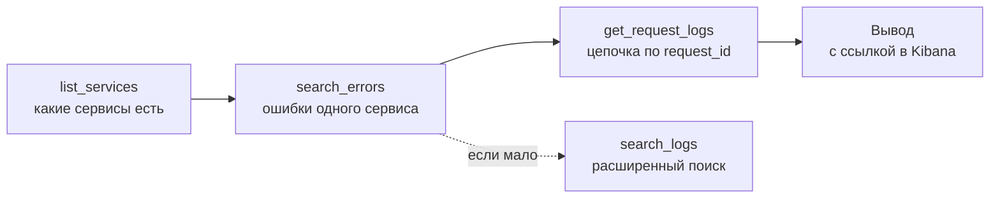

# MCP: подключение инструментов к модели

## Содержание

- [Зачем понадобился стандарт](#зачем-понадобился-стандарт)
- [Что MCP добавляет, а что нет](#что-mcp-добавляет-а-что-нет)
- [Из чего состоит сервер](#из-чего-состоит-сервер)
- [Транспорт](#транспорт)
- [Проектирование сервера: разбор на примере](#проектирование-сервера-разбор-на-примере)
- [Шесть приёмов защиты контекста](#шесть-приёмов-защиты-контекста)
- [Когда сервисов десятки](#когда-сервисов-десятки)
- [Границы доверия](#границы-доверия)
- [Типичные ошибки](#типичные-ошибки)
- [Interview-ready answer](#interview-ready-answer)

Model Context Protocol (MCP) — стандарт, которым внешние инструменты подключаются к приложениям с языковой моделью. Написанный один раз сервер работает с любым клиентом, поддерживающим протокол, — и это единственное, что MCP добавляет. Всё, что касается проектирования самих инструментов, остаётся тем же, что в [02-tool-calling.md](./02-tool-calling.md).

---

## Зачем понадобился стандарт

До MCP каждая интеграция писалась под конкретное приложение. Пять инструментов и три приложения означали пятнадцать реализаций, потому что у каждого приложения свой способ объявить функцию и вернуть результат.

```text
Без стандарта:                      С MCP:

  приложение A ──┬── логи             приложение A ──┐
                 ├── БД                              ├── клиент MCP ──┬── сервер логов
                 └── тикеты           приложение B ──┤                ├── сервер БД
  приложение B ──┬── логи                            │                └── сервер тикетов
                 ├── БД               приложение C ──┘
                 └── тикеты
  ...                                 3 приложения + 3 сервера
  3 × 3 = 9 реализаций                вместо 9 реализаций
```

Экономия не только в числе реализаций. Стандарт даёт общее место для описания инструментов, единый способ вернуть ошибку и общую точку, где клиент решает, какие инструменты вообще показывать модели.

---

## Что MCP добавляет, а что нет

Ключевое, что снимает половину путаницы: **модель не знает про MCP**. Она по-прежнему просто просит вызвать функцию, как описано в разборе вызова инструментов. Протокол живёт между клиентским приложением и сервером инструментов.


| | Даёт MCP | Остаётся на разработчике |
|---|---|---|
| Подключение | единый протокол и формат объявления | — |
| Набор инструментов | — | что именно объявить и насколько узко |
| Описания | место, куда их положить | текст, по которому модель решает вызывать |
| Объём ответа | — | проекция полей, лимиты, схлопывание |
| Проверка аргументов | схема в объявлении | вся смысловая проверка на сервере |
| Права | клиент решает, какие серверы включить | внутри сервера — своё разграничение |

Иначе говоря, MCP решает вопрос «как подключить», а не «как спроектировать». Плохо спроектированный MCP-сервер ровно так же забивает контекст, как плохо спроектированный обычный инструмент.

---

## Из чего состоит сервер

Сервер объявляет клиенту три вида сущностей:

- **Инструменты** — функции с описанием и схемой аргументов. То, что модель может попросить вызвать. Основной и чаще всего единственный используемый вид.
- **Ресурсы** — именованные данные, которые клиент может прочитать и подложить в контекст: файл, запись, конфигурация. В отличие от инструмента, читаются без решения модели.
- **Шаблоны промптов** — заготовки, которые приложение показывает пользователю как готовые сценарии.

Клиент при подключении спрашивает у сервера список того, что тот умеет, и дальше решает, что из этого показать модели. Эта развилка важна: сервер может объявлять двадцать инструментов, а клиент — включить четыре.

---

## Транспорт

Два способа связи, и выбор между ними определяет модель развёртывания.

| | Локальный процесс (stdio) | Сетевой (HTTP) |
|---|---|---|
| Как запускается | клиент поднимает сервер дочерним процессом | сервер работает отдельно, клиент ходит по сети |
| Кто пользователь | один человек на своей машине | несколько пользователей или сервисов |
| Учётные данные | берутся из окружения этого человека | хранятся у сервера, общие на всех |
| Права | права запустившего | нужно своё разграничение |
| Когда уместно | инструменты разработчика, локальные файлы | общий сервер для команды, внутренний сервис |

Разница в правах — не деталь, а архитектурная развилка. Локальный сервер видит ровно то, что видит его хозяин. Сетевой держит одну учётную запись на всех, и вопрос «чьими правами сейчас читаются продовые данные» становится вопросом дизайна, а не настройки.

---

## Проектирование сервера: разбор на примере

Возьмём конкретную задачу: агент помогает разобрать инцидент в сервисе коротких ссылок. В системе четыре сервиса, структурные логи в Elasticsearch с индексом вида `shortener-logs-*` и стандартизованный набор полей: `service`, `request_id`, `operation`, `error_kind`, `short_code`, `status_code`.

Наивный сервер выглядит так: один инструмент `search_logs(query)`, внутри — проброс запроса в Elasticsearch, наружу — сырой ответ. Работает на демонстрации и разваливается на первом реальном инциденте:

- модель пишет запрос по всему индексу и получает тысячи документов;
- сырой документ Elasticsearch содержит десятки служебных полей, из которых нужны пять;
- половина найденного — одна и та же ошибка, повторённая сотни раз;
- окно забивается на втором вызове, и агент начинает терять начало разговора.

Спроектированный сервер строится вокруг вопроса **что должно попасть в контекст**, а не вокруг того, что умеет API.

### Маршрут расследования как набор инструментов

Живой дежурный действует по понятной схеме: понять, какие сервисы есть, найти в подозрительном сервисе свежие ошибки, взять идентификатор запроса и посмотреть всю его цепочку. Инструменты повторяют эти шаги:



Четыре инструмента, а не один универсальный. Каждый решает один шаг и возвращает ровно столько, сколько нужно для следующего.

Порядок при этом зашивается не в системный промпт, а в **описания инструментов** — модель выбирает вызов, читая именно их:

```text
list_services
  Список сервисов и окружений. Вызывать первым, до любого поиска.

search_errors
  Ошибки и предупреждения одного сервиса за период. Точка входа,
  когда идентификатор запроса ещё неизвестен. Возвращает
  сгруппированные ошибки со счётчиком и примером request_id.

get_request_logs
  Все записи одной цепочки по request_id. Вызывать, когда
  идентификатор уже получен из search_errors.

search_logs
  Расширенный поиск по произвольным полям. Вызывать только если
  первых трёх не хватило.
```

Такое описание делает две вещи сразу: говорит, когда вызывать, и говорит, чего инструмент не делает.

---

## Шесть приёмов защиты контекста

То, что отличает рабочий сервер от обёртки. Приёмы общие — они применимы к любому источнику данных, не только к логам.

### 1. Проекция полей

Наружу отдаются только нужные поля, а не документ источника целиком. Из записи лога это обычно время, сервис, уровень, операция, вид ошибки, сообщение и идентификатор запроса. Всё служебное — версии индекса, внутренние метки, дубли полей — отсекается на сервере.

### 2. Схлопывание одинакового

Краш-луп даёт пятьсот идентичных строк. Группировка превращает их в одну запись со счётчиком.

Тонкость, о которой забывают: группировать по точному тексту почти бесполезно, потому что сообщения содержат уникальные куски — `short_code=abc123 not found`, `timeout after 3021ms`. Перед группировкой текст нормализуется: числа, идентификаторы и коды заменяются заполнителями.

```text
До нормализации:                    После:
  short_code=abc123 not found         short_code=<id> not found   × 412
  short_code=xy9z01 not found
  short_code=qq77aa not found
  ... ещё 409 строк
```

### 3. Видимое усечение

Лимит на число записей обязателен, но обрезать молча нельзя. Если инструмент вернул двадцать записей из трёх тысяч, агент решит, что ошибок было двадцать, и построит на этом весь разбор.

В ответе должно стоять явно: сколько показано, сколько всего, как сузить выборку.

### 4. Закрытые словари

Окружение задаётся перечислением `prod` / `test`, а не строкой с именем кластера. Сервис выбирается из списка, полученного из `list_services`. Модель не может выдумать значение, потому что схема его не пропустит — тот же приём, что в [структурированном выводе](../api-integration/02-structured-outputs.md).

### 5. Отказ на слишком широком запросе

Поиск без сервиса, без временного окна или с пустым фильтром отклоняется сервером с понятным текстом: чего не хватает и что подставить. Модель — недоверенный ввод, и надеяться, что она не попросит лишнего, нельзя.

Временное окно заслуживает отдельного упоминания: у инцидента есть время, и запрос без диапазона — это и самая дорогая операция для источника, и вопрос без смысла. Нужны и значение по умолчанию, и потолок.

### 6. Подсказка следующего шага в ответе

Результат инструмента сам направляет агента: «найдено три группы ошибок, для разбора цепочки вызови `get_request_logs` с одним из этих `request_id`». Это работает лучше инструкций в системном промпте, потому что приходит в нужный момент и с конкретными значениями.

Полезно добавлять и ссылку для человека — прямую ссылку в Kibana или в просмотрщик трассировок. Дежурный проверит вывод агента за десять секунд, а разбор инцидента получит ссылку в отчёт.

---

## Когда сервисов десятки

Разобранный выше сервер устроен под четыре сервиса с общей таксономией полей. Практическая граница такого дизайна — примерно десять-пятнадцать сервисов, дальше он перестаёт работать по трём причинам сразу.

**Перечисление становится налогом.** Список сервисов в `enum` попадает в схему инструмента, а схема уходит в каждом запросе на каждом ходу разговора. Четыре имени бесплатны, сорок — это сотни токенов, потраченных до того, как агент что-то сделал.

**Модель не знает, что выбрать.** `shortener` и `analytics` говорят сами за себя. Сорок внутренних имён вида `pmt-orch` или `notif-gw` не говорят ничего, и первый вызов уходит не туда.

**Уникальным полям некуда деться.** В примере выше `short_code` — поле одного сервиса, лежащее в общей схеме поиска. При сорока сервисах туда же попросятся `order_id`, `payment_id`, `campaign_id`, и схема будет описывать тридцать полей, из которых для конкретного сервиса осмысленны два.

### Чего делать не надо

Не заводить инструменты по числу сервисов. Соблазн понятный: у каждого сервиса свой набор полей, значит и свой `search_*` со своей схемой. Сорок сервисов на пять инструментов дают двести объявлений в каждом запросе — это не решение проблемы схемы, а её умножение.

Число инструментов остаётся прежним. Меняется то, откуда берутся значения.

### Перечисление заменяется обнаружением

| | До полутора десятков | Десятки |
|---|---|---|
| Список сервисов | `enum` в схеме | обнаруживается вызовом |
| Проверка значения | схемой, до вызова | сервером, при вызове |
| Поля запроса | фиксированные свойства | ядро плюс свободный словарь |
| Число инструментов | пять | шесть, добавляется описание сервиса |

Выше границы `service` становится обычной строкой, а роль ограничителя целиком переходит на сервер: он сверяет значение с живым реестром и при промахе отвечает не «неизвестно», а подсказкой — ближайшие по написанию имена и указание вызвать список сервисов. Гарантия схемы теряется, отказ сервера остаётся — а он и был настоящей защитой.

Плоский список из сорока имён при этом бесполезен, поэтому сужение делается в два шага: сначала домен или команда, потом шесть-восемь сервисов внутри. Доменов мало и меняются они редко, так что они остаются закрытым словарём.

### Ядро и хвост полей

Главное решение, и лежит оно не в протоколе, а в контракте платформы.

**Ядро** — небольшой набор полей, которые обязаны писать все сервисы: время, сервис, уровень, операция, вид ошибки, идентификатор запроса, идентификатор трассировки. Только оно попадает в типизированную схему и в проекцию по умолчанию.

**Хвост** — всё, что сервис пишет для себя. В схеме не перечисляется вовсе; вместо фиксированных свойств появляется одно:

```json
"filters": {
  "type": "object",
  "description": "Фильтры по полям этого сервиса. Допустимые имена вернёт describe_service.",
  "additionalProperties": { "type": "string" }
}
```

Схема перестаёт расти вместе с числом сервисов, а проверка имён переезжает на сервер, который знает поля конкретного сервиса.

Тот же принцип действует и в ответе: ядро отдаётся всегда, из хвоста — только поля, по которым фильтровали, и два-три самых информативных. Иначе экономия на схеме вернётся расходом на ответах.

### Инструмент описания сервиса

Он и делает хвост доступным: возвращает по одному сервису список полей с типом, примером значения и кардинальностью.

Кардинальность здесь не украшение. Поле с пятью значениями и поле с миллионом — инструменты для разных вопросов, и по имени их не различить. Без этой подсказки агент попытается сгруппировать выдачу по идентификатору запроса.

Это обычная постепенная выдача (`progressive disclosure`): вместо одной схемы на все сервисы модель спрашивает про тот один, который нужен сейчас.

### Операционные следствия

- **Кэш обнаружения.** Агрегация по сорока сервисам за сутки — недешёвый запрос, а список сервисов и набор полей меняются медленно.
- **Разграничение прав становится обязательным.** Десятки сервисов — это почти наверняка несколько команд, и одна учётная запись на всех означает чтение чужих продовых логов.
- **Маршрутизация по индексам.** Если логи разложены по индексам на сервис, запрос без сервиса перестаёт быть просто широким и становится дорогим для хранилища.

Правило, которое из этого следует и работает шире логов: **закрытый словарь в схеме — для того, чего мало и что меняется редко; всё, что растёт вместе с системой, обнаруживается вызовом и проверяется на сервере.**

---

## Границы доверия

Самая недооценённая часть при работе с логами и любыми пользовательскими данными.

**Содержимое лога — это ввод от постороннего.** В логи попадает то, что контролирует пользователь: заголовки, пути, тела запросов, сообщения об ошибках с подставленными значениями. Кто угодно, способный записать текст в логи, может положить туда инструкцию для агента. Это подмена инструкций (`prompt injection`) через результат вызова, разобранная в [02-tool-calling.md](./02-tool-calling.md).

Что с этим делать:

- помечать содержимое как данные и не давать ему определять следующий вызов;
- не совмещать в одной сессии чтение логов и любой инструмент с исходящим действием — отправку сообщения, запись, вызов внешнего API;
- ограничивать длину отдельного поля, чтобы длинная вставка не вытеснила инструкции.

**Секреты и персональные данные уезжают провайдеру.** В логах регулярно оказываются токены, почты, номера. Всё, что инструмент вернул, отправляется в модель, то есть наружу. Вычистка делается до попадания в контекст, а не после.

**Учётная запись сервера — только на чтение.** Сервер для расследования не должен уметь ничего менять. Отдельно стоит проверить, что права источника урезаны до минимума: доступ на чтение логов и ничего больше.

**Чьими правами работает агент.** Сетевой сервер с одной учётной записью означает, что любой, кто может писать агенту, читает всё, что видит эта запись. Если данные разделены по командам или клиентам, разграничение нужно внутри сервера, а не на уровне «выдать роль на инструменты».

---

## Типичные ошибки

### 1. Один универсальный инструмент вместо нескольких узких

`execute_query(sql)` или `search(query)` невозможно ни ограничить, ни провалидировать. Узкие функции с конкретными контрактами и безопаснее, и понятнее модели.

### 2. Отдавать сырой ответ источника

Документ Elasticsearch, ответ облачного API или строка базы содержат десятки полей, из которых нужны единицы. Проекция делается на сервере, иначе окно забивается на втором вызове.

### 3. Молча обрезать выдачу

Усечение без пометки превращается в неверный вывод: агент считает, что видел всё.

### 4. Схлопывать по точному тексту

Без нормализации сообщений группировка не срабатывает вовсе — механизм есть, эффекта нет.

### 5. Проверять аргументы в промпте, а не на сервере

Просьба «не делай широких запросов» в системном промпте не является ограничением. Ограничение — это отказ сервера.

### 6. Забыть про временное окно

Запрос без диапазона медленный, дорогой и бессмысленный. Умолчание и потолок задаются на сервере.

### 7. Плодить инструменты по числу сервисов

Отдельный `search_*` на каждый сервис множит объявления, уходящие в каждом запросе. Число инструментов фиксировано; масштабируются значения, а не схема.

### 8. Считать результат инструмента доверенным

Содержимое логов, писем, страниц и тикетов пишут посторонние. Оно остаётся данными.

---

## Interview-ready answer

**1. Что такое MCP и что он решает?**

- Суть — стандарт подключения внешних инструментов к приложениям с языковой моделью.
- Выигрыш — сервер пишется один раз и работает с любым совместимым клиентом, вместо реализации под каждое приложение.
- Граница — MCP отвечает за подключение, а не за проектирование инструментов.

**2. Знает ли модель про MCP?**

- Нет — модель по-прежнему просто просит вызвать функцию.
- Протокол — работает между клиентским приложением и сервером инструментов.
- Следствие — все правила вызова инструментов действуют без изменений.

**3. Из чего состоит сервер?**

- Инструменты — функции с описанием и схемой аргументов, основной вид.
- Ресурсы — именованные данные, читаемые клиентом без решения модели.
- Шаблоны промптов — готовые сценарии для пользователя приложения.

**4. Чем локальный сервер отличается от сетевого?**

- Локальный — запускается дочерним процессом, работает правами запустившего.
- Сетевой — отдельный сервис с общей учётной записью и собственным разграничением прав.
- Развилка — вопрос «чьими правами читаются данные» решается дизайном, а не настройкой.

**5. Как не забить контекст агента?**

- Проекция — отдавать только нужные поля, а не документ источника.
- Группировка — схлопывать одинаковое с нормализацией текста, иначе не сработает.
- Лимиты — с явной пометкой об усечении, чтобы агент не принял часть за целое.
- Отказ — слишком широкий запрос отклоняется сервером, а не отговаривается промптом.

**6. Что делать, когда сервисов десятки?**

- Перечисление — заменяется обнаружением: список приходит вызовом, а проверка значения переезжает на сервер.
- Поля — делятся на обязательное ядро в типизированной схеме и хвост в свободном словаре фильтров.
- Антипаттерн — инструменты по числу сервисов: схема тогда растёт вместе с системой.

**7. Где здесь граница безопасности?**

- Содержимое ответа — недоверенный ввод: в логи и тикеты пишут посторонние, там может оказаться инструкция для агента.
- Разделение — не совмещать в одной сессии чтение чужих данных и инструменты с исходящим действием.
- Права — учётная запись сервера урезана до чтения, вычистка секретов делается до попадания данных в модель.
