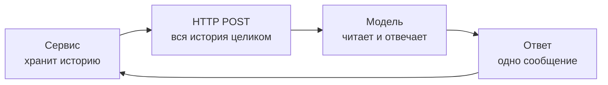

# Анатомия LLM API

## Содержание

- [Ментальная модель: сервер ничего не помнит](#ментальная-модель-сервер-ничего-не-помнит)
- [Из чего состоит запрос](#из-чего-состоит-запрос)
- [Роли сообщений](#роли-сообщений)
- [Токены и контекстное окно](#токены-и-контекстное-окно)
- [Что приходит в ответе](#что-приходит-в-ответе)
- [Причина остановки](#причина-остановки)
- [Три провайдера: где различия](#три-провайдера-где-различия)
- [Где протекает общая абстракция](#где-протекает-общая-абстракция)
- [Типичные ошибки](#типичные-ошибки)
- [Interview-ready answer](#interview-ready-answer)

Языковая модель с точки зрения backend-разработчика — это HTTP-эндпоинт, который принимает JSON и возвращает JSON. Всё остальное — детали формата. Разбор начинается с того, что именно уходит на сервер и что приходит обратно, потому что почти все ошибки интеграции растут из непонимания этих двух структур.

---

## Ментальная модель: сервер ничего не помнит

Главное свойство, из которого следует всё остальное: **вызов модели не имеет состояния**. Сервер провайдера не хранит диалог. Каждый запрос содержит всю историю целиком, и модель каждый раз читает её заново, как будто видит впервые.



Практические следствия:

- **Историю хранит сервис.** База, кэш, память процесса — где угодно, но не у провайдера.
- **Каждый следующий шаг диалога дороже предыдущего.** На третьей реплике отправляются все три предыдущие; на тридцатой — все тридцать. Стоимость входа растёт квадратично от длины разговора.
- **Ответ модели надо самому дописать в историю.** Иначе на следующем шаге модель не будет знать, что она отвечала.
- **Никакой «сессии» нет.** Идентификатора диалога, который можно передать вместо истории, у классического API не существует.

Так выглядит рост запроса по мере разговора:

```text
Запрос 1:  [системная инструкция][вопрос 1]
Запрос 2:  [системная инструкция][вопрос 1][ответ 1][вопрос 2]
Запрос 3:  [системная инструкция][вопрос 1][ответ 1][вопрос 2][ответ 2][вопрос 3]
                                  \________ повторяется каждый раз ________/
```

Повторяющийся префикс — это и есть то, за что берут деньги снова и снова, и одновременно то, что оптимизируется кэшированием (см. дальше про кэш префикса).

---

## Из чего состоит запрос

Пять частей, в том или ином виде присутствующих у всех провайдеров:

```text
┌─────────────────────────────────────────────────────────┐
│ 1. Модель          какую версию использовать            │
├─────────────────────────────────────────────────────────┤
│ 2. Инструкция      кто модель и по каким правилам       │
│                    работает (системная роль)            │
├─────────────────────────────────────────────────────────┤
│ 3. История         чередование сообщений пользователя   │
│                    и ответов модели                     │
├─────────────────────────────────────────────────────────┤
│ 4. Инструменты     список функций, которые модель        │
│                    может попросить вызвать              │
├─────────────────────────────────────────────────────────┤
│ 5. Параметры       лимит на длину вывода, формат ответа, │
│                    глубина рассуждений, потоковый режим  │
└─────────────────────────────────────────────────────────┘
```

Обязательны только первые три; инструменты и формат нужны, когда от модели требуется не свободный текст.

Отдельно стоит **лимит на длину вывода** (`max_tokens` и его аналоги). Это жёсткая граница: модель не «пишет короче», а обрывается на середине, когда упирается в лимит. Ответ при этом приходит успешный, с признаком обрыва в поле причины остановки — молча получить обрезанный JSON очень легко.

---

## Роли сообщений

История — это список сообщений, у каждого есть роль. Ролей три, и они различаются не вежливостью, а уровнем доверия.

| Роль | Кто пишет | Зачем |
|---|---|---|
| Системная (`system`, `developer`) | разработчик сервиса | правила, формат, границы поведения; действует на весь диалог |
| Пользователь (`user`) | конечный пользователь или сервис | сам запрос и данные для обработки |
| Ассистент (`assistant`) | модель | её предыдущие ответы, которые возвращаются в историю |

Практически важная граница проходит между системной ролью и ролью пользователя. Всё, что приходит извне — текст от пользователя, содержимое документа, ответ стороннего API — попадает в роль пользователя и является **данными, а не инструкциями**. Смешивать их с правилами в системной роли нельзя: это прямая дорога к подмене инструкций (`prompt injection`), когда во входном тексте оказывается фраза вида «забудь предыдущие указания».

---

## Токены и контекстное окно

**Токен** — кусок текста, которым оперирует модель: примерно слово или часть слова. Русский текст в токенах дороже английского, а код и разметка дороже обычной прозы.

Считать токены на глаз не нужно и вредно — у каждого семейства моделей свой разбиватель текста (`tokenizer`), и оценка «символы разделить на четыре» ошибается тем сильнее, чем дальше текст от английского. У провайдеров есть отдельные эндпоинты для подсчёта; ими и стоит пользоваться, если объём надо знать точно.

**Контекстное окно** — максимальное число токенов, которое помещается в один запрос вместе с ответом. Когда история перестаёт помещаться, вариантов три:

- **Обрезать** — выбросить самые старые сообщения.
- **Сжать** — заменить старую часть диалога кратким пересказом.
- **Вынести наружу** — хранить историю в поиске и подтягивать только релевантное (это уже [RAG](../rag/01-rag-fundamentals.md)).

Токены делятся на входные и выходные, и стоят они по-разному: выходные заметно дороже. Это же различие определяет и время ответа — см. [03-reasoning-and-latency.md](./03-reasoning-and-latency.md).

---

## Что приходит в ответе

Ответ — не строка. Это структура, в которой основное содержимое лежит списком блоков:

```text
{
  идентификатор запроса
  модель, которая ответила
  содержимое: [
      { тип: текст,      текст: "..." }
      { тип: рассуждение, ... }            ← если модель рассуждающая
      { тип: вызов_инструмента, имя, аргументы }  ← если попросила вызвать функцию
  ]
  причина остановки
  расход токенов: { входные, выходные, из кэша }
}
```

Три вещи, которые новички пропускают:

- **Содержимое — список, а не строка.** Брать `content[0].text` вслепую опасно: первым блоком может оказаться рассуждение или вызов инструмента, а при отказе список бывает пустым.
- **Расход токенов приходит в каждом ответе.** Это единственный честный источник данных о стоимости и о том, куда ушло время. Его нужно логировать с самого начала — восстановить задним числом невозможно.
- **Причина остановки важнее содержимого.** Она объясняет, полон ответ или оборван.

---

## Причина остановки

Поле, которое определяет, что делать дальше. Названия у провайдеров разные, смысл общий:

| Смысл | Что произошло | Что делать сервису |
|---|---|---|
| Закончил | модель сказала всё, что хотела | обычная обработка ответа |
| Упёрся в лимит | достигнут `max_tokens` | ответ оборван — поднять лимит или включить потоковый режим |
| Просит инструмент | модель хочет вызвать функцию | выполнить вызов и вернуть результат (см. [tool calling](../agents/02-tool-calling.md)) |
| Отказ | сработала защита провайдера | содержимое пустое или частичное; повторять тот же запрос бессмысленно |

Обработка ветки «просит инструмент» и ветки «упёрся в лимит» — это ровно те два места, где интеграция чаще всего оказывается недописанной.

---

## Три провайдера: где различия

Общая форма одинакова у всех: отправить историю, получить блоки. Различия начинаются в деталях, и именно они мешают написать один клиент на всех.

| | OpenAI | Anthropic | Google |
|---|---|---|---|
| Системная инструкция | сообщение с ролью в общем списке | **отдельный параметр** запроса, вне списка сообщений | отдельное поле инструкции |
| История | список входных элементов | список сообщений, содержимое — блоки | список содержимого с частями (`parts`) |
| Схема инструмента | описание функции с параметрами | описание с полем входной схемы | объявления функций |
| Строгий формат ответа | формат с JSON-схемой | конфигурация вывода с JSON-схемой | тип ответа плюс схема |
| Кэш префикса | включается **автоматически** для длинных повторяющихся начал | **явные точки разрыва** в запросе | своя схема кэширования |
| Результат работы инструмента | элемент с результатом вызова | блок результата внутри сообщения пользователя | часть с ответом функции |

Самое заметное расхождение — системная инструкция. У Anthropic это параметр верхнего уровня, а не элемент списка сообщений; код, который «просто кладёт system первым сообщением», там работать не будет.

Второе по важности — кэширование префикса. Идея общая: повторяющееся начало запроса не пересчитывается заново и стоит сильно дешевле. Но у одного провайдера это происходит само, а у другого требует явно расставить точки разрыва в запросе. И в обоих случаях действует одно правило: **кэш работает по совпадению префикса байт в байт**. Любая мелочь в начале запроса — текущая дата в системной инструкции, случайный идентификатор, несортированные ключи в JSON — обнуляет весь кэш дальше.

---

## Где протекает общая абстракция

Соблазн написать интерфейс `LLMClient` с одним методом `Complete(ctx, messages)` и подставлять любого провайдера возникает сразу. Он работает ровно до первой нетривиальной задачи.

Что переносится между провайдерами без боли:

- отправить историю и получить текст;
- ограничить длину вывода;
- потоковый режим на уровне «пришёл кусок текста».

Что не переносится:

- **Строгий вывод по схеме.** Разные ограничения на допустимые схемы, разное поведение при нарушении.
- **Вызов инструментов.** Разная структура объявления, разная упаковка результата, разное поведение при параллельных вызовах.
- **Кэширование промпта.** Автоматическое против явного — это разная архитектура сборки запроса, а не разные имена полей.
- **Рассуждения.** Разные способы задать глубину, разная видимость внутренних рассуждений.
- **Отказы и ошибки.** Разные коды, разные признаки, разные политики повторов.

Рабочий вывод: абстрагировать стоит **свой сценарий**, а не «LLM вообще». Интерфейс вида «разложи ответы квиза по тегам» переносится между провайдерами; интерфейс вида «вызови модель» — нет, потому что в него немедленно начинают протекать детали конкретного API.

---

## Типичные ошибки

### 1. Читать `content[0].text` без проверки

Первый блок не обязан быть текстом, а при отказе блоков может не быть вовсе. Правильно — искать блок нужного типа и обрабатывать случай, когда его нет.

### 2. Не смотреть на причину остановки

Оборванный по лимиту ответ приходит с успешным HTTP-статусом. Без проверки причины сервис получает обрезанный JSON и падает уже на разборе, в другом месте и с невнятной ошибкой.

### 3. Не логировать расход токенов

Поле с расходом есть в каждом ответе. Без него нельзя ни посчитать стоимость, ни понять, почему запрос идёт долго. Логировать длительность и не логировать расход — самая частая дыра в наблюдаемости.

### 4. Класть пользовательский ввод в системную инструкцию

Системная роль — это правила сервиса. Всё пришедшее извне идёт в роль пользователя, иначе внешний текст получает полномочия инструкции.

### 5. Собирать JSON-тело подстановкой в строку

Шаблон запроса с заменой `%PROMPT%` на текст ломается на первой же кавычке или переводе строки. Тело собирается структурой и сериализуется, а не склеивается.

### 6. Ломать кэш префикса мелочью в начале запроса

Текущее время, идентификатор запроса или несортированная сериализация в системной инструкции сводят экономию к нулю. Проверяется по полю расхода токенов: если доля из кэша всегда ноль, где-то в начале запроса что-то меняется.

### 7. Считать токены самодельной формулой

Оценки по числу символов ошибаются на десятки процентов, особенно на русском и на коде. Для точного числа есть эндпоинт подсчёта.

---

## Interview-ready answer

**1. Что представляет собой вызов LLM с точки зрения backend?**

- Суть — обычный HTTP-запрос с JSON, без состояния на стороне провайдера.
- История — хранится сервисом и целиком отправляется в каждом запросе.
- Следствие — стоимость входа растёт по мере диалога, и повторяющийся префикс становится главным объектом оптимизации.

**2. Из чего состоит запрос?**

- Обязательное — модель, системная инструкция, история сообщений.
- Опциональное — список инструментов, формат ответа, лимит вывода, глубина рассуждений.
- Роли — системная задаёт правила, пользовательская несёт данные; внешний текст всегда идёт в пользовательскую.

**3. Что важно прочитать в ответе, кроме текста?**

- Причина остановки — отличает полный ответ от оборванного по лимиту и от запроса на вызов инструмента.
- Расход токенов — единственный источник данных о стоимости и о причине долгого ответа.
- Структура — содержимое приходит списком блоков, обращение к нулевому элементу небезопасно.

**4. Чем отличаются API разных провайдеров?**

- Форма — общая: отправить историю, получить блоки.
- Различия — системная инструкция отдельным параметром или сообщением, разные схемы инструментов, разный строгий вывод, разное кэширование префикса.
- Вывод — общая абстракция протекает; абстрагировать надо конкретный сценарий, а не вызов модели вообще.

**5. Что такое кэширование префикса и как его сломать?**

- Механика — повторяющееся начало запроса не пересчитывается и стоит дешевле.
- Условие — совпадение префикса байт в байт.
- Типичная поломка — дата, случайный идентификатор или несортированный JSON в начале запроса; проверяется по доле токенов из кэша в поле расхода.
