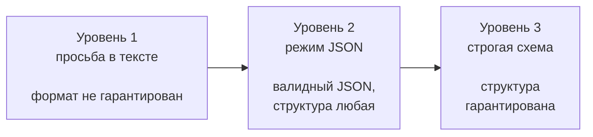

# Структурированный вывод

## Содержание

- [Проблема: модель отвечает текстом](#проблема-модель-отвечает-текстом)
- [Три уровня надёжности](#три-уровня-надёжности)
- [Как работает ограничение при генерации](#как-работает-ограничение-при-генерации)
- [Закрытый словарь через enum](#закрытый-словарь-через-enum)
- [Что схема выразить не может](#что-схема-выразить-не-может)
- [Валидация нужна всё равно](#валидация-нужна-всё-равно)
- [Инструмент как способ получить структуру](#инструмент-как-способ-получить-структуру)
- [Типичные ошибки](#типичные-ошибки)
- [Interview-ready answer](#interview-ready-answer)

Модель обучена продолжать текст, а сервису нужен объект: поля, типы, допустимые значения. Разрыв между этими двумя вещами закрывается механизмом структурированного вывода (`structured outputs`) — описанием схемы прямо в запросе. Это самый практичный приём во всей интеграции с языковыми моделями: он превращает вероятностный текст в данные, которые можно положить в базу.

---

## Проблема: модель отвечает текстом

Наивный подход — попросить нужный формат словами:

```text
Верни ответ строго в JSON вида {"tags": [...]}. Никакого другого текста.
```

Работает в большинстве случаев и ломается в остальных. Типичные способы сломаться:

- **Обёртка.** Ответ приходит внутри markdown-блока с тройными кавычками.
- **Преамбула.** Перед объектом появляется «Конечно! Вот результат:».
- **Выдуманное поле.** Модель добавляет `"confidence"`, которого в схеме не было.
- **Выдуманное значение.** Вместо тега из словаря появляется похожий по смыслу, но отсутствующий в системе.
- **Обрыв.** Ответ упирается в лимит вывода и приходит недописанным.

Каждая поломка требует своей заплатки: срезать кавычки, искать первую фигурную скобку, чистить лишние поля, сверять значения со словарём. Слой таких заплаток растёт бесконечно, потому что закрывает следствия, а не причину.

---

## Три уровня надёжности



| Уровень | Что гарантируется | Что остаётся на сервисе |
|---|---|---|
| Просьба в тексте | ничего | разбор, чистка, проверка типов, проверка значений |
| Режим JSON | вывод разбирается как JSON | проверка полей, типов и допустимых значений |
| Строгая схема | поля, типы и допустимые значения соответствуют схеме | проверка бизнес-смысла |

Разница между вторым и третьим уровнем принципиальна. Режим JSON обещает только то, что текст распарсится: `{"результат": "не знаю"}` — валидный JSON и совершенно бесполезный ответ. Строгая схема описывает конкретную форму: какие поля обязательны, какого они типа, какие значения допустимы, разрешены ли лишние поля.

Ответ по строгой схеме выглядит так:

```json
{
  "type": "json_schema",
  "strict": true,
  "schema": {
    "type": "object",
    "properties": {
      "tags": {
        "type": "array",
        "items": { "type": "string", "enum": ["family", "budget", "luxury"] }
      }
    },
    "required": ["tags"],
    "additionalProperties": false
  }
}
```

Два поля здесь несут основную нагрузку. `required` перечисляет обязательные поля — без него модель вправе их не заполнять. `additionalProperties: false` запрещает лишние поля — без него модель дописывает всё, что сочтёт полезным.

---

## Как работает ограничение при генерации

Строгая схема — не проверка после генерации, а ограничение во время неё. Механизм называется ограниченным декодированием (`constrained decoding`).

Модель генерирует текст по одному токену: на каждом шаге она получает распределение вероятностей по всему словарю и выбирает следующий токен. Схема превращается в правило, которое на каждом шаге запрещает токены, ведущие к невалидной структуре:

```text
Уже сгенерировано:  {"tags": ["fam

Что разрешено дальше по схеме (enum: family, budget, luxury):
    ily        ← ведёт к "family", допустимому значению
Что запрещено:
    ous"       ← дало бы "famous", такого значения в enum нет
    ily_room   ← дало бы "family_room", тоже нет
    любой другой токен, не продолжающий валидное значение

                    ┌──────────────────────────────┐
    распределение → │ маска допустимых токенов     │ → выбор
    по словарю      │ (построена из схемы)         │
                    └──────────────────────────────┘
```

Отсюда важное следствие: **модель физически не может нарушить схему**. Не «старается не нарушать», а не имеет технической возможности выбрать запрещённый токен. Это снимает целый класс постобработки — проверку типов и допустимых значений.

Тот же механизм за пределами облачных API называется управляемой генерацией (`guided decoding`) и доступен в движках локального запуска моделей и в библиотеках вроде `Outlines`. Идея везде одна: грамматика или схема превращаются в маску по словарю.

---

## Закрытый словарь через enum

Самый недооценённый приём: если у поля есть конечный список допустимых значений, он вписывается в схему как `enum`.

```json
"category": { "type": "string", "enum": ["hotel", "apartment", "hostel"] }
```

Что это даёт:

- **Проверка словаря переносится на сторону провайдера.** Значение вне списка не появится, сверять со справочником не нужно.
- **Ответ короче.** Модель не пишет пояснений вокруг значения.
- **Классификация становится задачей с выбором из вариантов.** Вместо «назови категорию» — «выбери одну из трёх», что заметно надёжнее.

Так же решается и разметка объектов набором меток: массив строк с `enum` из всей таксономии. Список из сотни допустимых меток внутри схемы выглядит громоздко, зато исключает выдуманные значения полностью.

Ограничение практическое: словарь попадает в запрос и занимает токены. Для десятков значений это нормально, для десятков тысяч — нет; там нужен поиск по справочнику, а не перечисление.

---

## Что схема выразить не может

Поддержка JSON Schema у провайдеров ограничена, и набор ограничений различается. Что обычно **не** поддерживается:

- **Числовые границы** — `minimum`, `maximum`, `multipleOf`.
- **Ограничения длины строк** — `minLength`, `maxLength`.
- **Сложные ограничения массивов** — минимальная и максимальная длина.
- **Рекурсивные схемы** — структура, ссылающаяся сама на себя.

Что обычно поддерживается: базовые типы, `enum`, `const`, объединения вариантов, ссылки на определения, `required`, `additionalProperties: false`.

Отсюда правило: схема задаёт **форму**, а не **бизнес-правила**. «Ответ — массив строк из словаря» выражается схемой. «Меток не больше пятнадцати, и метка `adult_only` несовместима с семейными» — не выражается и остаётся кодом на стороне сервиса.

---

## Валидация нужна всё равно

Строгая схема убирает ошибки формата, но не ошибки смысла. Оставшиеся классы проблем:

- **Правильная форма, неверное содержание.** Все метки из словаря, но подобраны неудачно.
- **Противоречия внутри ответа.** Одновременно выставлены взаимоисключающие значения.
- **Неполный ответ.** Отправлено двадцать объектов, вернулось семнадцать — схема на массив это допускает.
- **Обрыв по лимиту.** Генерация прервана на середине; результат не проходит даже разбор, и причина видна только в поле причины остановки.

Практический слой поверх схемы обычно состоит из трёх шагов: нормализация (привести значения к каноническому виду, убрать дубликаты, отсортировать), разрешение конфликтов (правила несовместимости) и проверка полноты (сошлось ли число объектов с числом отправленных).

Порядок сортировки стоит зафиксировать: одинаковые по смыслу ответы тогда одинаково выглядят в базе, и различие между двумя прогонами становится читаемым.

---

## Инструмент как способ получить структуру

Есть второй путь к структурированному ответу: объявить функцию с нужной схемой аргументов и заставить модель её «вызвать». Аргументы вызова и будут искомым объектом — механизм подробно разобран в [tool calling](../agents/02-tool-calling.md).

| | Формат ответа по схеме | Схема аргументов инструмента |
|---|---|---|
| Что получается | ответ модели целиком | аргументы вызова функции |
| Когда уместно | нужен один объект как результат | модель сама решает, вызывать ли, и может вызвать несколько раз |
| Совмещается с текстом | нет, ответ и есть объект | да, модель может и написать текст, и вызвать функцию |

Простое правило: если результат вызова — ровно один объект, используется формат ответа. Если модель должна решать, что делать, и структура нужна как аргументы действия — инструмент.

---

## Типичные ошибки

### 1. Забыть `additionalProperties: false`

Без этого поля модель дописывает то, чего в схеме нет: пояснения, оценки уверенности, служебные комментарии. Формально схема не нарушена, а данные приходят с мусором.

### 2. Забыть `required`

Схема без списка обязательных полей разрешает вернуть пустой объект. Обычно это обнаруживается уже на продакшене, на редком входе.

### 3. Использовать свободный JSON, когда нужна форма

Режим JSON гарантирует только разбираемость. Если структура известна заранее, свободный режим — это добровольный отказ от гарантий и заодно от контроля над длиной вывода.

### 4. Не проверять причину остановки

Строгая схема не защищает от обрыва по лимиту токенов. Оборванный ответ не разберётся, и ошибка появится в неожиданном месте.

### 5. Пытаться выразить в схеме бизнес-правила

Лимиты на количество, взаимоисключающие значения, зависимости между полями — это код, а не схема. Попытка описать их текстом в описании поля даёт нестабильный результат.

### 6. Отправлять много объектов одним запросом

Пакет из двадцати объектов в одном ответе экономит на входе, но модели свойственно терять элементы на длинном выводе. Проверка «пришло столько же, сколько отправили» — это признак того, что размер пакета выбран неудачно.

---

## Interview-ready answer

**1. Как заставить модель вернуть данные, а не текст?**

- Механизм — описание JSON-схемы прямо в запросе, а не просьба соблюдать формат в тексте.
- Гарантия — при строгом режиме структура не может быть нарушена, потому что схема ограничивает генерацию, а не проверяет результат.
- Слои — просьба в тексте не гарантирует ничего, режим JSON гарантирует разбираемость, строгая схема гарантирует форму.

**2. Как это работает внутри?**

- Генерация — идёт по одному токену, на каждом шаге есть распределение по словарю.
- Ограничение — схема превращается в маску, запрещающую токены, ведущие к невалидной структуре.
- Следствие — нарушить схему технически невозможно, а не маловероятно.

**3. Зачем в схеме enum?**

- Назначение — закрыть конечный словарь допустимых значений прямо в схеме.
- Выигрыш — проверка по справочнику переносится на сторону провайдера, выдуманные значения исключаются.
- Граница — словарь занимает токены в запросе, поэтому подходит для десятков значений, а не для десятков тысяч.

**4. Нужна ли валидация после строгой схемы?**

- Формат — уже гарантирован, проверять типы и допустимые значения не нужно.
- Смысл — не гарантирован: содержание может быть неудачным, значения противоречивыми, число объектов неполным.
- Практика — нормализация, разрешение конфликтов и проверка полноты остаются на стороне сервиса.

**5. Какие типичные ошибки в схемах?**

- Пропуск `additionalProperties: false` — модель дописывает лишние поля.
- Пропуск `required` — разрешён пустой объект.
- Попытка задать схемой бизнес-правила — числовые границы и зависимости полей обычно не поддерживаются и остаются кодом.
