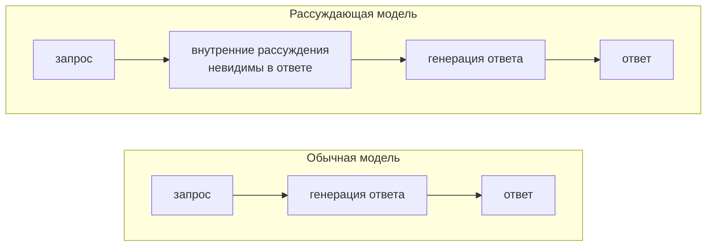
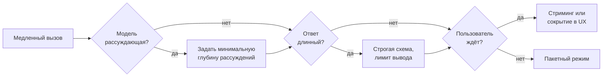

# Рассуждающие модели и латентность

## Содержание

- [Из чего складывается время ответа](#из-чего-складывается-время-ответа)
- [Вход дешёвый по времени, выход дорогой](#вход-дешёвый-по-времени-выход-дорогой)
- [Рассуждающие модели](#рассуждающие-модели)
- [Уровень усилий](#уровень-усилий)
- [Когда рассуждения окупаются](#когда-рассуждения-окупаются)
- [Рычаги сокращения времени](#рычаги-сокращения-времени)
- [Спрятать латентность вместо сокращения](#спрятать-латентность-вместо-сокращения)
- [Что измерять](#что-измерять)
- [Типичные ошибки](#типичные-ошибки)
- [Interview-ready answer](#interview-ready-answer)

Вызов модели, который идёт пятнадцать секунд, обычно выглядит загадкой: сеть в порядке, промпт небольшой, а ответ всё равно долгий. Загадки здесь нет — время ответа складывается из понятных частей, и почти всегда основную долю занимает одна из них.

---

## Из чего складывается время ответа

Три слагаемых:

```text
│◄── сеть ──►│◄──── обработка входа ────►│◄──────── генерация вывода ────────►│
│            │                            │                                    │
│  30-100 мс │      сотни миллисекунд     │   число токенов × время на токен   │
│            │  (или почти ноль при кэше) │                                    │
└────────────┴────────────────────────────┴────────────────────────────────────┘
                                          ▲
                              время до первого токена
```

- **Сеть.** Десятки миллисекунд. На фоне остального незаметна.
- **Обработка входа.** Модель читает весь запрос. Токены входа обрабатываются параллельно, поэтому длинный промпт добавляет сотни миллисекунд, а не секунды. При попадании в кэш префикса эта часть почти исчезает.
- **Генерация вывода.** Токены выхода производятся **последовательно, по одному**. Их нельзя посчитать параллельно: каждый следующий зависит от предыдущего.

Отсюда главная формула:

```text
время ≈ время до первого токена + (токенов на выходе × время на токен)
```

---

## Вход дешёвый по времени, выход дорогой

Это контринтуитивно и потому регулярно ведёт к оптимизации не того места.

| | Токены входа | Токены выхода |
|---|---|---|
| Как обрабатываются | параллельно | по одному, последовательно |
| Влияние на время | слабое | прямое и линейное |
| Влияние на стоимость | заметное | в несколько раз выше на токен |
| Кэшируются | да, при повторяющемся префиксе | нет |

Практический вывод: сокращение промпта на треть почти не влияет на время ответа, а сокращение вывода вдвое сокращает время примерно вдвое. Если вызов медленный, смотреть надо на то, **сколько модель пишет**, а не на то, сколько она читает.

Отсюда же следует, почему свободный формат ответа дороже строгой схемы по времени: без схемы модель сама решает, сколько написать, и обычно пишет больше нужного. Схема с закрытым словарём (см. [02-structured-outputs.md](./02-structured-outputs.md)) сокращает вывод, а вместе с ним и время.

---

## Рассуждающие модели

Отдельный класс моделей, появившийся как ответ на задачи, где качество растёт от «подумать перед ответом». Такая модель перед видимым ответом генерирует внутренние рассуждения — те же токены, с той же последовательной скоростью, но обычно **не попадающие в ответ**.



Что это значит на практике:

- **Время растёт на объём рассуждений.** Их может быть больше, чем самого ответа.
- **Деньги тоже.** Токены рассуждений тарифицируются как выходные.
- **В теле ответа их не видно.** Отсюда ощущение необъяснимой задержки: ответ короткий, а шёл долго.
- **Объём рассуждений виден в поле расхода токенов.** Это единственный способ узнать, куда ушло время.

Именно здесь возникает классическая ошибка диагностики: логируется длительность запроса, но не логируется расход токенов. В логах видна пятнадцатисекундная задержка и короткий ответ, а число, которое всё объясняет, отсутствует.

---

## Уровень усилий

У рассуждающих моделей есть параметр глубины — сколько модели позволено думать. Названия у провайдеров разные (уровень усилий, режим размышления, бюджет на рассуждения), смысл общий: ступенчатая шкала от минимальной до максимальной.

Ключевой момент: **у этого параметра есть значение по умолчанию, и оно не минимальное**. Запрос, в котором глубина не задана вообще, работает на уровне по умолчанию — то есть модель рассуждает, даже если задача этого не требует.

| Глубина | Когда уместна |
|---|---|
| Минимальная | извлечение данных, классификация, разложение по словарю, форматирование |
| Средняя | типовые задачи, где нужен разумный баланс |
| Высокая | многошаговые рассуждения, планирование, сложный код |
| Максимальная | случаи, где корректность важнее стоимости и времени |

Задача «разложить входные данные по фиксированной таксономии» — это отображение, а не головоломка. Рассуждения на ней сжигают время и деньги, не добавляя качества.

---

## Когда рассуждения окупаются

Простой признак: задача требует **промежуточных шагов, которые нельзя пропустить**.

Окупаются:

- многошаговые вычисления и выводы, где ошибка на шаге ломает результат;
- планирование последовательности действий;
- разбор кода и поиск ошибок;
- задачи, где надо сопоставить несколько разрозненных условий.

Не окупаются:

- извлечение полей из текста;
- классификация по готовому словарю;
- переформатирование и нормализация;
- ответ по найденному фрагменту документа.

Пограничный случай — задачи, которые выглядят как отображение, но требуют разрешения противоречий. Их стоит проверять замером на своём наборе примеров, а не выбирать по ощущению (см. [evals](../quality/01-evals.md)).

---

## Рычаги сокращения времени

По убыванию эффекта:



| Рычаг | Что даёт |
|---|---|
| Задать глубину рассуждений явно | самый крупный выигрыш там, где модель рассуждающая, а задача этого не требует |
| Строгая схема вместо свободного формата | потолок на длину вывода и запрет на лишний текст |
| Явный лимит вывода | защита от неограниченной генерации, но обрывает ответ, а не сокращает его |
| Модель поменьше | линейное сокращение времени на токен |
| Кэширование префикса | убирает обработку входа; на общее время влияет слабо, на стоимость сильно |
| Потоковый режим | не сокращает время, но первый токен приходит быстро, и ожидание переносится |
| Пакетный режим | время растёт до часов, зато дешевле; подходит для офлайн-задач |

Отдельно про **потоковый режим** (`streaming`): полное время ответа он не меняет. Он меняет воспринимаемое: вместо пятнадцати секунд пустого экрана пользователь видит текст через полсекунды. Работает это только там, где результат можно показывать по частям. Если ответ — JSON, который сервис разбирает целиком, стриминг не помогает: разбирать нечего, пока не пришёл весь объект.

---

## Спрятать латентность вместо сокращения

Самый недооценённый приём. Часто вызов вообще не обязан стоять в том месте, где пользователь его ждёт.

**Упреждающий запуск.** Если входные данные накапливаются постепенно — пользователь заполняет форму, проходит анкету, загружает файлы — запрос можно отправить, когда собрано почти всё, и доклеить остаток. Время, которое пользователь и так тратит на последний шаг, поглощает латентность целиком.

```text
Синхронно:     [заполнение формы ~90 c] [ждём модель 15 c] [результат]
                                          ▲ отвал пользователей

Упреждающе:    [заполнение формы ~90 c] [результат]
                          └─[модель 15 c]─┘  идёт параллельно
```

**Асинхронный результат.** Показать экран завершения сразу, посчитать в фоне, отдать результат отдельно. Работает, если результат кэшируется: повторный запрос отдаётся мгновенно, а синхронным остаётся только самый первый.

**Перенос в офлайн.** Если данные, к которым применяется модель, меняются редко, обработку можно вынести из пути пользователя целиком: заранее разметить, положить в базу, а в рантайме читать готовое.

---

## Что измерять

Минимальный набор для каждого вызова:

- **Длительность запроса.** Общая, с сетью.
- **Расход токенов.** Входные, выходные, отдельно рассуждения, отдельно попадания в кэш. Приходит в теле ответа и логируется всегда.
- **Модель и версия параметров.** Иначе изменение поведения нельзя привязать к изменению настроек.
- **Причина остановки.** Отличает полный ответ от оборванного.
- **Код ответа и тело ошибки** при неуспехе.

Без второго пункта диагностика невозможна: видно, что медленно, и не видно, почему. Логировать длительность без расхода токенов — самая частая дыра в наблюдаемости LLM-интеграций.

---

## Типичные ошибки

### 1. Не задавать глубину рассуждений

Параметр не задан — работает значение по умолчанию, и оно не минимальное. На задачах-отображениях это сжигает секунды и деньги без выигрыша в качестве.

### 2. Оптимизировать длину промпта ради скорости

Вход обрабатывается параллельно и почти не влияет на время. Сокращать промпт полезно для стоимости, но задачу «долго отвечает» это не решает.

### 3. Не логировать расход токенов

Без него причина долгого ответа не определяется вообще: в логах длительность есть, объяснения нет.

### 4. Считать стриминг решением проблемы латентности

Стриминг меняет восприятие, а не время. Для JSON-ответа, который разбирается целиком, он не даёт ничего.

### 5. Ставить лимит вывода вместо сокращения вывода

Лимит обрывает генерацию, а не делает ответ короче. Ответ приходит недописанным, с успешным HTTP-статусом.

### 6. Оставлять вызов в пути пользователя, когда его можно убрать

Пять секунд ожидания после действия — тоже отвал. Часто правильное решение не в модели, а в том, чтобы запустить вызов раньше или отдать результат асинхронно.

---

## Interview-ready answer

**1. Из чего складывается время ответа модели?**

- Формула — время до первого токена плюс число выходных токенов, умноженное на время на токен.
- Вход — обрабатывается параллельно, влияет слабо; при попадании в кэш префикса почти исчезает.
- Выход — генерируется последовательно и определяет основную долю времени.

**2. Что такое рассуждающая модель и чем она опасна для латентности?**

- Механика — перед видимым ответом модель генерирует внутренние рассуждения теми же последовательными токенами.
- Невидимость — в теле ответа их нет, поэтому задержка выглядит необъяснимой.
- Умолчание — глубина рассуждений имеет значение по умолчанию, и оно не минимальное; незаданный параметр означает, что модель рассуждает.

**3. Как сокращать время ответа?**

- Первое — задать минимальную глубину рассуждений там, где задача этого не требует.
- Второе — сократить сам вывод: строгая схема с закрытым словарём вместо свободного формата.
- Третье — сменить модель на более быструю; кэш префикса при этом экономит деньги, а не время.

**4. Помогает ли стриминг?**

- Полное время — не меняет.
- Восприятие — меняет: первый токен приходит быстро, ожидание переносится на чтение.
- Ограничение — бесполезен, когда ответ разбирается целиком, например строгий JSON.

**5. Что делать, если сократить время не получается?**

- Упреждающий запуск — начать вызов, пока пользователь ещё вводит данные, и доклеить остаток.
- Асинхронность — отдать экран сразу, результат посчитать в фоне и закэшировать.
- Офлайн — вынести обработку из пути пользователя, если исходные данные меняются редко.

**6. Что логировать у каждого вызова?**

- Длительность и код ответа — база.
- Расход токенов — входные, выходные, рассуждения, попадания в кэш; без этого причина долгого ответа не определяется.
- Причина остановки — отличает полный ответ от оборванного по лимиту.
