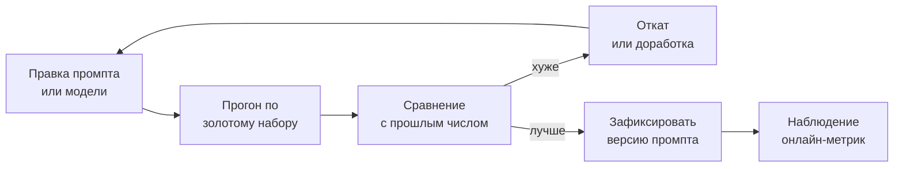

# Оценка качества LLM-функций

## Содержание

- [Проблема: стало лучше или хуже](#проблема-стало-лучше-или-хуже)
- [Почему обычные тесты не работают](#почему-обычные-тесты-не-работают)
- [Золотой набор](#золотой-набор)
- [Пирамида проверок](#пирамида-проверок)
- [Судья-модель](#судья-модель)
- [Рабочий цикл](#рабочий-цикл)
- [Офлайн и онлайн метрики](#офлайн-и-онлайн-метрики)
- [Регрессия при смене модели](#регрессия-при-смене-модели)
- [Проверки в CI](#проверки-в-ci)
- [Типичные ошибки](#типичные-ошибки)
- [Interview-ready answer](#interview-ready-answer)

Оценка качества (`evals`) — это набор размеченных примеров и способ прогнать по ним систему, чтобы получить число. Без неё работа с промптами превращается в перебор наугад: правку внесли, посмотрели три ответа, показалось лучше, поехали дальше. Это и есть граница между экспериментом и эксплуатацией.

---

## Проблема: стало лучше или хуже

Типичная ситуация: промпт переписали, чтобы модель перестала выдумывать теги. Проверили на пяти примерах — выдумывать перестала. Задеплоили.

Через неделю выясняется, что заодно она стала пропускать очевидные теги на другом классе входов, которых в пяти примерах не было. Обнаружилось это по жалобам, а не по метрике.

Проблема не в невнимательности, а в том, что у изменения промпта **нет обратной связи**. Компилятор не ругается, тесты зелёные, ошибок в логах нет. Единственный способ увидеть эффект — измерить его целенаправленно.

---

## Почему обычные тесты не работают

Юнит-тест построен на детерминизме: одинаковый вход даёт одинаковый выход, сравнение точное. У LLM-функции ни одного из этих свойств нет.

| | Обычный тест | Проверка LLM-функции |
|---|---|---|
| Повторяемость | одинаковый выход | выход меняется между прогонами |
| Сравнение | точное совпадение | совпадение по смыслу или по критериям |
| Результат | прошёл или упал | доля успеха на наборе |
| Порог | 100% | подбирается: например, не ниже 85% |
| Стоимость прогона | бесплатно | реальные вызовы модели |

Отсюда другая единица измерения. Не «тест прошёл», а «на наборе из двухсот примеров точность 0.91, было 0.88». Отдельный пример может провалиться и это нормально; значимо только изменение доли.

Побочное следствие: прогон стоит денег и времени. Полный набор не гоняется на каждый коммит — см. раздел про CI.

---

## Золотой набор

Основа всего — набор примеров с правильными ответами.

**Откуда брать примеры:**

- **Реальные запросы из продакшена.** Лучший источник: распределение входов совпадает с настоящим.
- **Разобранные жалобы.** Каждый случай «система ответила не то» превращается в пример.
- **Крайние случаи, придуманные вручную.** Пустой ввод, очень длинный ввод, другой язык, противоречивые данные.

**Каким должен быть:**

- **Размер.** Пятьдесят примеров дают шумную оценку, две-три сотни — уже рабочую. Начинать разумно с пятидесяти: даже такой набор ловит грубые регрессии.
- **Покрытие.** Не только типичные входы. Классы, которых в наборе нет, ломаются незаметно.
- **Стабильность.** Набор не правится под текущий результат. Как только «эталон» подгоняют под то, что выдаёт модель, набор перестаёт измерять.
- **Версионирование.** Лежит в репозитории рядом с промптом и меняется осознанно.

**Как размечать.** Первый проход руками — это дорого, но делается один раз. Ускорить можно так: прогнать текущую систему, вручную проверить и исправить ответы, использовать исправленные как эталон. Важно исправлять именно ошибки, а не принимать всё подряд.

---

## Пирамида проверок

Проверки выстраиваются снизу вверх: от дешёвых и точных к дорогим и приблизительным. Чем ниже уровень закрывает проблему, тем лучше.

```text
                    ┌──────────────────────┐
                    │   Оценка человеком   │  дорого, медленно
                    │  выборочно, вручную  │  точнее всех
                    ├──────────────────────┤
                    │    Судья-модель      │  дорого, шумно
                    │  оценка по критериям │  единственный способ
                    │                      │  для свободного текста
                  ┌─┴──────────────────────┴─┐
                  │   Семантическое сходство  │  дёшево
                  │   близость к эталону      │  приблизительно
                ┌─┴───────────────────────────┴─┐
                │   Правила на содержимом        │  дёшево
                │   содержит / не содержит /     │  точно
                │   значения из словаря          │
            ┌───┴────────────────────────────────┴───┐
            │       Разбор и соответствие схеме       │  бесплатно
            │       валидный JSON, нужные поля        │  абсолютно точно
            └─────────────────────────────────────────┘
```

Уровни снизу вверх:

- **Схема.** Разбирается ли ответ, есть ли обязательные поля, верные ли типы. Быстро, бесплатно, однозначно. При [строгом выводе по схеме](../api-integration/02-structured-outputs.md) этот уровень закрыт самим API.
- **Правила.** Проверка конкретных фактов: ответ содержит нужный идентификатор, не содержит запрещённых формулировок, все значения из допустимого словаря, число элементов в диапазоне. Дёшево и точно; закрывает больше, чем кажется.
- **Семантическое сходство.** Ответ переводится в вектор и сравнивается с эталоном. Ловит «то же самое другими словами», но плохо различает близкие по форме и противоположные по смыслу ответы.
- **Судья-модель.** Другая модель оценивает ответ по заданным критериям.
- **Человек.** Выборочная ручная проверка. Дорого, поэтому применяется к небольшой выборке и к спорным случаям.

Практический совет: большинство задач с фиксированным форматом ответа — классификация, извлечение, разметка — закрываются двумя нижними уровнями полностью. Судья нужен там, где ответ свободный текст.

---

## Судья-модель

Приём: попросить модель оценить ответ другой модели по критериям.

Что делает его работоспособным:

- **Конкретные критерии вместо общих.** Не «оцени качество от 1 до 10», а «содержит ли ответ ссылку на источник: да или нет», «противоречит ли ответ приведённому фрагменту: да или нет».
- **Дискретная шкала.** Двоичные и трёхзначные оценки заметно стабильнее, чем шкала от одного до десяти: на широкой шкале оценки плывут между прогонами.
- **Эталон в запросе.** Судить «насколько ответ близок к эталонному» проще, чем судить в вакууме.
- **Структурированный вывод.** Оценка приходит по схеме, а не текстом.

Известные искажения, о которых надо помнить:

- **Длина.** Длинные ответы систематически получают более высокие оценки.
- **Порядок.** При сравнении двух вариантов первый оценивается выше; лечится прогоном в обоих порядках.
- **Своё.** Модель склонна выше оценивать ответы, похожие на её собственный стиль.
- **Уверенность.** Уверенно сформулированный неверный ответ оценивается выше неуверенного верного.

Отсюда правило: судья калибруется по человеческой разметке. Берётся сотня примеров, размеченных человеком, прогоняется судья, считается совпадение. Если оно низкое — правятся критерии, а не выводы.

---

## Рабочий цикл



Дисциплина здесь важнее инструментов:

- **Одно изменение за прогон.** Две правки сразу — и непонятно, какая из них дала эффект.
- **Число фиксируется рядом с версией промпта.** Иначе через месяц не установить, откуда взялась текущая точность.
- **Прогоняется одинаковый набор.** Изменившийся набор делает числа несравнимыми.
- **Учитывается шум.** Разница в один процент на наборе из ста примеров — это шум, а не улучшение.

---

## Офлайн и онлайн метрики

Два разных контура, оба нужны.

| | Офлайн | Онлайн |
|---|---|---|
| Когда | до выката | на живом трафике |
| На чём | золотой набор | реальные запросы |
| Что показывает | не стало ли хуже на известных случаях | что происходит на самом деле |
| Скорость обратной связи | минуты | дни |
| Примеры | точность, полнота, доля валидных ответов | доля повторных запросов, доля отказов, время до результата, конверсия |

Офлайн ловит регрессии до пользователей, но измеряет только то, что попало в набор. Онлайн видит всё, но медленно и без эталона.

Полезные онлайн-сигналы, которые не требуют разметки:

- **Доля неразобравшихся ответов.** Должна быть около нуля; рост означает поломку формата.
- **Доля упёршихся в лимит вывода.** Растёт — значит ответы удлинились.
- **Повторный запрос сразу после ответа.** Косвенный признак, что ответ не устроил.
- **Расход токенов на запрос.** Резкий рост означает изменение поведения модели.

---

## Регрессия при смене модели

Главный сценарий, ради которого набор и заводится.

Провайдер выпускает новую версию модели, она дешевле и лучше по общим тестам. Вопрос «а на нашей задаче лучше?» без набора не имеет ответа, и переход превращается в лотерею.

С набором это обычная процедура:

1. Прогнать текущую модель, зафиксировать число.
2. Прогнать новую, ничего больше не меняя.
3. Сравнить не только среднее, но и распределение: часто среднее растёт, а отдельный класс входов деградирует.
4. Разобрать разошедшиеся примеры вручную.

Тот же порядок применяется при изменении промпта, при смене глубины рассуждений и при переходе на другого провайдера.

Отдельно стоит **закреплять версию модели** в конфигурации. Плавающий псевдоним вида «последняя стабильная» означает, что поведение системы меняется без деплоя и без возможности связать изменение с чем-либо.

---

## Проверки в CI

Полный набор на каждый коммит гонять дорого. Разумное разделение:

| Когда | Что гоняется | Уровни проверок |
|---|---|---|
| Каждый коммит | 10–20 примеров | схема и правила, без вызовов модели там, где возможно |
| Изменение промпта или модели | полный набор | все уровни, включая судью |
| Перед релизом | полный набор плюс ручная выборка | все уровни |
| Регулярно на проде | выборка реального трафика | правила и онлайн-сигналы |

Отдельный приём — **записанные ответы** (`fixtures`): сохранённые реальные ответы модели, по которым тестируется вся обвязка вокруг вызова — разбор, нормализация, обработка ошибок. Это уже обычные детерминированные тесты, они бесплатны и должны покрывать весь код, кроме самого сетевого вызова.

---

## Типичные ошибки

### 1. Оценивать на трёх примерах

Три примера ловят только грубые поломки. Изменение, которое улучшает один класс входов и ломает другой, на такой выборке невидимо.

### 2. Править эталоны под текущий результат

Как только неудобные эталоны начинают подгоняться под то, что выдаёт модель, набор перестаёт измерять качество и начинает измерять сам себя.

### 3. Просить у судьи оценку от 1 до 10

Широкая шкала нестабильна между прогонами. Двоичные и трёхзначные критерии дают воспроизводимые числа.

### 4. Не калибровать судью

Судья — тоже модель со своими искажениями: любит длинные и уверенные ответы. Без сверки с человеческой разметкой его числа ничего не значат.

### 5. Не закреплять версию модели

Плавающий псевдоним меняет поведение системы без изменения кода. Регрессию в этом случае невозможно ни воспроизвести, ни привязать к причине.

### 6. Измерять только среднее

Средняя точность может вырасти при одновременной деградации отдельного класса входов. Смотреть надо и на разбивку по классам.

### 7. Не иметь онлайн-сигналов

Набор покрывает только известные случаи. Доля неразобравшихся ответов, доля обрывов по лимиту и расход токенов — дешёвые сигналы, которые ловят то, чего в наборе нет.

---

## Interview-ready answer

**1. Почему обычные тесты не подходят для LLM-функций?**

- Недетерминизм — одинаковый вход даёт разные ответы, точное сравнение невозможно.
- Единица измерения — не «прошёл или упал», а доля успеха на наборе примеров с порогом.
- Стоимость — прогон требует реальных вызовов, поэтому полный набор не гоняется на каждый коммит.

**2. Что такое золотой набор и как его собрать?**

- Состав — примеры входов с правильными ответами, из реального трафика, разобранных жалоб и крайних случаев.
- Размер — от полусотни для грубых регрессий, две-три сотни для рабочей оценки.
- Дисциплина — набор версионируется рядом с промптом и не правится под текущий результат модели.

**3. Какие бывают уровни проверок?**

- Дешёвые и точные — разбор и соответствие схеме, правила на содержимом: содержит нужное, значения из словаря, число элементов в диапазоне.
- Приблизительные — семантическое сходство с эталоном.
- Дорогие — судья-модель по конкретным критериям и выборочная ручная проверка.
- Правило — задачи с фиксированным форматом закрываются двумя нижними уровнями полностью.

**4. Как использовать модель в роли судьи?**

- Критерии — конкретные и дискретные, а не оценка качества по десятибалльной шкале.
- Искажения — судья предпочитает длинные, уверенные и похожие на собственный стиль ответы; при сравнении вариантов важен порядок.
- Калибровка — сверка с человеческой разметкой на сотне примеров, иначе числа судьи ничего не значат.

**5. Зачем всё это, если система работает?**

- Смена модели — без набора вопрос «стало лучше на нашей задаче» не имеет ответа.
- Правка промпта — не даёт обратной связи: компилятор молчит, тесты зелёные, эффект виден только замером.
- Версия модели — закрепляется в конфигурации, иначе поведение меняется без деплоя и регрессию невозможно воспроизвести.
